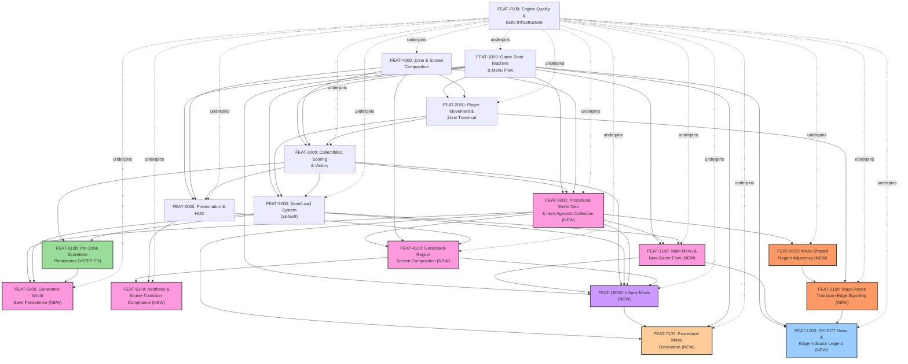

# FP-04 — Feature Dependency Graph

> **Status: ✅ Authored (bootstrap as-built, 2026-07-07); delta 2026-07-10 (procgen-world
> increment); delta 2026-07-11 (`ADR-0012` maze-adjacency remediation, `FEAT-9100`/`FEAT-2100`);
> delta 2026-07-13 (edge-indicator legend screen, `FEAT-1200`, `CR-06`/`BL-0100`); delta
> 2026-07-14 (Infinite Mode, `FEAT-10000`, `ADS-001`/`ADR-0016`/`ADR-0017`/`BL-0082`); delta
> 2026-07-14 (cont'd) (`FEAT-10000`'s missing `FEAT-4100` edge added, `BL-0111`); delta 2026-07-16
> (`FEAT-7100` added, `ADR-0019`/`BL-0127`).**
> Owned by `05-feature-decomposition`. Analyzes dependencies among [FP-03](03-feature-catalog.md)'s
> eighteen Features. **No circular dependency found.**

## Graph

*(FEAT-5100 highlighted green — shipped and VERIFIED since this graph's last version. The five
procgen-world increment Features highlighted pink as not-yet-implemented. FEAT-7000 no longer
highlighted red — both its tracked non-compliances (`NFR-1200`/`NFR-7100`) are now VERIFIED Met.
FEAT-9100/FEAT-2100 highlighted orange — the 2026-07-11 `ADR-0012` post-ship remediation, a
distinct thread from the original procgen-world increment's own pink Features (all of which are
already `COMPLETE`/`VERIFIED` or awaiting only fresh-session verification). FEAT-1200 highlighted
blue — the 2026-07-13 edge-indicator legend screen delta (`CR-06`/`BL-0100`), a third, independent
thread: its own dependencies (FEAT-1100's cursor-menu convention, FEAT-2100's already-shipped
tiles) are both already satisfied, so it is immediately buildable, not serialized behind
FEAT-2100's own in-flight render branch (`IP-1082`). FEAT-10000 highlighted purple — the
2026-07-14 Infinite Mode delta (`ADS-001`/`ADR-0016`/`ADR-0017`, `BL-0082`), a fourth, independent
thread: its five dependencies (FEAT-1000/1100/3000/5000/9000) are all already shipped/`VERIFIED`,
so it too is immediately buildable once specified — not serialized behind any other pink/orange/
blue Feature's own in-flight work. **`FEAT-4100 → FEAT-10000` added same-day (`BL-0111`)** — a
materialized Infinite Mode region's rendering path reuses `FEAT-4100`'s own biome-family
screen-composition dispatch, omitted from the original cataloging pass and correctly surfaced by
`06-feature-specification`'s own `FS-110` Open Question 1; `FEAT-4100` is already shipped/
`VERIFIED`, so this addition does not change `FEAT-10000`'s immediate-buildability. **FEAT-7100
highlighted tan — the 2026-07-16 procedural-music-generation delta (`ADR-0019`, `BL-0127`), a
fifth, independent thread: unlike every other pink/orange/blue/purple Feature, one of its three
dependencies (`FEAT-10000`) is itself still `Future`-bucketed and not release-scheduled, and a
second (`FEAT-9000`'s own `FR-4320` widening) is mid-implementation and gated on G3 — so
`FEAT-7100`'s build-time generation half is immediately startable (its data-level dependencies are
all shipped) but its runtime selection half cannot be fully exercised until both upstream threads
land, a real, named sequencing constraint (see Critical path, below).
Solid arrows are hard dependencies (A → B means B depends on A); dotted arrows from FEAT-7000
represent the non-blocking "underpins" relationship its cross-cutting NFRs have with every
player-visible Feature.)*

## Dependency summary

| Feature | Depends on | Depended on by |
|---|---|---|
| FEAT-1000 | — (foundational) | FEAT-2000, FEAT-3000, FEAT-5000, FEAT-6000, FEAT-9000, FEAT-1100, FEAT-1200, FEAT-10000, FEAT-7100 |
| FEAT-4000 | — (foundational) | FEAT-2000, FEAT-3000, FEAT-6000, FEAT-9000, FEAT-4100 |
| FEAT-2000 | FEAT-1000, FEAT-4000 | FEAT-3000, FEAT-5000, FEAT-2100 |
| FEAT-3000 | FEAT-1000, FEAT-2000, FEAT-4000 | FEAT-5000, FEAT-6000, FEAT-5100, FEAT-9000, FEAT-10000 |
| FEAT-6000 | FEAT-1000, FEAT-3000, FEAT-4000 | FEAT-4100, FEAT-6100 |
| FEAT-5000 | FEAT-1000, FEAT-2000, FEAT-3000 | FEAT-5100, FEAT-1100, FEAT-5300, FEAT-10000 |
| FEAT-5100 | FEAT-3000, FEAT-5000 | FEAT-5300 |
| FEAT-7000 | — (infrastructure floor) | all others, non-blocking |
| **FEAT-9000** | FEAT-1000, FEAT-3000, FEAT-4000 | FEAT-4100, FEAT-1100, FEAT-5300, FEAT-9100, FEAT-10000, FEAT-7100 |
| **FEAT-4100** | FEAT-9000, FEAT-4000, FEAT-6000 | FEAT-6100, FEAT-10000 |
| **FEAT-1100** | FEAT-1000, FEAT-9000, FEAT-5000 | FEAT-1200, FEAT-10000 |
| **FEAT-5300** | FEAT-9000, FEAT-5000, FEAT-5100 | — (nothing yet) |
| **FEAT-6100** | FEAT-4100, FEAT-6000 | — (nothing yet) |
| **FEAT-9100** | FEAT-9000 | FEAT-2100 |
| **FEAT-2100** | FEAT-9100, FEAT-2000 | FEAT-1200 |
| **FEAT-1200** | FEAT-1000, FEAT-1100, FEAT-2100 | — (nothing yet) |
| **FEAT-10000** | FEAT-1000, FEAT-1100, FEAT-3000, FEAT-5000, FEAT-9000, FEAT-4100 | FEAT-7100 |
| **FEAT-7100** | FEAT-9000, FEAT-10000, FEAT-1000 | — (nothing yet) |

## Critical path

**Bootstrap increment (unchanged):** FEAT-1000 → FEAT-2000 → FEAT-3000 → FEAT-5000 → FEAT-5100
(5 nodes) — fully built and VERIFIED end-to-end.

**Procgen-world increment (unchanged):** **FEAT-9000 → FEAT-4100 → FEAT-6100** (3 nodes) — the
longest dependency chain in that increment: world generation must exist before a generated region
can be rendered, and a rendered region must exist before its aesthetic/palette-stepping
compliance can be judged. FEAT-1100 and FEAT-5300 each depend only on FEAT-9000 (already the
chain's root) plus already-shipped bootstrap Features, so neither adds length beyond FEAT-9000.
**All four procgen-world Features are now `COMPLETE`/`VERIFIED` or content-reviewed** — this
chain is fully built, only fresh-session `09-package-verification` remains outstanding.

**`ADR-0012` maze-adjacency remediation (new, 2026-07-11):** **FEAT-9000 → FEAT-9100 → FEAT-2100**
(3 nodes, counting from the same already-shipped root) — the longest chain in this new thread.
`FEAT-9100`'s own direct dependency is only `FEAT-9000` (already `COMPLETE`), so this thread's
*effective* new-work critical path is 2 nodes (`FEAT-9100` → `FEAT-2100`), shorter than the
original increment's 3-node chain, and does not extend it (a parallel, independent thread off
the same root, not a continuation).

**Edge-indicator legend screen (new, 2026-07-13):** **FEAT-1000/FEAT-1100/FEAT-2100 → FEAT-1200**
— all three of `FEAT-1200`'s own dependencies are already satisfied (`FEAT-1000`/`FEAT-1100`
shipped; `FEAT-2100`'s specific dependency is its *tiles*, already shipped via `IP-1030`/`IP-1081`,
not its still-in-flight render branch `IP-1082`) — this thread's own *effective* new-work length
is 1 node (`FEAT-1200` itself), the shortest of the three active threads, and does not extend the
critical path.

**Infinite Mode (new, 2026-07-14):** all six of `FEAT-10000`'s own dependencies
(`FEAT-1000`/`FEAT-1100`/`FEAT-3000`/`FEAT-5000`/`FEAT-9000`, plus `FEAT-4100`, added `BL-0111`
the same day) are already shipped/`VERIFIED` — this thread's own *effective* new-work length is
still 1 node (`FEAT-10000` itself), tied with `FEAT-1200` for the shortest active thread, and does
not extend the critical path. The `BL-0111` correction only names an already-satisfied
dependency explicitly; it does not add build-order risk.

**Procedural Music Generation (new, 2026-07-16):** `FEAT-7100`'s three dependencies split unevenly
in readiness — `FEAT-1000` and `FEAT-9000` are shipped/`VERIFIED`, but `FEAT-9000`'s own
nine-identity axis (`FR-4320`) is mid-implementation, gated on G3 (four packages,
`IP-1105`/`IP-1033`/`IP-1022`/`IP-1106`, none authorized), and `FEAT-10000` itself sits in the
`Future` bucket, fully decomposed but not release-scheduled. This is a **genuinely different
shape of dependency than any prior delta**: every earlier new-work thread's own dependencies were
either fully shipped or, at worst, mid-flight within the same increment (`FEAT-9100` waiting on
its own sibling `FEAT-9000`). Here, `FEAT-7100`'s *build-time generation half* (transposing the
existing main theme) has no such blocker and is immediately startable; only its *runtime
selection half* (which sub-theme plays for which identity) needs both upstream threads further
along. This thread's own *effective* new-work length is 1 node (`FEAT-7100` itself) for the
generation half, but the selection half's true readiness trails `FR-4320`'s own arc — worth
flagging explicitly rather than folding into a single undifferentiated "1 node, ready" claim the
way `FEAT-1200`/`FEAT-10000` were.

## Blocking Features (high fan-out)

- **FEAT-1000** (8 direct dependents) — remains the single highest-fan-out Feature; grows by one
  (`FEAT-7100`) with this delta.
- **FEAT-9000** (6 direct dependents: FEAT-4100, FEAT-1100, FEAT-5300, FEAT-9100, FEAT-10000,
  FEAT-7100) — the procgen-world increment's own highest-fan-out Feature, now also gating this
  session's remediation thread, the Infinite Mode Epic, and the new Procedural Music Generation
  Epic. Any change to the generation algorithm's output shape ripples into rendering, the new-game
  flow, save persistence, adjacency shape, Infinite Mode's own shared PRNG construction, *and* now
  music sub-theme selection simultaneously — worth noting since `FEAT-9000` is already
  `COMPLETE`/shipped, so this fan-out is now a stability/regression concern, not an open design
  risk. `FEAT-10000`'s own dependency on `FEAT-9000` is code-reuse only (`gw_prng_step`), not a
  structural build-order dependency on anything `FEAT-9000`-specific — see `FEAT-10000`'s own
  catalog entry. `FEAT-7100`'s own dependency on `FEAT-9000` is a genuine build-order dependency
  (it reads the biome-family identity `FEAT-9000` assigns), unlike `FEAT-10000`'s code-reuse-only
  relationship.
- **FEAT-4000** (5 direct dependents) — unchanged from the prior delta.
- **FEAT-4100** (2 direct dependents: FEAT-6100, FEAT-10000) — grows by one with this delta
  (`BL-0111`); still well below the "high fan-out" threshold the three Features above meet, noted
  here only because the correction changed the count, not because it newly qualifies as blocking.

## Parallel opportunities

- **FEAT-6000 (Presentation & HUD)** and **FEAT-5000/FEAT-5100 (Persistence)** — unchanged from
  the bootstrap graph, both already shipped.
- **FEAT-1100, FEAT-5300, FEAT-9100** all depend only on the already-`COMPLETE` `FEAT-9000` (plus,
  for FEAT-1100/FEAT-5300, already-shipped bootstrap Features) — all three can proceed
  independently of each other; `FEAT-9100` in particular does not need to wait on
  `FEAT-4100`/`FEAT-6100` at all (both already shipped and unaffected), only on `FEAT-9000`.
- **FEAT-2100 is the one genuinely serialized new-work node this delta adds** — it cannot start
  before `FEAT-9100` ships (there is nothing to signal yet), the same single-point-of-
  serialization pattern the original increment had at `FEAT-9000`.
- **FEAT-7000 (Engine Quality)**'s two prior tracked non-compliances are both now resolved
  (`NFR-1200`/`NFR-7100`, both VERIFIED) — it no longer represents an open scheduling choice.
- **FEAT-1200 is immediately buildable, not serialized behind anything in-flight** — unlike
  `FEAT-2100` (which had to wait on `FEAT-9100`), all three of `FEAT-1200`'s own dependencies are
  already satisfied today (`FEAT-1000`/`FEAT-1100` shipped; `FEAT-2100`'s tiles already shipped
  independent of its still-in-flight render branch). It can proceed in parallel with `FEAT-2100`'s
  own remaining work, not after it.
- **FEAT-7100's build-time generation half can proceed independently of every other in-flight
  thread** — its data-level dependency is only the *existence* of `FR-4320`'s identity axis as a
  concept (already requirements-baselined) plus the already-shipped main theme, not any specific
  package shipping. Its *runtime selection half*, however, is the one genuinely serialized piece
  this delta adds: it cannot be fully exercised against all nine identities until `FR-4320`'s own
  four packages ship (gated on G3) and, separately, until `FEAT-10000` is release-scheduled if
  Infinite Mode playback is to be verified too — a two-source wait unlike any single-blocker
  pattern seen in prior deltas (`FEAT-2100`'s single wait on `FEAT-9100`, `FEAT-1200`'s zero
  waits).

## Circular dependency check

**None found**, including after adding the two `ADR-0012` remediation Features and `FEAT-1200`.
One near-miss was resolved during
this delta's own authoring, not left for the graph to surface: `FR-9130` ("exactly one KeyItem
per generated region") and `FR-3220` ("item-agnostic KeyItem collection") name each other as
dependencies at the *requirement* level (FR-9130 depends on the collection mechanism existing;
FR-3220 depends on the one-per-region invariant holding). Rather than split them across two
Features and create an artificial FEAT-level cycle, both requirements were assigned to the same
Feature (**FEAT-9000**) — the mutual coupling becomes internal cohesion within one Feature
instead of a cross-Feature cycle. The graph above is a strict DAG — tracing every edge from any
node terminates without revisiting a node.

**Procedural Music Generation delta (2026-07-16):** re-confirmed clean with `FEAT-7100` added —
all three of its own edges point *into* it from already-terminal-or-mid-chain Features
(`FEAT-1000`, `FEAT-9000`, `FEAT-10000`), and `FEAT-7100` itself has zero dependents, so it can
only ever be a sink, never introduce a cycle by construction — the same structural argument
`FEAT-10000` itself relied on.
