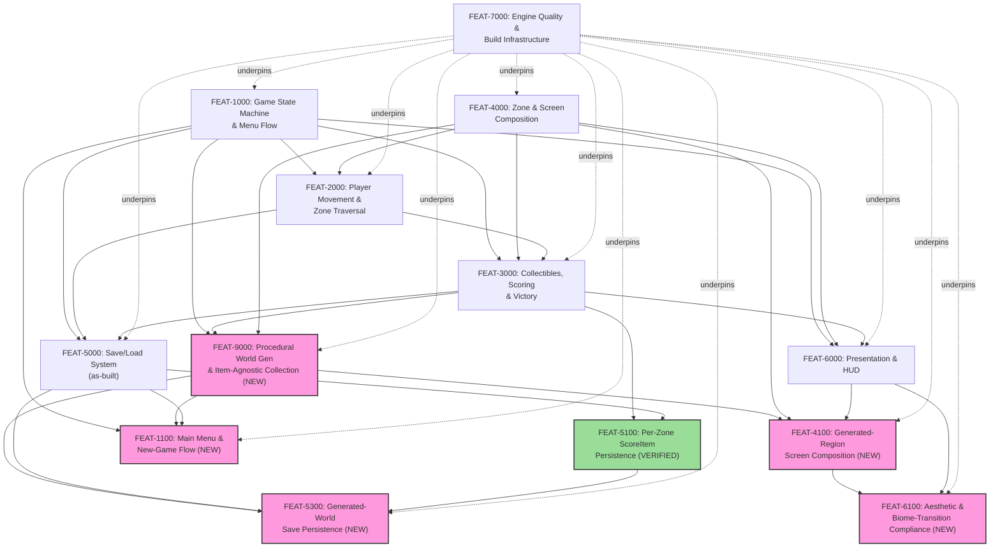

# FP-04 — Feature Dependency Graph

> **Status: ✅ Authored (bootstrap as-built, 2026-07-07); delta 2026-07-10 (procgen-world
> increment).** Owned by `05-feature-decomposition`. Analyzes dependencies among
> [FP-03](03-feature-catalog.md)'s thirteen Features. **No circular dependency found.**

## Graph

*(FEAT-5100 highlighted green — shipped and VERIFIED since this graph's last version. The five
procgen-world increment Features highlighted pink as not-yet-implemented. FEAT-7000 no longer
highlighted red — both its tracked non-compliances (`NFR-1200`/`NFR-7100`) are now VERIFIED Met.
Solid arrows are hard dependencies (A → B means B depends on A); dotted arrows from FEAT-7000
represent the non-blocking "underpins" relationship its cross-cutting NFRs have with every
player-visible Feature.)*

## Dependency summary

| Feature | Depends on | Depended on by |
|---|---|---|
| FEAT-1000 | — (foundational) | FEAT-2000, FEAT-3000, FEAT-5000, FEAT-6000, FEAT-9000, FEAT-1100 |
| FEAT-4000 | — (foundational) | FEAT-2000, FEAT-3000, FEAT-6000, FEAT-9000, FEAT-4100 |
| FEAT-2000 | FEAT-1000, FEAT-4000 | FEAT-3000, FEAT-5000 |
| FEAT-3000 | FEAT-1000, FEAT-2000, FEAT-4000 | FEAT-5000, FEAT-6000, FEAT-5100, FEAT-9000 |
| FEAT-6000 | FEAT-1000, FEAT-3000, FEAT-4000 | FEAT-4100, FEAT-6100 |
| FEAT-5000 | FEAT-1000, FEAT-2000, FEAT-3000 | FEAT-5100, FEAT-1100, FEAT-5300 |
| FEAT-5100 | FEAT-3000, FEAT-5000 | FEAT-5300 |
| FEAT-7000 | — (infrastructure floor) | all others, non-blocking |
| **FEAT-9000** | FEAT-1000, FEAT-3000, FEAT-4000 | FEAT-4100, FEAT-1100, FEAT-5300 |
| **FEAT-4100** | FEAT-9000, FEAT-4000, FEAT-6000 | FEAT-6100 |
| **FEAT-1100** | FEAT-1000, FEAT-9000, FEAT-5000 | — (nothing yet) |
| **FEAT-5300** | FEAT-9000, FEAT-5000, FEAT-5100 | — (nothing yet) |
| **FEAT-6100** | FEAT-4100, FEAT-6000 | — (nothing yet) |

## Critical path

**Bootstrap increment (unchanged):** FEAT-1000 → FEAT-2000 → FEAT-3000 → FEAT-5000 → FEAT-5100
(5 nodes) — fully built and VERIFIED end-to-end.

**Procgen-world increment (new):** **FEAT-9000 → FEAT-4100 → FEAT-6100** (3 nodes) — the longest
new-work dependency chain, and the one that matters for this increment's scheduling: world
generation must exist before a generated region can be rendered, and a rendered region must exist
before its aesthetic/palette-stepping compliance can be judged. FEAT-1100 and FEAT-5300 each
depend only on FEAT-9000 (already the chain's root) plus already-shipped bootstrap Features
(FEAT-1000/FEAT-5000/FEAT-5100), so neither adds length beyond FEAT-9000 — they can proceed in
parallel with FEAT-4100/FEAT-6100 once FEAT-9000 lands.

## Blocking Features (high fan-out)

- **FEAT-1000** (6 direct dependents, was 4) — remains the single highest-fan-out Feature; now
  also gates FEAT-9000 (generation is invoked during a state transition) and FEAT-1100.
- **FEAT-9000** (3 direct dependents: FEAT-4100, FEAT-1100, FEAT-5300) — the new increment's own
  highest-fan-out Feature; it is this increment's foundational node, exactly analogous to
  FEAT-1000/FEAT-4000's role in the bootstrap graph. Any change to the generation algorithm's
  output shape (the region-graph structure) ripples into rendering, the new-game flow, and save
  persistence simultaneously.
- **FEAT-4000** (5 direct dependents, was 3) — now also gates FEAT-9000 (generalizes the fixed
  zone/screen model) and FEAT-4100.

## Parallel opportunities

- **FEAT-6000 (Presentation & HUD)** and **FEAT-5000/FEAT-5100 (Persistence)** — unchanged from
  the bootstrap graph, both already shipped.
- **FEAT-1100, FEAT-5300** (both depend only on FEAT-9000 plus already-shipped bootstrap
  Features) can proceed **in parallel with each other and with FEAT-4100/FEAT-6100** once
  FEAT-9000 lands — none of the four depends on any of the others. This is the operative
  scheduling fact for the procgen-world increment: only FEAT-9000 itself is a hard serialization
  point.
- **FEAT-7000 (Engine Quality)**'s two prior tracked non-compliances are both now resolved
  (`NFR-1200`/`NFR-7100`, both VERIFIED) — it no longer represents an open scheduling choice.

## Circular dependency check

**None found**, including after adding the five new Features. One near-miss was resolved during
this delta's own authoring, not left for the graph to surface: `FR-9130` ("exactly one KeyItem
per generated region") and `FR-3220` ("item-agnostic KeyItem collection") name each other as
dependencies at the *requirement* level (FR-9130 depends on the collection mechanism existing;
FR-3220 depends on the one-per-region invariant holding). Rather than split them across two
Features and create an artificial FEAT-level cycle, both requirements were assigned to the same
Feature (**FEAT-9000**) — the mutual coupling becomes internal cohesion within one Feature
instead of a cross-Feature cycle. The graph above is a strict DAG — tracing every edge from any
node terminates without revisiting a node.
