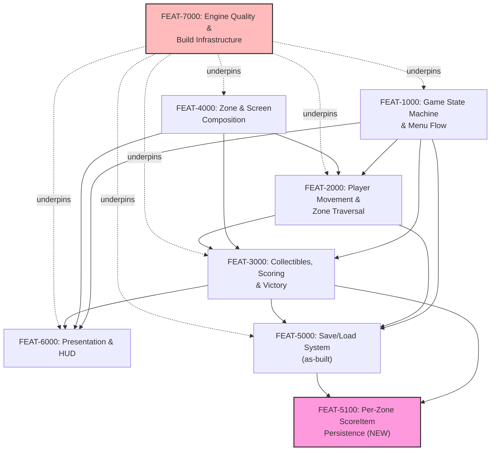

# FP-04 — Feature Dependency Graph

> **Status: ✅ Authored (bootstrap as-built, 2026-07-07).** Owned by `05-feature-decomposition`.
> Analyzes dependencies among [FP-03](03-feature-catalog.md)'s seven Features. **No circular
> dependency found.**

## Graph

*(FEAT-5100 highlighted pink as the one not-yet-implemented Feature; FEAT-7000 highlighted red as
the highest-risk Feature. Solid arrows are hard dependencies (A → B means B depends on A); dotted
arrows from FEAT-7000 represent the non-blocking "underpins" relationship its cross-cutting NFRs
have with every player-visible Feature — a floor, not a scheduling gate, since 4 of its 6 NFRs are
already Met.)*

## Dependency summary

| Feature | Depends on | Depended on by |
|---|---|---|
| FEAT-1000 | — (foundational) | FEAT-2000, FEAT-3000, FEAT-5000, FEAT-6000 |
| FEAT-4000 | — (foundational) | FEAT-2000, FEAT-3000, FEAT-6000 |
| FEAT-2000 | FEAT-1000, FEAT-4000 | FEAT-3000, FEAT-5000 |
| FEAT-3000 | FEAT-1000, FEAT-2000, FEAT-4000 | FEAT-5000, FEAT-6000, FEAT-5100 |
| FEAT-6000 | FEAT-1000, FEAT-3000, FEAT-4000 | — |
| FEAT-5000 | FEAT-1000, FEAT-2000, FEAT-3000 | FEAT-5100 |
| FEAT-5100 | FEAT-3000, FEAT-5000 | — (nothing yet) |
| FEAT-7000 | — (infrastructure floor) | all six others, non-blocking |

## Critical path

**FEAT-1000 → FEAT-2000 → FEAT-3000 → FEAT-5000 → FEAT-5100** (5 nodes) — the longest dependency
chain in the graph, and the one that matters for scheduling: it is the exact chain leading to
**FEAT-5100, the only Feature with no shipped implementation**. Since FEAT-1000 through FEAT-5000
are already fully built, FEAT-5100's critical path is in practice already clear — nothing upstream
of it needs to be (re)built before it can be specified and implemented.

## Blocking Features (high fan-out)

- **FEAT-1000** (4 direct dependents: FEAT-2000, FEAT-3000, FEAT-5000, FEAT-6000) — the single
  highest-fan-out Feature; any change to the state machine's shape has the widest blast radius.
- **FEAT-4000** (3 direct dependents: FEAT-2000, FEAT-3000, FEAT-6000) — the second-highest;
  any change to the zone/screen structure (e.g. growing beyond 9 zones toward C7) ripples into
  traversal, collection, and presentation simultaneously.

## Parallel opportunities

- **FEAT-6000 (Presentation & HUD)** and **FEAT-5000/FEAT-5100 (Persistence)** share the same
  upstream dependencies (FEAT-1000, FEAT-3000) but do not depend on each other — in a from-scratch
  build these could proceed in parallel. This is retrospective for the already-shipped Features,
  but is the operative fact for **FEAT-5100**: it can proceed independent of any FEAT-6000 work,
  and independent of `BL-0006`/`BL-0008`'s test-suite remediation (FEAT-7000), since FEAT-5100's
  own verification strategy is new tests, not repaired ones.
- **FEAT-7000 (Engine Quality)** has no hard dependency on anything — its remediation
  (`BL-0006`/`BL-0008`) can be scheduled at any time relative to FEAT-5100, entirely independently.
  This is a real scheduling choice for `07-implementation-planning`/the user, not resolved here
  (see [FP-01](01-release-plan.md)'s Highest-Risk callout).

## Circular dependency check

**None found.** The graph above is a strict DAG — tracing every edge from any node terminates
without revisiting a node. FEAT-7000's relationship to the other six is explicitly modeled as
non-blocking ("underpins," dotted) specifically to avoid a false appearance of a cycle (e.g.
FEAT-7000's NFR-7100 covers *all* Features' test suites, which could naively be drawn as every
Feature depending on FEAT-7000 depending on every Feature — the dotted, one-directional
"underpins" relationship avoids that misrepresentation).
