# Master Build Plan

> **Status (updated 2026-07-16, `09-package-verification` on `IP-1104`): all 31 of 31 packages
> now `VERIFIED` — the tree's full implementation set closes.** `IP-1104` (visited-region-ledger
> save persistence) independently verified — `VERIFIED`
> ([VR-1104](verification/VR-1104-infinite-mode-ledger-save-persistence.md), 309/309, fresh
> session, independent of `IP-1104`'s own implementation and its `BL-0119` amendment). Position +
> bounded-ledger (128 entries × 5 bytes) save/load confirmed shipped in full via
> `save_to_sram`/`try_load_save` extensions (`SAVE_VERSION_VAL` `0x04`→`0x05`, the fifth bump since
> ship, single MBC1 bracket confirmed preserved in both routines); FIFO eviction at capacity
> confirmed (`T27.c`); a systematic negative-test sweep confirms no mechanic ends a loaded Infinite
> Mode run (`T27.f`, FR-10600). This closes the Infinite Mode tranche's own five-package
> implementation set — `BL-0112` (the run-end trigger for `FR-10400`'s top-3 comparison) is the
> tranche's sole standing gap, explicitly out of this package's own scope. `BL-0119` amendment
> confirmed shipped exactly as specified, independently: a 642-byte WRAM working copy of the
> ledger (`LEDGER_COUNT`/`LEDGER_CURSOR`/`LEDGER`, `0xC419`–`0xC69A`, mirroring `SRAM_LEDGER`
> byte-for-byte) so `IP-1102`'s `inf_ensure_window` cheaply consults collected-state on *every*
> materialization — new-game entry, ordinary in-session navigation, and post-load restore alike —
> not only at the save/load boundary the original plan covered; `inf_ledger_mark_collected`
> confirmed to operate on WRAM only (no per-collection SRAM/MBC1 access anywhere in the source).
> Independently live-driven at a non-fixture seed (9092) in two scenarios — a save/load round
> trip, and a genuine two-region window-eviction in-session re-entry stronger than `T27.g`'s own
> one-step move — both confirm the `BL-0119` core claim directly, not just via the suite. Two
> Low-severity documentation findings (neither blocking): `T27`'s "7 checks" claim undercounts the
> actual 13 `check()` calls (same pattern `VR-1100` found for `T25`); `IP-1104` §9's own text cites
> the wrong requirements file for the `NFR-5400` status update (the implementation used the
> correct file regardless). New suite `T26`→`T27` (the package's own planned suite collided with
> `IP-1103`'s actual shipped `T26`, this tranche's fourth such renaming). `IP-1103` (Infinite Mode, treasure placement &
> win-condition state) independently verified — `VERIFIED` ([VR-1103](verification/VR-1103-infinite-mode-treasure-and-win-condition.md),
> 296/296, one Low documentation finding, not blocking). Deliberate scope boundary reconfirmed
> (`IP-1103` §2/§7, `FS-110` OQ3/`BL-0112`): Workflow C steps 1–2 shipped in full (treasure
> spawn/collection/running count) plus the top-3 comparison subroutine `inf_check_top_score` —
> which has **zero call sites, by design**, independently confirmed by direct code read (source
> grep + `T26.d`'s own ROM scan), not just trusted from the suite; the automatic run-end trigger
> still awaits `BL-0112`'s resolution, so `FR-10400` remains recorded Partially Implemented, not
> rounded up. `IP-1100` `VERIFIED` ([VR-1100](verification/VR-1100-infinite-mode-mode-selection.md),
> 296/296, two Low documentation findings, neither blocking). `IP-1102` `VERIFIED`
> ([VR-1102](verification/VR-1102-infinite-mode-streaming-window-and-render.md); `NFR-4300` Met,
> `NFR-1400` honestly measured `NOT MET`, see `02-non-functional-requirements.md`). `IP-1101`
> `VERIFIED` ([VR-1101](verification/VR-1101-infinite-mode-region-materialization.md), 0 open
> findings).**
> Every prior package remains `VERIFIED` —
> nothing below this line is re-opened by the new tranche. **Prior status (corrected 2026-07-13, `09-package-verification` on `IP-1082`):
> 26 of 26 packages VERIFIED.** `IP-1090` (SELECT Menu & Edge-Indicator Legend Screen, `BL-0100`)
> `VERIFIED`
> 2026-07-13 ([VR-1090](verification/VR-1090-select-menu-edge-indicator-legend-screen.md));
> `IP-1082` (`FS-108` rendering half, `BL-0075`) `VERIFIED` 2026-07-13
> ([VR-1082](verification/VR-1082-maze-blocked-edge-indicator-render.md)), both independently
> verified in a genuinely fresh session. Every implementation package in the tree is now
> `VERIFIED` — a `09-content-review` pass is still owed on `IP-1081`/`IP-1082`'s shipped tile art
> (`BL-0097`), and the `IP-1081`/`IP-1082` set still needs its own `10-integration-review` pass.
> **Bootstrap tranche fully VERIFIED (2026-07-10) — all five packages VERIFIED.**
> **Release 2 tranche (procgen-world increment): authorized 2026-07-10 (user G3, `BL-0040`, all
> five packages) — `IP-1020` (foundational, dependency-root) VERIFIED 2026-07-10
> ([VR-1020](verification/VR-1020-procedural-world-generation.md)); `IP-1030` (critical-path,
> code half) VERIFIED 2026-07-10 ([VR-1030](verification/VR-1030-generated-region-screen-composition-code.md)),
> which unblocked `IP-1031` (critical-path, content half) to `COMPLETE` 2026-07-11 — the
> tranche's critical path (`IP-1020`→`IP-1030`→`IP-1031`) is now fully implemented end-to-end;
> `IP-1040`/`IP-1050` both VERIFIED 2026-07-11
> ([VR-1040](verification/VR-1040-main-menu-new-game-flow.md),
> [VR-1050](verification/VR-1050-generated-world-save-persistence.md)). **`IP-1031` independently
> verified 2026-07-12 ([VR-1031](verification/VR-1031-generated-region-screen-composition-content.md))**
> — 231/231 pass, exact 5-family mapping and zero-new-art/palette claims both confirmed. **All
> five Release-2 packages now `VERIFIED`.** **Post-ship remediation tranche planned
> 2026-07-11** (`IP-9050`/`IP-9060`/`IP-9070`, five bugs from playtesting — see below) — **all
> three packages authorized 2026-07-11 (user G3, `BL-0062`); all three reached `COMPLETE` the
> same session (implementer independence required before any can reach `VERIFIED`). **`IP-9070`
> independently verified 2026-07-12 ([VR-9070](verification/VR-9070-cur-zone-indexed-structures-generalization.md))**
> — 231/231 pass, `SCOREITEM_FLAGS`/`SRAM_SCOREITEM` relocation and `ZONE_COLLECTS` biome-keyed
> lookup both confirmed. **`IP-9050` independently verified 2026-07-12
> ([VR-9050](verification/VR-9050-generated-world-navigation-fix.md))** — 231/231 pass,
> `check_zone_transition` confirmed fully `REGION_GRAPH`-driven via the shared `czt_region_hl`
> subroutine. **`IP-9060` independently verified 2026-07-12
> ([VR-9060](verification/VR-9060-main-menu-cursor-fix.md))** — 231/231 pass, `MM_CURSOR`
> reset confirmed correctly relocated and gated on genuine state entry. **This closes the
> post-ship remediation tranche end-to-end — all three packages (`IP-9050`/`9060`/`9070`) now
> `VERIFIED`.** **Maze-
> shaped region adjacency tranche planned 2026-07-11** (`IP-1070`/`IP-1080`, `FS-107`/`FS-108`
> logic half, `ADR-0012`) — a first `08-code-implementation` attempt hit a Blocking Report (the
> shipped PRNG collapses under the braid pass's many back-to-back draws), root-caused by `R113`
> and resolved by `ADR-0013` (a loop-local counter-XOR perturbation scoped to `IP-1070`'s own
> carve+braid draws, `gw_prng_step` itself untouched) — a second `08-code-implementation` attempt
> implemented the fix and reached **`IP-1070` → `COMPLETE` 2026-07-11**, full 211/211-check suite
> green (new suite `T19`, plus non-regression fixes to `T11`/`T17`'s own hardcoded full-lattice
> traversal assumptions — a genuine supersession-sweep gap this package's own planning missed).
> **`IP-1070` independently verified 2026-07-12 ([VR-1070](verification/VR-1070-maze-shaped-region-adjacency.md))** —
> 226/226 pass (current suite size), all seven FS-107 ACs confirmed, oracle/SM83 lockstep
> reconfirmed, zero-diff scope on `dsr_p`/`draw_region_arrows`/`check_zone_transition` confirmed.
> **`IP-1080` authorized 2026-07-12** (explicit user G3, `BL-0083`, "IP-1080 approved") and
> **implemented the same day — reached `COMPLETE`, 230/230 checks pass** (new suite T20 a–d).
> **`IP-1080` independently verified 2026-07-12
> ([VR-1080](verification/VR-1080-maze-aware-edge-classification.md))** — 231/231 pass, `DRA_ROW`/
> `DRA_COL` re-derivation and open-edge-unchanged claims both confirmed. **This closes the
> maze-shaped region adjacency tranche's full critical path — both packages (`IP-1070`/`1080`)
> now `VERIFIED`.**
> Material drift found in the package's own §6/§7 (a stale citation claiming `check_zone_
> transition` still performs row/col grid arithmetic — `IP-9050` removed that) worked around by
> correcting the citation, not routed around; two new transient WRAM bytes (`DRA_ROW`/`DRA_COL`)
> added mid-implementation after `TMP1` was found, via a real failing test, to collide with
> `handle_play_input`'s own per-frame flag. `FS-108`'s rendering half remains unplanned (its own
> blocking `GDS-08` delta landed, `BL-0068` closed, but the rendering half's own spec is a future
> `06-feature-specification` task; AC-4 stays explicitly open). **Movement/pickup/UI bug-remediation
> tranche planned 2026-07-11** (`IP-9080`/`IP-9090`/`IP-9100`, four standing backlog bugs —
> `BL-0049`/`0051`/`0052`/`0053` — see below), all three authorized 2026-07-11 (user G3, `BL-0072`)
> — **all three now `COMPLETE` 2026-07-11 — the tranche's full extent is implemented end-to-end.**
> `IP-9090`: 213/213 suite passing, exact-boundary fix to `handle_play_input`'s UP/RIGHT clamps.
> `IP-9100`: 217/217 suite passing, `check_collisions`' pickup hitbox corrected to a true
> point-in-box test — the package's own originally-planned symmetric-threshold formula was found
> wrong during implementation (verified against `BL-0053`'s own reproduction data) and replaced
> with the correct asymmetric unsigned-range test. `IP-9080`: 220/220 suite passing, content-only
> on-screen label added for the SAVE screen's previously-silent third option. **All three
> independently verified 2026-07-12** ([VR-9080](verification/VR-9080-save-screen-third-option-labeling.md),
> [VR-9090](verification/VR-9090-movement-clamp-boundary-fix.md),
> [VR-9100](verification/VR-9100-collectible-pickup-hitbox-fix.md)) — 231/231 pass each, **the
> movement/pickup/UI bug-remediation tranche is now fully `VERIFIED`.** **`gw_prng_step`
> mixing-step repair planned AND implemented 2026-07-11** (`IP-9110`, `BL-0074`/`ADR-0014`) — a
> much larger defect than first reported: the shipped PRNG degenerated for effectively every seed
> (100% of 2000 tested), not just the literal default (`SEED=0`); at `scale=9`, 55% of seeds
> already produced a majority-Water world. `ADR-0014` confirmed the `7,9,8` shift-triplet repair as
> the correct fix and the user explicitly authorized shipping it ("Yes, ship the fix (Recommended),"
> in direct, specific response to a question naming the exact save-compatibility consequence) —
> **`IP-9110` reached `COMPLETE` 2026-07-11**, 222/222 suite passing, `SAVE_VERSION_VAL` bumped
> `0x03`→`0x04`, `T12.j`/`T12.k` confirm the fix directly (mean Water fraction 15.6% at `scale=9`,
> down from ~46%). **Independently verified 2026-07-12
> ([VR-9110](verification/VR-9110-gw-prng-step-mixing-step-repair.md))** — 231/231 pass, the
> `7,9,8` triplet and lockstep oracle mirror both confirmed, plus this run's own live PyBoy
> re-check of the pre-upgrade save-exclusion behavior. **`IP-9110` now `VERIFIED`.** **`RIGHT
> zone-transition threshold fix planned AND implemented 2026-07-12`** (`IP-9120`, `BL-0076`) — a
> Critical regression from `IP-9090`'s own commit: the corrected RIGHT movement clamp (max
> `X=152`) fell below `check_zone_transition`'s own RIGHT-edge trigger (`X>=156`), breaking every
> rightward zone transition in every generated world. Authorized (user G3, `BL-0077`, "Yes, ship
> the fix"), reached `COMPLETE` 2026-07-12 (224/224 suite passing) — rightward navigation
> restored, directly re-verified at `BL-0076`'s own original reproduction point. **Independently
> verified 2026-07-12** ([VR-9120](verification/VR-9120-right-zone-transition-threshold-fix.md))
> — 231/231 pass. **`IP-9120` now `VERIFIED`.** **Zone-transition
> intent gate planned AND implemented 2026-07-12** (`IP-9130`, `BL-0078`) — `check_zone_transition`'s
> own position-only trigger produced spurious transitions (reachable now that the maze pass makes
> open/blocked vary per-region); gated all four branches on `JOY_CUR`. Authorized (user G3,
> `BL-0079`), reached `COMPLETE` 2026-07-12 (226/226 suite passing) — directly re-verified at
> `BL-0078`'s own exact reported sequence. **Independently verified 2026-07-12**
> ([VR-9130](verification/VR-9130-zone-transition-intent-gate.md)) — 231/231 pass, all four
> `JOY_CUR` gates confirmed. **`IP-9130` now `VERIFIED`.** **Right-arrow off-screen position fix
> planned AND implemented 2026-07-12** (`IP-9140`, `BL-0084`) — `draw_region_arrows`'s
> `ARROW_ADDR_R` placed the right arrow at tilemap column 30, outside the true 20-column visible
> window, never rendered — a pre-existing defect inherited from the retired pre-procgen
> `_zone_arrows`. Authorized (user G3, `BL-0085`), reached `COMPLETE` 2026-07-12 (231/231 suite
> passing) — right arrow now visibly renders. **Independently verified 2026-07-12**
> ([VR-9140](verification/VR-9140-right-arrow-offscreen-position-fix.md)) — 231/231 pass,
> re-driven live via PyBoy at `BL-0084`'s own exact reproduction sequence. **`IP-9140` now
> `VERIFIED`.** **This closes verification on every implementation package in the tree — all
> 22 are now `VERIFIED`.** Owned by
> `07-implementation-planning`
> (rows/graph/authorization state) with status transitions written by the stage-08 peers
> (`IN PROGRESS`/`COMPLETE`/`BLOCKED`) and `09-package-verification` (`VERIFIED`, exclusively).
> Status vocabulary, verbatim: `NOT STARTED / READY / IN PROGRESS / BLOCKED / COMPLETE /
> VERIFIED`. `READY` requires fully-specified **and** all dependencies `VERIFIED`. Eligibility is
> not authorization (G3 — see `.claude/skills/README.md`, including the bootstrap carve-out).

[↑ Docs index](../INDEX.md) · [Packages](packages/INDEX.md) ·
[Verification reports](verification/INDEX.md) ·
[Technical Work Breakdown](01-technical-work-breakdown.md)

## Package status table

| Package | Title | Owner (08 peer) | Status | Depends on | Authorized? | Notes |
|---|---|---|---|---|---|---|
| [IP-9010](packages/IP-9010-test-suite-rewrite.md) | Test suite rewrite (BL-0006 + BL-0005) | `08-code-implementation` | **VERIFIED** | — | **YES — explicit user G3, 2026-07-07 (BL-0024)** | **Verified 2026-07-07 ([VR-9010](verification/VR-9010-test-suite-rewrite.md)):** 109/109 pass, ROM byte-identical, all DoD/checklist items confirmed independently. One Low finding: package cites nonexistent `NFR-7000` (should be `NFR-6100`). |
| [IP-9020](packages/IP-9020-score-bar-vblank-fix.md) | Score-bar VRAM write timing fix (BL-0003) | `08-code-implementation` | **VERIFIED** | IP-9010 (VERIFIED) | **YES** — G3 bootstrap carve-out (BL-0003 ∈ BL-0001…0005) | **Verified 2026-07-07 ([VR-9020](verification/VR-9020-score-bar-vblank-fix.md)):** sole call site confirmed at frame-top VBlank, all other VRAM writers LCD-off, T8.10a/b pass, 125/125. One Low finding: stale "pending verification" clauses (04-delta batch). |
| [IP-9030](packages/IP-9030-root-doc-refresh.md) | Root documentation refresh (BL-0007) | `08-code-implementation` | **VERIFIED** | IP-9010 (VERIFIED), IP-9020 (VERIFIED) | **YES — explicit user G3, 2026-07-07 (BL-0024)** | **Verified 2026-07-10 ([VR-9030](verification/VR-9030-root-doc-refresh.md)):** all three root docs confirmed accurate against the shipped tree and GDS ladder, stale-term sweep clean, README quick-start commands actually executed (byte-identical build, 125/125), WRAM pointer spot-check matches `asm_game.py`. No findings — bootstrap tranche complete. |
| [IP-9040](packages/IP-9040-legacy-artifact-archival.md) | Legacy artifact archival (BL-0004) | `08-code-implementation` | **VERIFIED** | IP-9010 (VERIFIED) | **YES** — G3 bootstrap carve-out + explicit user decision (run #1; widened scope run #2) | **Verified 2026-07-07 ([VR-9040](verification/VR-9040-legacy-artifact-archival.md)):** root clean, `legacy/` complete, history-preserving `git mv`, zero live references, ROM byte-identical, 125/125. No findings. |
| [IP-1010](packages/IP-1010-per-zone-scoreitem-persistence.md) | Per-zone ScoreItem persistence (FS-101 / FEAT-5100) | `08-code-implementation` | **VERIFIED** | IP-9010 (VERIFIED) | **YES — explicit user G3, 2026-07-07 (BL-0024)** | **Verified 2026-07-07 ([VR-1010](verification/VR-1010-per-zone-scoreitem-persistence.md)):** 125/125 pass independently re-run, ROM byte-identical rebuild, all DoD/checklist items confirmed, BL-0023 fix proven (T11.a4/a5). One Low finding: NFR-5200's "pending independent verification" clause now stale (04 delta). |
| [IP-1020](packages/IP-1020-procedural-world-generation.md) | Procedural world generation & item-agnostic collection (FS-102 / FEAT-9000) | `08-code-implementation` | **VERIFIED** | IP-9010/9020/9030/9040/1010 (all VERIFIED) | **YES — explicit user G3, 2026-07-10 (BL-0040)** | **Verified 2026-07-10 ([VR-1020](verification/VR-1020-procedural-world-generation.md)):** 133/133 pass independently re-run (fresh container), ROM byte-identical rebuild (23660/32768 bytes), all 8 FS-102 ACs confirmed (T12.a–i + retargeted T8.7/T8.8), oracle/SM83 lockstep confirmed both by T12.b and direct side-by-side code read. `check_collisions`/`setup_zone_collects` generalized to `KEYITEM_FLAGS`/`KEYITEM_COUNT`, orphaning `CARROT_FLAGS` (companion fix to `update_map_hearts`/`st_intro`/`st_victory` confirmed necessary, not scope creep). `save_to_sram`/`try_load_save` deliberately untouched — `IP-1050`'s scope. This tranche's foundational package (critical path root) — `IP-1030`/`1040`/`1050` now `READY`. One Medium finding: `ROADMAP.md`'s `IM-00`/`IP-xxxx` rows stale (pre-dates this run). |
| [IP-1030](packages/IP-1030-generated-region-screen-composition-code.md) | Generated-region screen composition — code (FS-103 / FEAT-4100) | `08-code-implementation` | **VERIFIED** | IP-1020 (VERIFIED) | **YES — explicit user G3, 2026-07-10 (BL-0040)** | **Verified 2026-07-10 ([VR-1030](verification/VR-1030-generated-region-screen-composition-code.md)):** 180/180 pass on current tree head (IP-1030's own T13: 3/3), ROM byte-identical rebuild, both FS-103 ACs confirmed (T13.a tile-family audit, T13.b call-site audit), `_zone_arrows` retirement + scale=3 arrow-placement regression confirmed byte-for-byte (T13.c). `ALL_SCREENS` generalized from 14 fixed entries to 5 biome-family representatives (water→lake, sand→beach, grass→forest, stone→mountain, brick→castle — GDS-07's existing terrain-family/palette grouping; IP-1031 may revise, a one-line change) + 5 UI screens. Critical-path package — unblocks `IP-1031` to `READY`. No new findings. |
| [IP-1031](packages/IP-1031-generated-region-screen-composition-content.md) | Generated-region screen composition — content (FS-103 / FEAT-4100) | `08-content-authoring` | **VERIFIED** | IP-1020 (VERIFIED), IP-1030 (VERIFIED) | **YES — explicit user G3, 2026-07-10 (BL-0040)** | **Verified 2026-07-12 ([VR-1031](verification/VR-1031-generated-region-screen-composition-content.md)): independently confirmed** — 231/231 pass (current suite size, up from 180/180 at implementation time), ROM byte-identical rebuild, `ALL_SCREENS`'s exact 5-family mapping confirmed by direct read, `tiles.py`/`build_rom.py` palette tables confirmed diff-clean since `IP-1030`'s own commit (zero new art/palette entries), `T13.a` tile-family audit and the pre-existing independent content review (`content-review-IP-1031.md`, clean, one Low informational finding) both confirm no cross-family tile leakage. **This closes Release 2's full package set — all five (`IP-1020`/`1030`/`1031`/`1040`/`1050`) now `VERIFIED`.** One Low finding: `FR-4300` not yet promoted to the global RTM (pre-existing gap). **Confirmation package, not new authorship:** `IP-1030`'s own commit (`3479dba`) already wired all 5 `(family_name, fn)` pairs this package specifies (Water→`lake_screen`, Sand→`beach_screen`, Grass→`forest_screen`, Stone→`mountain_screen`, Brick→`castle_screen`) directly into `ALL_SCREENS` as its default representative choice — `tilemaps.py` required zero further edits. This run independently confirmed the DoD: `tiles.py`/`build_rom.py` palette tables diff-clean (zero new art/palette entries), each family's tile-index usage falls within its own 8-tile-aligned block (IP-1030's own T13.a passes, no cross-family leakage), ROM rebuilds byte-identical (22344/32768 bytes), full suite 180/180. Rendered and screenshotted all 5 family screens in PyBoy (via `force_region_redraw`, mirroring T13.a's own method) — all read cleanly, correct family tiles/labels. Docs updated: GDS-08 §8 confirming note, FS-103 metadata. **Outstanding Issue:** the 07→08 package split assumed content work remained; in practice IP-1030's code-half package delivered the content mapping as an inherent side effect of generalizing `ALL_SCREENS`, since a working default had to be chosen to keep the code buildable/testable. Future packages splitting "code" from "content" across a data structure's *default values* should flag this coupling risk at planning time. First package `FEAT-6100`'s standard applies to (via a future `09-content-review` pass). |
| [IP-1040](packages/IP-1040-main-menu-new-game-flow.md) | Main menu & new-game flow (FS-104 / FEAT-1100) | `08-code-implementation` | **VERIFIED** | IP-1020 (VERIFIED) | **YES — explicit user G3, 2026-07-10 (BL-0040)** | **Verified 2026-07-11 ([VR-1040](verification/VR-1040-main-menu-new-game-flow.md)):** 180/180 pass (T14 sub-total 20/20), ROM byte-identical, all 6 FS-104 ACs confirmed, auto-load bypass confirmed genuinely retired (sole `try_load_save` call site), B-cancel writes nothing, exit-to-main-menu reuses the exact save-write routine, FR-9110 immutability holds under a systematic sweep. Two Low findings: stale "163/163" snapshot counts (corrected), commit message undercounted T14's own check count (cosmetic). Two new states (`GS_MAIN_MENU`, `GS_SEED_SCALE_ENTRY`) added; boot's unconditional `try_load_save` call replaced with an unconditional transition to `GS_MAIN_MENU` — retiring FR-1120's auto-load bypass (confirmed by direct code read: exactly one `try_load_save` call site remains, MAIN MENU's "continue" action). New `check_save_valid` probes magic+version (stricter than `try_load_save`'s own magic-only gate — ADR-0010: a version-mismatched save is absent for "continue" purposes). Digit-cursor SEED/SCALE ENTRY: 5 independent decimal digits + scale, composed into the real 16-bit `SEED` via saturating repeated-addition (`sse_compose_seed`, no general multiply needed) on A-confirm; B cancels to MAIN MENU without writing `SEED`/`WORLD_SCALE` (resolves FS-104 OQ1). D-pad up/down toggles MAIN MENU's highlighted option (resolves OQ2). `st_save` gains a third SELECT option (exit-to-main-menu, reuses `save_to_sram` verbatim); `st_victory`'s A-target changes to MAIN MENU. Two new screens (`main_menu_screen`/`seed_scale_entry_screen`, `tilemaps.py`) + 2 new `patches` pairs. **Cascading regression fixes** (the new boot flow ripples through every test that reaches PLAYING): `advance_to_playing` rewritten for the 3-step MAIN MENU→SEED/SCALE ENTRY→INTRO flow; T4/T5/T10/T11 updated for MAIN MENU replacing TITLE, the retired auto-load bypass (T10.6/T11.b3 now explicitly select "continue"), and ADR-0010's stricter pre-upgrade-save handling (T11.d1–d3 rewritten — a version-mismatched save no longer auto-loads at all, confirmed by `T11.d1b`). New suite **T14** (a–e, 20 checks — VR-1040 corrected the implementing commit's own "15 checks" undercount) added — package template named it "T13"; renumbered since IP-1030 claimed T13 earlier this tranche. ROM: 22344/32768 bytes (+3072 from IP-1030's 19272, ~10.2KB headroom remains). Parallel-eligible with IP-1030/1031/1050 — implemented independently of IP-1030's own COMPLETE state. |
| [IP-1050](packages/IP-1050-generated-world-save-persistence.md) | Generated-world save persistence (FS-105 / FEAT-5300) | `08-code-implementation` | **VERIFIED** | IP-1020 (VERIFIED) | **YES — explicit user G3, 2026-07-10 (BL-0040)** | **Verified 2026-07-11 ([VR-1050](verification/VR-1050-generated-world-save-persistence.md)):** 180/180 pass (T15: 17/17, matching the implementing commit's own count exactly), ROM byte-identical, both FS-105 ACs confirmed, single MBC1 bracket preserved, `REGION_GRAPH` confirmed never persisted, legacy fields round-trip, pre-upgrade saves cleanly rejected. No findings. Second save-format version bump since ship (`0x01`→`0x02`), extending IP-1010's exact pattern (a strictly monotonic sequence — a future extension must bump to `0x03`). `save_to_sram`/`try_load_save` extended with `SEED`/`WORLD_SCALE`/`KEYITEM_FLAGS` (81 bytes, via the existing `memcpy` subroutine rather than an unrolled loop) inside the existing single MBC1 bracket. `try_load_save`'s version-2 branch restores `SEED`/`WORLD_SCALE`, calls `IP-1020`'s `generate_world` to regenerate `REGION_GRAPH` (never itself persisted — confirmed by direct diff, T15.d), then restores `KEYITEM_FLAGS` onto the freshly-regenerated graph. `IP-1040`'s `check_save_valid`/`try_load_save` automatically consume the bumped version value via the shared `SAVE_VERSION_VAL` symbolic constant — zero code changes needed there; a version-1 save is now excluded from "continue" entirely. New suite **T15** (a–d, 17 checks) added — package template named it "T14"; renumbered since IP-1040 claimed T14 earlier this tranche. `T14.e1`'s static write-site audit (IP-1040) widened to also exclude `try_load_save`'s legitimate restore block. ROM: 22344/32768 bytes (unchanged after 0x100-boundary code padding; ~10.4KB headroom remains). Parallel-eligible with IP-1030/1031/1040 — implemented independently of both. |
| [IP-9070](packages/IP-9070-cur-zone-indexed-structures-generalization.md) | `CUR_ZONE`-indexed structure generalization (BL-0058 + BL-0059) | `08-code-implementation` | **VERIFIED** | IP-1020 (VERIFIED), IP-1030 (VERIFIED), IP-1040 (VERIFIED), IP-1050 (VERIFIED) | **YES — explicit user G3, 2026-07-11 (BL-0062)** | **Verified 2026-07-12 ([VR-9070](verification/VR-9070-cur-zone-indexed-structures-generalization.md)): independently confirmed** — 231/231 pass (current suite size, up from 193/193 at implementation time), ROM byte-identical rebuild, `SCOREITEM_FLAGS`/`SRAM_SCOREITEM` relocation confirmed non-overlapping against every neighboring constant, `ZONE_COLLECTS`'s biome-keyed lookup confirmed (T16.a–e), driven at non-default region indices (up to 80, scale=7). One Low finding: RTM's `FR-5220` row not updated for this package (routed to a future `07` pass). **Implementation Summary (2026-07-11).** Files Modified: `asm_game.py` (`SCOREITEM_FLAGS` relocated `0xC060`→`0xC286`, widened 9→81 bytes; `SRAM_SCOREITEM` relocated `0xA013`→`0xA070`, widened 9→81 bytes; `SAVE_VERSION_VAL` `0x02`→`0x03`; `st_intro`/`st_victory` clear loops widened to 81 bytes; `save_to_sram`/`try_load_save` converted to 81-byte `memcpy` transfers; `setup_zone_collects` rewritten to read `REGION_GRAPH`'s biome-id and index `zc_table` by it, not `CUR_ZONE`), `tilemaps.py` (`ZONE_COLLECTS` reduced 9→5 biome-family lists, docstring corrected), `test_rom.py` (T1.10 fixed; T8/T11/T15 hardcoded-position fixes for the Forest-list region-0 default; new suite **T16 a–e**, 13 checks; stale pre-relocation `SCOREITEM_FLAGS`/`SRAM_SCOREITEM` test constants corrected to the real new addresses — a latent gap where T11.d2/T15.c5-6 had been passing against the wrong WRAM location). Files Created: none. Tests Added: T16.a (bounds/BL-0058 regression), T16.b (biome-keyed lookup/BL-0059 regression), T16.c (save-format v3 round-trip incl. region 80), T16.d (pre-upgrade rejection, version-2 fixture), T16.e (legacy-field regression at scale=7). Tests Passed: 193/193 (up from 180/180; ROM 22216/32768 bytes, down from 22344 — net WRAM/ROM layout change, zero code-size regression). Requirements Implemented: FR-5220 generalization, `BL-0058`/`BL-0059` fixes. Documentation Updated: GDS-07 §2/§3 tables + new §7a, GDS-08 §8 extension, `memory.md` collectible quick-ref, NFR-4200 (SRAM half MET), NFR-5300 (third version bump). Traceability Updated: this row. Outstanding Issues: none — `IP-9050` (`BL-0047`'s own fix) is the dependent package this unblocks. Discovered by `BL-0047`'s own mandatory supersession sweep. |
| [IP-9050](packages/IP-9050-generated-world-navigation-fix.md) | Generated-world navigation fix (BL-0047) | `08-code-implementation` | **VERIFIED** | IP-9070 (VERIFIED), IP-1020 (VERIFIED), IP-1030 (VERIFIED) | **YES — explicit user G3, 2026-07-11 (BL-0062)** | **Verified 2026-07-12 ([VR-9050](verification/VR-9050-generated-world-navigation-fix.md)): independently confirmed** — 231/231 pass (current suite size, up from 213/213 at implementation time), ROM byte-identical rebuild, `check_zone_transition` confirmed fully `REGION_GRAPH`-driven via the shared `czt_region_hl` subroutine (addressing identical to `dsr_p`'s own, zero hardcoded `CUR_ZONE` arithmetic remains), `T17.a`/`T17.b` confirmed passing at both a genuine scale=5 world (25/25 regions reached via real button-driven navigation) and the scale=3 regression. No findings — the RIGHT-threshold value now reading `152` instead of the package's own originally-cited `156` is expected, already-documented drift from the later `IP-9120` package, not a defect here. **Implementation Summary (2026-07-11).** Files Modified: `asm_game.py` (`check_zone_transition` fully rewritten — new shared `czt_region_hl` subroutine computes `HL = REGION_GRAPH + CUR_ZONE*5` mirroring `dsr_p`'s own addressing exactly; all four edge-branches now read a `REGION_GRAPH` neighbor byte, `0xFF` = blocked, otherwise `CUR_ZONE` ← the neighbor byte's own value directly — zero hardcoded `CUR_ZONE` literal comparisons/arithmetic remain; the pre-fix cascade control-flow, kept bit-for-bit, per `T17.b`'s scale=3 regression), plus companion fix `BL-0063` (`KEYITEM_FLAGS`'s `st_intro`/`st_victory` clear loops widened 9→81 bytes — found incidental to this package's own supersession sweep, folded in as same-package scope per the finding's own note), `test_rom.py` (retired **T9** entirely, replaced by new suite **T17 a–d**, 24 checks — `T17.b` is `T9`'s own 14 checks renamed/relocated, bit-for-bit unchanged). Files Created: none. Tests Added: T17.a (scale=5, 25-region full-world traversal via real button-driven navigation, oracle-cross-checked — the direct `BL-0047` regression test), T17.b (scale=3 regression, `T9`'s retired checks), T17.c (boundary halt at a genuine generated-world edge, not an assumed `CUR_ZONE` value), T17.d (entry-position correctness, folded into T17.a's own per-step assertions). Tests Passed: 213/213 (up from 205/205; ROM unchanged at 22216/32768 bytes). Requirements Implemented: `FR-2300`/`FR-2310` (forward-pointer notes only, per this package's own SHALL-NOT-modify-requirements scope — `BL-0061` routes the actual text generalization upstream). Documentation Updated: GDS-04 (`Region` adjacency confirmed navigation-driven, completing `ADR-0009` Decision point 1), FR-2300/FR-2310 Notes fields, RTM Test cells (now cite `T17`, superseding `T9`). Traceability Updated: this row. Outstanding Issues: none — the tranche's critical path (`IP-9070`→`IP-9050`) is now fully implemented end-to-end. |
| [IP-9060](packages/IP-9060-main-menu-cursor-fix.md) | Main menu cursor fix (BL-0048) | `08-code-implementation` | **VERIFIED** | IP-1040 (VERIFIED) | **YES — explicit user G3, 2026-07-11 (BL-0062)** | **Verified 2026-07-12 ([VR-9060](verification/VR-9060-main-menu-cursor-fix.md)): independently confirmed** — 231/231 pass (current suite size, up from 205/205 at implementation time), ROM byte-identical rebuild, `check_save_valid` confirmed to write no `MM_CURSOR` value, `mm_on_entry`'s reset confirmed gated on `MM_JUST_ENTERED` (exactly 4 real transition sites plus the consuming clear, no bypass), all 12 `T18.*` checks confirmed passing. One Low finding: RTM's `FR-1170` row not updated for this package — corrected in place by this run. **Implementation Summary (2026-07-11).** Files Modified: `asm_game.py` (new 1-byte WRAM flag `MM_JUST_ENTERED` at `0xC2D7`; `check_save_valid`'s own `MM_CURSOR`-reset tail removed entirely; reset logic moved into `mm_on_entry`, gated on `MM_JUST_ENTERED`; the flag is set at every genuine `GAMESTATE → GS_MAIN_MENU` transition site — **4 found, not the 3 the package's own §6 task list named**: boot, `st_victory`'s A-press, `st_save`'s SELECT option, and `st_seed_scale_entry`'s B-cancel, the last one caught only because `T18.c`'s own test exercises it), `test_rom.py` (new suite **T18 a–d**, 12 checks). Files Created: none. Tests Added: T18.a (direct `BL-0048` regression — toggle with a valid save, exact-value assertions at every step), T18.b (toggle no-op with no save), T18.c (genuine re-entry via SEED/SCALE ENTRY B-cancel still resets correctly — the test that surfaced the 4th transition site), T18.d (new game end-to-end reachable from the toggled state). Tests Passed: 205/205 (up from 193/193; ROM unchanged at 22216/32768 bytes — one new 1-byte WRAM flag, no ROM growth after 0x100-boundary padding). Requirements Implemented: `FR-1170` regression fix (no requirement text change — the target behavior was always correctly specified). Documentation Updated: confirmed GDS-01's target-state diagram needed no change (already describes the correct, now-actually-achieved toggle behavior); this row. Traceability Updated: this row. Outstanding Issues: none. Independent of `IP-9050`/`IP-9070` — implemented in parallel, no shared file region touched by either. |
| [IP-1070](packages/IP-1070-maze-shaped-region-adjacency.md) | Maze-shaped region adjacency (FS-107 / FEAT-9100) | `08-code-implementation` | **VERIFIED** | IP-1020 (VERIFIED) | **YES — explicit user G3, 2026-07-11 (BL-0069)** | **Implemented 2026-07-11.** `generate_world` (`asm_game.py`) runs a new maze-generation pass after biome assignment: an iterative randomized DFS/recursive-backtracker spanning-tree carve (`GW_MAZE_STATE`/`GW_CUR_REGION`/`GW_MAZE_DIR`/`GW_BRAID_IDX`, new subroutines `gw_neighbor_hl`/`gw_maze_state_hl`), then a canonical-edge (down/right only) braid/prune pass — `REGION_GRAPH`'s 5-bytes/region format unchanged, only some neighbor bytes rewritten. Every `gw_prng_step` draw this pass makes is decorrelated via `ADR-0013`'s loop-local `GW_MAZE_DRAW_CTR` counter (XOR-perturbed, stepped +97/draw, never fed back into `gw_prng_step`'s own state); `gw_prng_step` itself and the biome-assignment loop are untouched. `worldgen.py`'s `_carve_maze` mirrors the SM83 routine step-for-step (validated byte-identical, 36-`(seed,scale)`-combination corpus). Two hand-assembly bugs found and fixed during implementation (fall-through into a subroutine body reached before any `CALL`; a register clobber in the prune-write block from calling `gw_neighbor_hl` twice without stashing the first result) — both confirmed fixed via direct PyBoy inspection. New suite **T19** (7 checks: subgraph, reachability, oracle parity, grammar, braid-fraction statistics — measured 25.80% against the ~25% target, static audit, WRAM headroom). Fixed a genuine supersession-sweep gap this package's own `07-implementation-planning` pass missed: `test_rom.py`'s `T11`/`T17` suites hardcoded a full-lattice-connectivity assumption (both at scale=5 and, more significantly, at the default scale=3 fixture used throughout the rest of the suite) — rewritten graph-driven (a real DFS tour over whatever edges the actual generated graph provides) rather than patched around. Documentation updated: GDS-07 §7b (new WRAM entries), FR-9140/FR-9150 (implemented), NFR-4200 (measured 85-byte WRAM addition), RTM rows, FS-107 Open Questions 1–3 resolved. **Verified 2026-07-12 ([VR-1070](verification/VR-1070-maze-shaped-region-adjacency.md)): independently confirmed in a fresh session — 226/226 pass (current suite size, up from 211/211 at implementation time as later packages added checks), ROM rebuilds at exactly 32768 bytes, all seven FS-107 ACs confirmed via T19.a–g, oracle/SM83 lockstep confirmed by T19.c (0 mismatches) plus a direct side-by-side code read, `dsr_p`/`draw_region_arrows`/`check_zone_transition` confirmed zero-diff via commit-scoped `git diff`.** One Low finding: the package's own §6 narrative describes the prune-pass tree-edge test as a single check when the shipped code (and oracle) correctly implement two — a real, necessary correctness property (a randomized DFS can carve an edge in either direction) the package's prose undersold; not a code defect, routed to a future `07` documentation touch. |
| [IP-1080](packages/IP-1080-maze-aware-edge-classification.md) | Maze-aware transition-edge classification, logic half (FS-108 / FEAT-2100) | `08-code-implementation` | **VERIFIED** | IP-1070 (VERIFIED), IP-1030 (VERIFIED) | **YES — explicit user G3, 2026-07-12 (BL-0083, "IP-1080 approved")** | **Verified 2026-07-12 ([VR-1080](verification/VR-1080-maze-aware-edge-classification.md)): independently confirmed** — 231/231 pass (current suite size, up from 230/230 at implementation time), ROM byte-identical rebuild, `DRA_ROW`/`DRA_COL` re-derivation confirmed via repeated-subtraction division (mirrors `generate_world`'s `gw_mod3`, not the package's own now-corrected stale `check_zone_transition` citation), open-edge branch confirmed byte-for-byte unchanged, all four `T20.*` checks confirmed passing (including AC-4 confirmed still honestly open). No findings. **Implementation Summary (2026-07-12).** Material drift found and worked around, not routed silently: the package's own §6/§7 cited "reuse `check_zone_transition`'s own established boundary-check pattern (`IP-9050`)," but direct code read confirmed `check_zone_transition` no longer performs row/col grid arithmetic at all — `IP-9050` (`BL-0047`) rewrote it to read `REGION_GRAPH`'s neighbor byte directly, removing the row/col-based clamp method the package's citation assumed. The underlying algorithm the package specifies (row = `CUR_ZONE`/`WORLD_SCALE`, col = `CUR_ZONE` MOD `WORLD_SCALE`, boundary tests against `WORLD_SCALE`) remained fully implementable on its own; only the "reuse" citation was stale, corrected in this package's own §6 text rather than treated as a Blocking Report. Files Modified: `asm_game.py` (`draw_region_arrows` gains a row/col re-derivation via repeated-subtraction division, computed once per call before the four `REGION_GRAPH` neighbor bytes claim `B`–`E`; two new transient WRAM bytes `DRA_ROW`/`DRA_COL` at `0xC2D8`–`0xC2D9`, the confirmed-unused gap after `MM_JUST_ENTERED` — **not** `TMP1`/`TMP2` as the package's own §6 suggested: `TMP1` was found, via a real failing test, to collide with `handle_play_input`'s own per-frame "did the player move" flag, clobbering row on the very next frame; the existing open-edge arrow-write branches are otherwise byte-for-byte unchanged), `test_rom.py` (new suite **T20 a–d**: a/b/c drive real generated worlds via `enter_seed_scale` — a 4-entry corpus, scale ∈ {2,3,9} + one extra seed, deliberately smaller than T19's own 15-entry corpus since this suite needs the CPU running its normal game loop afterward, incompatible with `invoke_generate_world`'s PC/SP-hijack trap per T13.c's own established caution — d is a static source-scan). Files Created: none. Tests Added: T20.a (open, AC-1), T20.b (blocked, AC-2, n=120), T20.c (absent, AC-3, n=68), T20.d (static ordering audit). Tests Passed: 230/230 (up from 226/226; ROM unchanged at 22472/32768 bytes — the ~30-byte addition absorbed within the code section's own existing 0x1000-boundary padding). AC-4 (visual rendering) confirmed still explicitly open per this package's own Definition of Done — no suite claims to cover it. Requirements Implemented: `FR-2330` **partially** (classification logic only, Notes entry recording the split). Documentation Updated: `FR-2330` Notes, RTM `FR-2330` row, `FS-108` forward-reference + §19 OQ2 resolved, `GDS-07` §2 (`DRA_ROW`/`DRA_COL` + the previously-undocumented `MM_JUST_ENTERED` added in the same pass). Traceability Updated: this row. Outstanding Issues: none — `IP-1080`'s own §6 citation correction is folded into this row, not a separate backlog item. |
| [IP-9090](packages/IP-9090-movement-clamp-boundary-fix.md) | Movement clamp boundary fix (BL-0051 + BL-0052) | `08-code-implementation` | **VERIFIED** | IP-1010 (VERIFIED, `handle_play_input`'s own shipped implementation) | **YES — explicit user G3, 2026-07-11 (BL-0072)** | **Verified 2026-07-12 ([VR-9090](verification/VR-9090-movement-clamp-boundary-fix.md)): independently confirmed** — 231/231 pass (current suite size, up from 213/213 at implementation time), ROM byte-identical rebuild, UP floor (`Y=8`) and RIGHT ceiling (`X=152`) both confirmed by direct code read, DOWN/LEFT confirmed unchanged, `T7.8`/`T7.8b`/`T7.10`/`T7.10b` all confirmed passing via genuine movement input. Confirmed the `X=152` ceiling is consumed consistently by `IP-9120`'s own later `check_zone_transition` fix. No findings. **Implementation Summary (2026-07-11).** Files Modified: `asm_game.py` (UP clamp magic bound `17`→`8`; RIGHT clamp comparison `CP_n(160)`→`CP_n(153)`; DOWN/LEFT unchanged, confirmed byte-for-byte), `test_rom.py` (`T7.8` rewritten to assert the corrected floor exactly, `Y==8`, not the old `Y>=17`; new `T7.8b` confirms the floor holds under continued input; `T7.10`'s stale comment corrected; new `T7.10b` drives the RIGHT clamp via genuine movement input, confirming it settles at exactly `X=152`). Files Created: none. Tests Added: T7.8b, T7.10b (T7.8/T7.10 corrected in place). Tests Passed: 213/213 (up from 211/211; ROM unchanged at 22472/32768 bytes — constant-value changes only, no new bytes). Requirements Implemented: `FR-2100` (Notes entry recording the corrected boundary values and the still-open requirements-baseline gap — no FR states the exact pixel bounds, flagged for a future `04` pass, not resolved here). Documentation Updated: `FR-2100` Notes, RTM `FR-2100` row. Traceability Updated: this row. Outstanding Issues: none — the requirements-baseline gap named in §3/§9 is a forward pointer, not a defect in this package's own scope. |
| [IP-9100](packages/IP-9100-collectible-pickup-hitbox-fix.md) | Collectible pickup hitbox fix (BL-0053) | `08-code-implementation` | **VERIFIED** | IP-1010 (VERIFIED, `check_collisions`' own shipped implementation) | **YES — explicit user G3, 2026-07-11 (BL-0072)** | **Verified 2026-07-12 ([VR-9100](verification/VR-9100-collectible-pickup-hitbox-fix.md)): independently confirmed** — 231/231 pass (current suite size, up from 217/217 at implementation time), ROM byte-identical rebuild, the asymmetric point-in-box test confirmed by direct code read (unsigned-subtract range check, not the originally-planned symmetric formula), all four boundary checks (`T8.x/T8.y/T8.z1/T8.z2`) confirmed passing at the exact `BL-0053` reproduction points and boundary values. `FR-3100`'s text-vs-implementation divergence confirmed honestly flagged, not silently absorbed. No findings. **This closes the movement/pickup/UI bug-remediation tranche end-to-end — `IP-9080`/`9090`/`9100` all now `VERIFIED`.** **Implementation Summary (2026-07-11).** The package's own planned fix (a symmetric `|diff|<8`/`|diff|<16` threshold change, keeping the existing abs-value code shape) was found **wrong during implementation** — direct PyBoy verification against `BL-0053`'s own two reproduction points showed it still incorrectly collected `item_y=75` (`\|80-75\|=5<16`). Re-derived the correct model: the item is a collision *point*, not a second box — pickup fires iff that point falls inside the player's real 8×16 box (`0<=item_x-PLAYER_X<=7`, `0<=item_y-PLAYER_Y<=15`), an asymmetric unsigned-range test, not a symmetric one. Files Modified: `asm_game.py` (`check_collisions`' X/Y overlap test rewritten as a single unsigned subtract+compare per axis, using `H` as scratch — not `B`/`C`, both live/needed later in the same routine), `test_rom.py` (new `T8.x`/`T8.y`/`T8.z1`/`T8.z2`; `T11.a1` corrected from an `(dx,dy)=(8,8)` near-miss position — valid only under the old buggy tolerance — to the item's exact coordinates, matching every other pickup test's own convention). Files Created: none. Tests Added: T8.x, T8.y, T8.z1, T8.z2. Tests Passed: 217/217 (up from 213/213; ROM unchanged at 22472/32768 bytes). Requirements Implemented: `FR-3100` (Notes entry with the corrected formula — `FR-3100`'s own Title/Description/AC text still describes the old `10px`-symmetric model, left unmodified, flagged for a future `04` pass to correct properly, not just note). Documentation Updated: `FR-3100` Notes, RTM `FR-3100` row, `IP-9100`'s own package document (§6/§7/§10/§11 corrected to match what was actually built and verified). Traceability Updated: this row. Outstanding Issues: none — the `FR-3100` text correction is a named forward pointer, not a defect in this package's own scope. Parallel-eligible with `IP-9080`/`IP-9090` — no shared file region. |
| [IP-9080](packages/IP-9080-save-screen-third-option-labeling.md) | SAVE screen third-option labeling (BL-0049) | `08-content-authoring` | **VERIFIED** | IP-1040 (VERIFIED, `st_save`'s own shipped SELECT-option behavior) | **YES — explicit user G3, 2026-07-11 (BL-0072)** | **Verified 2026-07-12 ([VR-9080](verification/VR-9080-save-screen-third-option-labeling.md)): independently confirmed** — 231/231 pass (current suite size, up from 220/220 at implementation time), ROM byte-identical rebuild, `T5.10–T5.12` confirmed passing, and independently re-driven via PyBoy (no prior content review existed for this package) — screenshot confirms "SELECT: SAVE"/"AND EXIT" renders cleanly, no overlap. No findings. **Implementation Summary (2026-07-11).** Files Modified: `tilemaps.py` (`save_screen` gains two new `_str()` lines, "SELECT: SAVE" / "AND EXIT," rows 12–13, columns 5–16/5–12, reusing the screen's existing font tiles/palette 2 — zero new tile art, zero new palette entries), `test_rom.py` (new `T5.10`–`T5.12` checks: SAVE screen reachable, label present in rows 12–13, no collision with the existing "A: YES"/"B: NO"/bottom-border rows; screenshot `T5_save_screen.png` captured and visually confirmed clean). `asm_game.py` untouched, per this package's own content-only scope. Files Created: none. Tests Added: T5.10, T5.11, T5.12. Tests Passed: 220/220 (up from 217/217; ROM unchanged at 22472/32768 bytes — text reuses existing font tiles, no new tile-index/palette-table entries). Requirements Implemented: `FR-1190` (Notes entry — behavior was already Met, this closes the discoverability gap). Documentation Updated: `FR-1190` Notes, RTM `FR-1190` row. Traceability Updated: this row. Outstanding Issues: none. UI-input-mapping question resolved directly (kept the existing `A`/`B`/`SELECT` scheme, no cursor-based redesign) — see this row's own planning note and the TWBS's fuller rationale. Parallel-eligible with `IP-9090`/`IP-9100` — different stage-08 peer, no shared file region. |
| [IP-9110](packages/IP-9110-gw-prng-step-mixing-step-repair.md) | `gw_prng_step` mixing-step repair (BL-0074) | `08-code-implementation` | **VERIFIED** | IP-1010 (VERIFIED, `gw_prng_step`'s own shipped implementation) | **YES — explicit user G3, 2026-07-11 (BL-0074, "Yes, ship the fix")** | **Verified 2026-07-12 ([VR-9110](verification/VR-9110-gw-prng-step-mixing-step-repair.md)): independently confirmed** — 231/231 pass (current suite size, up from 222/222 at implementation time), ROM byte-identical rebuild, `7,9,8` shift-triplet confirmed shipped exactly (`asm_game.py`) with `worldgen.py`'s `_step` mirroring it in lockstep (zero oracle mismatches), `T12.j`/`T12.k` confirmed passing via the live SM83-built ROM (not just the oracle). This run independently re-performed the package's own "ad hoc, not a permanent test" pre-upgrade-save check live via PyBoy: a `version=0x03` fixture shows CONTINUE genuinely blank, a `version=0x04` fixture shows it offered — confirmed correct. No findings. **Implementation Summary (2026-07-11).** No drift — package's own cited lines (`asm_game.py:1200-1214`, `SAVE_VERSION_VAL` at line 122) matched exactly. Files Modified: `asm_game.py` (`gw_prng_step`'s mixing step replaced: `x^=x<<7` via 7 chained single-bit shifts on a D:E scratch pair — `SLA E`/`RL D`, no cheap decomposition exists, verified `(x<<8)>>1 != x<<7` for ~half of all 16-bit values; `x^=x>>9` via the verified-exact free decomposition `(x>>8)>>1` — a byte-move (`E:=TMP1, D:=0`) plus one `SRL D`/`RR E`; `x^=x<<8` via a straight byte-move (`D:=TMP2`), cheaper than the byte-swap it replaces. Clobbers only A/D/E, HL/BC untouched — matches every existing call site's own contract, confirmed by the biome loop's own HL-survives-the-call reliance and the maze pass's explicit `PUSH_DE`/`POP_DE` bracket. `SAVE_VERSION_VAL` bumped `0x03`→`0x04`), `worldgen.py` (`_step` updated in lockstep to the identical `7,9,8` triplet — `_carve_maze` inherits the fix automatically, it calls `_step` directly), `test_rom.py` (new `T12.j`/`T12.k` in the existing T12 suite). Files Created: none. Tests Added: T12.j (non-degeneracy statistical check, 36-seed corpus at scale=9, mean Water fraction measured 15.6%, all under the 40% bound), T12.k (direct `BL-0074` reproduction re-check — `seed=0`/`scale=9` now measures 25.9% Water, rows 1-8 no longer all-zero). Tests Passed: 222/222 (up from 220/220; ROM unchanged at 22472/32768 bytes), including `T19`'s own existing braid-fraction check (24.35%, within band — confirms `ADR-0013`'s `GW_MAZE_DRAW_CTR` perturbation, deliberately left in place, continues to decorrelate correctly against the now-repaired underlying stream) and `T19.c`'s oracle-parity check (0 mismatches — SM83/Python lockstep confirmed under the new algorithm). Directly re-verified via PyBoy (ad hoc, not a new permanent test, per the Verification Checklist's own framing): a synthetic `version=0x03` save fixture boots to MAIN MENU with the CONTINUE row genuinely blank (all-space tiles), while an identical fixture at `version=0x04` shows real CONTINUE text — the existing generic version-guard machinery excludes a pre-fix save exactly as intended, zero new code needed. Requirements Implemented: `FR-9100` (Notes entry recording the repair; the FR's own determinism guarantee held throughout — this was an output-quality defect, not a determinism defect). Documentation Updated: `FR-9100` Notes, `NFR-2200` Notes (confirms the "no DIV/MUL" constraint remains satisfied, orthogonal to this fix), RTM `FR-9100` row (cites `T12.j`/`T12.k`, `IP-9110`, `ADR-0014`). Traceability Updated: this row. Outstanding Issues: none — the named risk (`IP-1070` also depends on `gw_prng_step`) was directly checked, not merely trusted: full suite green including `T19`'s own properties-based checks. |
| [IP-9120](packages/IP-9120-right-zone-transition-threshold-fix.md) | RIGHT zone-transition threshold fix (BL-0076) | `08-code-implementation` | **VERIFIED** | IP-1010 (VERIFIED, `check_zone_transition`'s own bootstrap dependency), IP-9050 (VERIFIED, the routine's own current shape) | **YES — explicit user G3, 2026-07-12 (BL-0077, "Yes, ship the fix")** | **Verified 2026-07-12 ([VR-9120](verification/VR-9120-right-zone-transition-threshold-fix.md)): independently confirmed** — 231/231 pass (current suite size, up from 224/224 at implementation time), ROM byte-identical rebuild, RIGHT-edge comparison confirmed reading `CP_n(152)` matching `handle_play_input`'s own clamp ceiling exactly, `T7.11` confirmed passing via real, sustained button-press input (not a memory teleport). No findings. **Implementation Summary (2026-07-12).** No drift — package's own cited line (`asm_game.py:662`) matched exactly. Files Modified: `asm_game.py` (`check_zone_transition`'s RIGHT-edge comparison `CP_n(156)`→`CP_n(152)`, exactly matching `handle_play_input`'s own RIGHT clamp ceiling — the entire production change), `test_rom.py` (new `T7.11`). Files Created: none. Tests Added: T7.11 — **corrected during implementation** (package's own §3/§8 originally cited `FR-2310`, the negative "no transition at true boundary" requirement; corrected to `FR-2300`, the actual positive-transition requirement this bug breaks — flagged and fixed in the package document itself, mirroring `IP-9100`'s own precedent). The test's own first draft also needed correction: holding RIGHT for a fixed tick count (mirroring `T7.10b`'s dead-end case) caused overshoot once the transition actually fired mid-hold, since the player keeps moving inside the *new* zone too — fixed by releasing the button the instant `CUR_ZONE` changes, then asserting `CUR_ZONE==4` and `PLAYER_X<=20` (not an exact `X==8`, tolerant of residual movement ticks). Uses region 3 (oracle-confirmed open right neighbor: region 4) via the same `CUR_ZONE`-forcing convention `T7.10`/`T16.a` already establish, since the default fixture's own region 0 has no open right neighbor. Tests Passed: 224/224 (up from 222/222; ROM unchanged at 22472/32768 bytes — a single operand byte changed value). Directly re-verified via PyBoy at `BL-0076`'s own original reproduction point (region 9, `seed=0`/`scale=9`): sustained real rightward button-press input now carries the player through multiple real transitions (9→10→11), where it previously stuck at 9 forever. Requirements Implemented: `FR-2300` (Notes entry recording the regression and fix). Documentation Updated: `FR-2300` Notes, RTM `FR-2300` row (cites `T7.11`, `IP-9050`, `IP-9120`), `IP-9120`'s own package document (§3/§8 corrected to match what was actually built and verified). Traceability Updated: this row. Outstanding Issues: none — the broader "no direction has real-button-press positive-transition coverage" gap (named in the TWBS) remains a recommended, low-urgency future `07` pass, not this package's own scope. |
| [IP-9130](packages/IP-9130-zone-transition-intent-gate.md) | Zone-transition intent gate (BL-0078) | `08-code-implementation` | **VERIFIED** | IP-1010 (VERIFIED, `check_zone_transition`'s own bootstrap dependency), IP-9050 (VERIFIED), IP-9120 (VERIFIED, the routine's own current shape) | **YES — explicit user G3, 2026-07-12 (BL-0079, "Yes, ship the fix")** | **Verified 2026-07-12 ([VR-9130](verification/VR-9130-zone-transition-intent-gate.md)): independently confirmed** — 231/231 pass (current suite size, up from 226/226 at implementation time), ROM byte-identical rebuild, all four `JOY_CUR` gates confirmed by direct code read (correct bit, correct branch target for each direction), `T7.12` confirmed passing via the exact `BL-0078` reproduction sequence, `T11.a2`/`_t17_do_move` confirmed holding real buttons. No findings. **Implementation Summary (2026-07-12).** No drift — package's own cited lines matched exactly. Files Modified: `asm_game.py` (all four `check_zone_transition` branches gated on their own `JOY_CUR` direction bit — `BIT_b_A(J_RIGHT/J_LEFT/J_UP/J_DOWN)` — before the existing position test; DOWN's gate `RET_Z()`s directly since `czt_bot` has no further fallthrough), `test_rom.py` (`T11.a2`/`T11.a3` wrapped with real `button_press`/`button_release` for the matching direction; `_t17_do_move` — shared by `T17.a`/`b2`/`b5` — likewise; new `T7.12`). Files Created: none. Tests Added: T7.12. A second overshoot bug (the same class `T7.11` hit) surfaced during implementation: `_t17_do_move` originally held the button for `settle`'s fixed 80-tick duration, causing `T17.d`/`T17.b3`'s own entry-position checks to fail once the transition fired mid-hold and the player kept moving in the newly entered zone — fixed by releasing the button the instant `CUR_ZONE` changes (mirroring `T7.11`'s own fix). Tests Passed: 226/226 (up from 224/224; ROM: 22472/32768 bytes unchanged — four small `BIT`-test sequences absorbed within existing padding). Directly re-verified via PyBoy, reproducing `BL-0078`'s own exact reported sequence at the literal default game start: walk RIGHT until blocked (zone 0, `X=152`), walk DOWN only — zone now correctly settles at 3 and stays there through an extended settle window (previously jumped to 4). Confirmed a legitimate rightward press in zone 3 still correctly transitions to zone 4 — the fix blocks only the spurious case, not real intent. Requirements Implemented: `FR-2300` (Notes entry recording this second, distinct regression and its fix). Documentation Updated: `FR-2300` Notes, RTM `FR-2300` row (cites `T7.12`, `IP-9130`). Traceability Updated: this row. Outstanding Issues: none. |
| [IP-9140](packages/IP-9140-right-arrow-offscreen-position-fix.md) | Right-arrow off-screen position fix (BL-0084) | `08-code-implementation` | **VERIFIED** | IP-1030 (VERIFIED), IP-1080 (VERIFIED, disjoint diff, no merge risk) | **YES — explicit user G3, 2026-07-12 (BL-0085, "Yes, ship the fix")** | **Verified 2026-07-12 ([VR-9140](verification/VR-9140-right-arrow-offscreen-position-fix.md)): independently confirmed** — 231/231 pass, ROM byte-identical rebuild, `ARROW_ADDR_R` confirmed reading column 18 by direct code read, `T13.d` confirmed passing, and independently re-driven via PyBoy at the exact `BL-0084` reproduction sequence (default seed/scale, walk down region 0→3) — screenshot confirms the right arrow now renders visibly. No findings. **This closed every implementation package in the tree to `VERIFIED` at the time — `IP-1081`/`IP-1082` (planned 2026-07-12, `FS-108`'s rendering half) are new additions since.** **Implementation Summary (2026-07-12).** No drift — `ARROW_ADDR_R`'s cited definition matched exactly. Files Modified: `asm_game.py` (`ARROW_ADDR_R` column offset `(32-2)`→`(20-2)`, i.e. tilemap column 30→18 — the only change, `ARROW_ADDR_U`/`D`/`L` confirmed already within the visible 0–19/0–17 range, untouched), `test_rom.py` (`ARROW_POS['right']` corrected in place to match — this test constant carried the same stale `32-2` column that let the defect ship undetected; new check **T13.d**, a screen-visibility audit asserting every arrow address falls inside the true 20×18 visible window, immediately after `T13.c`). Files Created: none. Tests Added: T13.d. Tests Passed: 231/231 (up from 230/230; ROM unchanged at 22472/32768 bytes — a single operand byte changed value). Directly re-verified via PyBoy screenshot at `BL-0084`'s own exact reported sequence (default seed/scale, walk down from region 0 to region 3): the right arrow is now visibly present where region 3's own live right-neighbor (region 4) exists. `IP-1080`'s own classification logic reconfirmed unaffected by this fix — the DFS-driven traversal from this package's own investigation (five `(seed,scale)` combinations, real navigation) found zero discrepancies, cited in this package's own document rather than re-run as a formal check. Requirements Implemented: `FR-2320` (Notes entry recording the defect and fix). Documentation Updated: `FR-2320` Notes, RTM `FR-2320` row (previously entirely `UNASSIGNED` — also backfilled with `IP-1030`'s own base-implementation credit while correcting this row, a pre-existing gap this fix's own investigation surfaced). Traceability Updated: this row. Outstanding Issues: none — a pre-existing, long-standing defect (not a regression from any current-session work), now fully closed. |

**FEAT-6100 (Aesthetic & Biome-Transition Compliance) needs no package** — per FS-106 §8/§10, it
has no runtime behavior or module of its own; its standard (GDS-08 delta §7/§8) is already
authored and is first exercised via a future `09-content-review` pass on `IP-1031`'s content, not
via an Implementation Package.

## Maze-blocked edge indicator tranche (`FS-108` rendering half, `BL-0075`, planned 2026-07-12)

`FS-108`'s own last Open Question closed 2026-07-12 (`06-feature-specification`) — Workflow C and
Acceptance Criteria 4/5 fully specify the rendering half `IP-1080` (logic half, `VERIFIED`)
deliberately left open. Closed `BL-0075` — `IP-1082` reached `VERIFIED` 2026-07-13 ([VR-1082](verification/VR-1082-maze-blocked-edge-indicator-render.md)).

| [IP-1081](packages/IP-1081-maze-blocked-edge-indicator-content.md) | Maze-blocked edge indicator — content (FS-108 / FEAT-2100 / BL-0075) | `08-content-authoring` | **VERIFIED** ([VR-1081](verification/VR-1081-maze-blocked-edge-indicator-content.md), 2026-07-13) | IP-1080 (VERIFIED, cited for completeness, not a build dependency) | **YES — explicit user G3, 2026-07-12 (BL-0092, "Yes, build both")** | **Implemented 2026-07-12.** 4 new tile bitmaps (`TL_BLOCKED_U/D/L/R`, `0x1A`-`0x1D`, per `GDS-08` §10's already-decided silhouette/palette) — a broken/dashed-bar silhouette, confirmed visually distinct from the solid-triangle arrow tiles (rendered comparison, not merely asserted) — registered via `build_tile_data()`'s existing `put()` convention. Zero new palette entries confirmed by diff (`build_rom.py` untouched). GDS-07 §4 tile-index table and `memory.md`'s quick-ref both updated (87 of 256 slots used, up from 83). Full suite unchanged at 231/231 (no new checks — nothing calls the new tiles yet, per this package's own scope). **Independently verified 2026-07-13 (fresh session)**: 233/233 re-confirmed (the +2 is `IP-1021`'s own, landed separately), all DoD/checklist items confirmed by direct diff/code read. One Medium finding (`BL-0097`): `blocked_up()`/`blocked_down()` are pixel-identical, as are `blocked_left()`/`blocked_right()` — the package's own §6 text called for 4 directional glyphs "the same way the arrow tiles are," but the shipped tiles collapse to 2 distinct bitmaps reused across direction pairs. Does not block `VERIFIED` (deferred to `09-content-review` per the package's own §13 Risks); routed there. Unblocks `IP-1082` → `READY`. Owed a `09-content-review` pass after `IP-1082` ships (new visible art) — that review should weigh `BL-0097` directly. |
| [IP-1082](packages/IP-1082-maze-blocked-edge-indicator-render.md) | Maze-blocked edge indicator — render (FS-108 / FEAT-2100 / BL-0075) | `08-code-implementation` | **VERIFIED** ([VR-1082](verification/VR-1082-maze-blocked-edge-indicator-render.md), 2026-07-13) | IP-1081 (VERIFIED), IP-1080 (VERIFIED) | **YES — explicit user G3, 2026-07-12 (BL-0092, "Yes, build both")** | **Implemented 2026-07-13.** `draw_region_arrows`'s four `dra_no_*` (0xFF) branches each extended with a blocked-vs-absent test (`DRA_ROW`/`DRA_COL` vs `WORLD_SCALE`, the exact per-direction grid-adjacency arithmetic FS-108 §6/§7 specifies) — blocked draws `IP-1081`'s `TL_BLOCKED_<dir>` via the existing `_arrow_write` helper at the same `ARROW_ADDR_<dir>` position; absent stays a no-op. Open-edge branches confirmed byte-for-byte unchanged (only new code added after each `dra_no_*` label, gated behind a jump on the open-arrow-write path). Found and fixed a same-package defect during implementation: the first draft ran the new blocked-test unconditionally after each `dra_no_*` label, including on the open-arrow fallthrough path, silently overwriting a just-drawn open arrow whenever the blocked-side condition also happened to hold — fixed by adding an explicit `JR` past the blocked-test block right after each open-arrow write. `T20.b` corrected to assert the positive blocked-tile index (not "no arrow"); new `T20.e` (open-case non-regression). Full suite 234/234 (+3 net: `T20.e` new, `T20.b`/`T20.c` semantics corrected in place, no suite-count change from those two). Closes `BL-0075` and `FR-2330` in full. **Independently verified 2026-07-13 (fresh session)**: 246/246 re-confirmed (`T20.a`–`e` all pass), open-edge branches and `IP-1080`'s classification arithmetic both reconfirmed byte-for-byte unchanged by direct diff. Independently re-driven via PyBoy at a non-corpus `(seed=42, scale=9)` — the blocked tile (`0x1B`, DOWN) confirmed rendering at region 0's grid-adjacent-but-maze-pruned edge, both by direct WRAM tile-index read and visual screenshot; the open case (RIGHT, `0x16`) confirmed unaffected. No findings blocking `VERIFIED`. A `09-content-review` pass is now owed (first exercise of this art as live, rendered content — should weigh `BL-0097` directly), and the `IP-1081`/`IP-1082` set still needs its own `10-integration-review` pass. |

## Win-condition redesign tranche (`FS-102` revision, `BL-0093`, planned 2026-07-12)

The project owner's own resolved decision ([ADR-0015](../architecture/adr/ADR-0015-dead-end-anchored-treasure-and-win-condition.md)):
`KeyItem` placement becomes selective (`WORLD_SCALE` total, dead-end-prioritized, random-fill
fallback), win condition becomes `KeyItemCount == WORLD_SCALE`. Closes `BL-0093` once `VERIFIED`.

| [IP-1021](packages/IP-1021-win-condition-redesign.md) | Win-condition redesign — dead-end-anchored treasure placement (FS-102 / FEAT-9000 / BL-0093) | `08-code-implementation` | **VERIFIED** ([VR-1021](verification/VR-1021-win-condition-redesign.md), 2026-07-13) | IP-1020 (VERIFIED), IP-1070 (VERIFIED) | **YES — explicit user G3, 2026-07-12 (BL-0096, "Yes, build it")** | Implemented 2026-07-13. `generate_world`'s new placement pass (inserted between `maze_carve_done` and the braid pass, reusing `IP-1070`'s own `GW_MAZE_STATE` for leaf classification), `KEYITEM_FLAGS`'s value domain widened to a tri-state (no new WRAM/SRAM — confirmed both real consumers, `setup_zone_collects`/`check_collisions`, already handle any nonzero value correctly), `check_complete`'s comparison operand corrected to a runtime `WORLD_SCALE` read, `worldgen.py` oracle mirror (zero mismatches, full corpus). Also fixed a same-package defect found during implementation: `st_intro`'s own unconditional `KEYITEM_FLAGS` clear ran *after* `generate_world` and silently destroyed the placement pass's output — the clear moved to the SEED/SCALE ENTRY confirm handler, immediately before `CALL('generate_world')`. Full suite 233/233 (+2 new checks: `T12.e` revised, `T12.n` added). Supersedes `FR-9130`/`FR-3300`, formally recorded in their own Notes. **Independently verified 2026-07-13 (fresh session)**: 233/233 re-confirmed, live-driven at non-corpus scales 6/8 via the real UI path — exact placement count, oracle parity, and victory threshold all confirmed directly. |

## Post-ship remediation tranche (playtesting bugs, planned 2026-07-11)

Three packages remediating bugs the project owner found playtesting the shipped Release-2
tranche (`BL-0047`/`BL-0048`, filed via `00-intake`) — plus two more Critical defects
(`BL-0058`/`BL-0059`) `BL-0047`'s own mandatory supersession sweep discovered along the way (see
the
[TWBS](01-technical-work-breakdown.md#post-ship-remediation-tranche-playtesting-bugs-bl-0047bl-0048-planned-2026-07-11)
for the full sweep record). **None of these five bugs — nor the three packages remediating
them — fall under the `BL-0001`…`BL-0005` G3 bootstrap carve-out; explicit user authorization is
required before `08-code-implementation` can start any of them.** Critical path: **IP-9070 →
IP-9050** (2 packages); `IP-9060` is independent and parallel-eligible with both.

## Maze-shaped region adjacency tranche (planned 2026-07-11)

Two packages implementing `ADR-0012`'s maze-generation decision (`BL-0064`/`BL-0065`/`BL-0067`,
`FS-107`/`FS-108`). **Neither falls under the `BL-0001`…`BL-0005` G3 bootstrap carve-out; explicit
user authorization is required before `08-code-implementation` can start either.** Critical path:
**IP-1070 → IP-1080** (2 packages, the tranche's full extent). `FS-108`'s rendering half remains
unplanned — riding `BL-0068`'s still-open `GDS-08` delta, not a package in this tranche.

- **`IP-1070`** (`FEAT-9100`) depends functionally only on `IP-1020` (`VERIFIED`) — the maze pass
  reads `REGION_GRAPH`'s already-written full-lattice candidate bytes as its own input.
- **`IP-1080`** (`FEAT-2100`, logic half) depends on `IP-1070` reaching `VERIFIED` — no maze-
  blocked case exists to classify before the maze exists.
- **Authorization state: `IP-1070` authorized 2026-07-11** (explicit user G3, `BL-0069` —
  "Authorize IP-1070"). A first `08-code-implementation` attempt hit a Blocking Report (the
  existing PRNG doesn't stay well-distributed across the braid pass's many consecutive draws),
  root-caused by `R113` and resolved by `ADR-0013` (see the package status table's own `IP-1070`
  row); a second attempt implemented the fix and reached **`COMPLETE`** (211/211 suite passing).
  Authorization stood throughout — the blocker was a dependency defect, not a missing go-ahead.
  **`IP-1070` independently verified 2026-07-12 ([VR-1070](verification/VR-1070-maze-shaped-region-adjacency.md)) — now `VERIFIED`.**
  **`IP-1080` authorized 2026-07-12** (explicit user G3, `BL-0083` — "IP-1080 approved") and
  **implemented the same day — `COMPLETE`, 230/230 checks pass** (see the package status table's
  own `IP-1080` row). This closes the maze-shaped region adjacency tranche's full extent —
  `IP-1080` awaits independent (fresh-session) verification; `FS-108`'s rendering half remains a
  future, unstarted spec/implementation task, not part of this tranche.

## Movement/pickup/UI bug-remediation tranche (planned 2026-07-11)

Three packages, four standing backlog bugs (`BL-0049`/`BL-0051`/`BL-0052`/`BL-0053`), all
independently reported/reproduced prior to this pass. **None falls under the `BL-0001`…`BL-0005`
G3 bootstrap carve-out; explicit user authorization is required before `08-code-implementation`/
`08-content-authoring` can start any of them.** No critical path — all three are mutually
independent (different root causes, no shared symbol, two different stage-08 peers) and fully
parallel-eligible.

- **`IP-9090`** (`BL-0051`/`BL-0052`, movement clamps) depends only on `IP-1010` (`VERIFIED`,
  `handle_play_input`'s own shipped implementation).
- **`IP-9100`** (`BL-0053`, pickup hitbox) depends only on `IP-1010` (`VERIFIED`,
  `check_collisions`' own shipped implementation).
- **`IP-9080`** (`BL-0049`, SAVE screen text) depends only on `IP-1040` (`VERIFIED`, `st_save`'s
  own shipped SELECT-option behavior).
- **Authorization state: all three authorized 2026-07-11** (explicit user G3, `BL-0072` —
  "Authorize IP-9080/IP-9090/IP-9100"), distinct from the `BL-0062` answer, which named only
  `BL-0047`/`0048`/`0058`/`0059`/`0063` explicitly.
- **Notable finding:** `IP-9100`'s own fix directly contradicts `FR-3100`'s currently-baselined
  Acceptance Criteria (the requirement describes the pre-fix symmetric-window behavior as if
  intended) — implemented per this package's own scope, `FR-3100`'s text left unmodified, flagged
  as a Notes-only forward pointer for a future `04-requirements-engineering` correction (see the
  package status table's own `IP-9100` row).

## SELECT Menu & Edge-Indicator Legend Screen tranche (`FS-109`/`FEAT-1200`/`BL-0100`, planned 2026-07-13)

One package extending `PLAYING`'s SELECT press into a two-option cursor menu (MAP/LEGEND) and
adding a new static LEGEND screen explaining the transition-edge indicator tiles — see the
[TWBS](01-technical-work-breakdown.md#select-menu--edge-indicator-legend-screen-fs-109feat-1200bl-0100-planned-2026-07-13)
for the verb inventory and supersession sweep (three existing `test_rom.py` sites needed
correction for the new two-hop SELECT path). **Does not fall under the `BL-0001`…`BL-0005` G3
bootstrap carve-out; explicit user authorization is required before `08-code-implementation` can
start.** No critical path — a single package, fully `READY` (every dependency already
`VERIFIED`).

| [IP-1090](packages/IP-1090-select-menu-edge-indicator-legend-screen.md) | SELECT Menu & Edge-Indicator Legend Screen (FS-109 / FEAT-1200 / BL-0100) | `08-code-implementation` | **VERIFIED** ([VR-1090](verification/VR-1090-select-menu-edge-indicator-legend-screen.md), 2026-07-13) | IP-1040 (VERIFIED), IP-1030 (VERIFIED), IP-1081 (VERIFIED) | **YES — explicit user G3, 2026-07-13 ("Yes")** | **Implemented 2026-07-13.** `GS_SELECT_MENU`/`GS_LEGEND` = 8/9 added; `handle_play_input`'s SELECT branch retargeted from `GS_MAP` to `GS_SELECT_MENU` (`st_map` itself confirmed byte-for-byte unchanged); new `st_select_menu` (D-pad toggle, A-confirm to MAP/LEGEND, B-cancel to PLAYING) and `st_legend` (B-only) state handlers; `sm_on_entry`/`draw_select_menu_cursor` mirror `mm_on_entry`/`draw_menu_cursor`, reusing `MM_CURSOR`/`MM_JUST_ENTERED` (no new WRAM bytes); two new static screens (`select_menu_screen()`, `legend_screen()`) reusing existing tile primitives — zero new tile art, zero new palette entries, ROM at 25544/32768 bytes (+2560 from the two screens). New `test_rom.py` suite **T21** (12 checks — SELECT MENU entry/toggle, both confirm branches, B-cancel with a scoped meaningful-fields diff, LEGEND entry/exit, and direct tilemap-content assertions confirming the real `TL_ARROW_U`/`TL_BLOCKED_U` tiles and a genuinely blank world-edge cell). Corrected the three existing tests (`T4.6`, `T8.11`, `T14.e2`) the Technical Work Breakdown's supersession sweep flagged, each with an inserted `A` press for the new two-hop path. Full suite 246/246 (was 234 — net +12, all new T21 checks; zero regressions). Backfilled GDS-07's missing `MM_SAVE_VALID`/`MM_CURSOR` WRAM-table rows (referenced since `IP-1040` but never entered) and extended `MM_JUST_ENTERED`'s row for its new `GS_SELECT_MENU` reuse. `FR-1200`/`FR-1210` marked Implemented (Notes-only), RTM Test column filled. Closes `BL-0100` in full. **Independently verified 2026-07-13 (fresh session)**: 246/246 re-confirmed (fresh PyBoy+Pillow install), every DoD/checklist item confirmed by direct code read, `st_map` reconfirmed byte-for-byte unchanged. Independently re-driven via PyBoy screenshot: SELECT MENU's cursor correctly highlights MAP by default and moves to LEGEND on D-pad down; LEGEND renders the real open-arrow/blocked-bar tiles beside their labels with a genuinely blank WORLD EDGE cell. No findings. |

## Infinite Mode tranche (`FS-110`/`FEAT-10000`/`EP-6000`, planned 2026-07-14)

Five packages implementing `FS-110` end to end (except Open Question 3's own top-3-comparison
trigger, deliberately deferred — see `IP-1103`) — see the
[TWBS](01-technical-work-breakdown.md#infinite-mode-fs-110feat-10000ep-6000-planned-2026-07-14)
for the full verb inventory, the rendering-integration investigation, and the sizing decisions.
Both named upstream blockers (`BL-0111`, `BL-0113`) are resolved; every package's own upstream
dependency (`IP-1020`/`1030`/`1040`) is already `VERIFIED`, so the tranche is immediately
buildable once authorized. **Does not fall under the `BL-0001`…`BL-0005` G3 bootstrap carve-out;
explicit user authorization is required before `08-code-implementation` can start on any of the
five packages.** Critical path: `IP-1101` → `IP-1102` → `IP-1103` → `IP-1104` (4 packages);
`IP-1100` is parallel-eligible with `IP-1102` once `IP-1101` is `COMPLETE`.

**Authorized 2026-07-14** (user G3, "Yes, build all five"). **`IP-1101` implemented 2026-07-14 —
`COMPLETE`, 253/253 checks pass** (new suite `T22`, 7 checks — planned as `T23`, renamed since
`IP-1101` was implemented before `IP-1100`, mirroring `IP-1050`'s own precedent for the identical
situation). **`IP-1101` independently verified 2026-07-14 — `VERIFIED`**
([VR-1101](verification/VR-1101-infinite-mode-region-materialization.md)), 253/253 pass
re-confirmed in a fresh session, all Definition-of-Done/Verification-Checklist items confirmed by
direct code read; three Low-severity documentation findings noted, none blocking. **`IP-1102`
implemented 2026-07-14 — `COMPLETE`, 260/260 full suite** (new suite `T24`, 7 checks): streaming
materialized-window management (`inf_ensure_window`), transition-triggered materialization
(`czt_infinite`), and render integration (`dsr_p`'s `GAME_MODE`-gated biome-dispatch entry,
`draw_region_arrows_inf`) — `dsr_p`'s finite-mode path confirmed byte-for-byte unchanged by direct
static diff (`T24.c1`) plus full T13/T20 regression (`T24.c2`). `NFR-4300` sized and Met (15 bytes
vs. ~3.1 KiB bank-0 headroom); `NFR-1400` honestly measured `NOT MET` (78,860–81,792 cycles vs. a
70,224-cycle frame budget, `T24.e`) — not a blocker for this package's own Definition of Done
(measured-and-recorded, not compliance, is what DoD requires) nor for Infinite Mode's MVP
playability, but a real, filed follow-up finding for a future optimization package. **`IP-1102`
independently verified 2026-07-14 — `VERIFIED`**
([VR-1102](verification/VR-1102-infinite-mode-streaming-window-and-render.md)), 260/260 pass
re-confirmed in a fresh session, all Definition-of-Done/Verification-Checklist items confirmed by
direct code read, `NFR-1400`'s `NOT MET` result independently re-measured via a standalone script
against a disjoint corpus (77,812–81,816 cycles, same order of magnitude and conclusion); one
Low-severity documentation finding noted (an `ADR-0016` point-7 citation mismatch), not blocking.
`IP-1103` depends on `IP-1101`/`IP-1102`, both `VERIFIED` — **`READY`**. `IP-1104` still depends on
`IP-1100`/`1102`/`1103` reaching `VERIFIED` — `IP-1102` cleared, `IP-1100` is `COMPLETE` (own
`09-package-verification` pass pending, independent session required), `IP-1103` not yet built —
`IP-1104` stays `NOT STARTED`/blocked-in-substance. **`IP-1100` implemented 2026-07-14 —
`COMPLETE`, 280/280 checks pass** (new suite `T25`, 10 checks — planned as `T22`, renamed since
`IP-1101` already claimed `T22` earlier this same tranche, mirroring `IP-1101`'s own identical
renaming precedent): `GS_MODE_SELECT`/`GS_INFINITE_SEED_ENTRY` (`GDS-01` §4d) reachable exactly
per the diagram, including the named asymmetric-cancel-path tradeoff (`T25.b1c`); `MAIN MENU`'s
own `advance_to_playing()`/`enter_seed_scale()` test helpers updated project-wide for the new
`MODE SELECT` hop (a real, expected ripple from inserting a new state ahead of the shipped
`SEED/SCALE ENTRY` flow — ~10 pre-existing call sites across `T4`/`T14`–`T18` needed the extra
confirm press, not a regression in any of them). `INFINITE SEED ENTRY`'s own A-confirm calls
`IP-1102`'s `inf_ensure_window` (not a single direct `inf_materialize_region` call, a deliberate
deviation from this package's own §6 text — written before `IP-1102` existed — documented in code
and in `FR-10100`'s own Notes). `GAME_MODE` explicitly reset to 0 at `mm_newgame` (a defensive
correctness fix caught during implementation: without it, a canceled "infinite" attempt followed
by a fresh "finite" new-game would leave `GAME_MODE` stuck at 1). Implements FR-10100 (mode-choice
half, now fully Implemented alongside `IP-1101`'s generate half). `docs/architecture/01-concept-
of-play.md` (§4d confirmed shipped), `docs/requirements/01`/`04`, `FS-110`'s own metadata + §19
OQ6 marked Resolved, this Master Build Plan, `packages/INDEX.md` all updated in sync.
**`IP-1103` implemented 2026-07-16 — `COMPLETE`, 296/296 checks pass** (new suite `T26`, 16
checks — the package's own §8 names "T25", renamed since `IP-1100` claimed `T25` first, the
tranche's third such renaming). **Deliberate scope boundary, stated exactly (§2/§7,
`FS-110` OQ3/`BL-0112`):** Workflow C steps 1–2 shipped in full — `RUNNING_TREASURE_COUNT`/
`TOP_SCORE_TABLE` WRAM (`0xC405`–`0xC40C`, `GDS-07` §7f, explicitly boot-cleared per
`GAME_MODE`'s own §7e lesson), treasure spawn (`setup_zone_collects`' new `GAME_MODE == 1`
branch: exactly one `COLL_DATA` item at a per-biome position mirroring `ZONE_COLLECTS`' type-2
entry — values deliberately duplicated, `T26.a0` is the drift guard), collection
(`check_collisions`' new `GAME_MODE == 1` branch: 16-bit count increment, `INF_TREASURE_HERE`
cache clear, forward `CALL inf_ledger_mark_collected` — a `RET` stub until `IP-1104` implements
the receiving end), and the corpus-verified comparison subroutine `inf_check_top_score`
(`T26.c`) — **which has zero call sites, by design** (`T26.d` asserts the zero-call-site state;
the automatic run-end trigger awaits `BL-0112`). `INF_TREASURE_HERE` is now populated (cached at
`inf_ensure_window`'s center-cell materialization — the write `IP-1102` §7e reserved for this
package). **Same-package hazard closed (named by `IP-1100` §6 for this package to confirm):**
the `GAME_MODE` gates mean Infinite Mode no longer runs the finite spawn/collection paths
against stale `CUR_ZONE`/`REGION_GRAPH` data — before this package, colliding with a stale
type-2 item incremented `KEYITEM_COUNT` toward a reachable spurious finite victory; now no
finite counter is touched (`T26.a7`) and `GAMESTATE` stays `PLAYING` (`T26.a8`). Re-entry
re-collection after leaving the materialized window remains possible until `IP-1104`'s ledger
ships — the sequenced gap `FS-110` Workflow C/D split across the two packages, not an oversight.
Implements FR-10300 (collection half — now fully Implemented alongside `IP-1101`'s presence
half); FR-10400 recorded **Partially Implemented**, not rounded up. `docs/requirements/01`/`04`,
`GDS-07` §7f, `FS-110` metadata + §19 OQ3 cross-referenced (left open), this Master Build Plan,
`packages/INDEX.md` all updated in sync. **`IP-1100` independently verified 2026-07-16 —
`VERIFIED`** ([VR-1100](verification/VR-1100-infinite-mode-mode-selection.md)): 296/296
re-confirmed from scratch, ROM byte-identical rebuild, all 19 `T25.a`–`f` checks confirmed
passing, `SEED/SCALE ENTRY`'s unredirected B-cancel and `MODE SELECT`'s no-write B-cancel both
confirmed by direct code read, independently live-driven at a non-fixture seed (`39482`) through
the real UI path. Two Low documentation findings (package text never amended for the shipped
`inf_ensure_window`-call deviation; the suite's "10 checks" claim undercounts the real 19),
neither blocking. **`IP-1103` independently verified 2026-07-16 — `VERIFIED`**
([VR-1103](verification/VR-1103-infinite-mode-treasure-and-win-condition.md)): 296/296
re-confirmed from scratch (fresh session, independent of `IP-1103`'s own implementation), ROM
byte-identical rebuild, all 16 `T26.*` checks confirmed passing (an explicit count-accuracy audit
confirmed the claimed "16" is correct, unlike `T25`'s own stale "10" `VR-1100` caught),
`check_collisions`'s new `GAME_MODE==1` branch confirmed by direct code read to leave the
`KeyItem`/`ScoreItem` branches byte-for-byte unchanged, `inf_check_top_score` confirmed to have
zero call sites anywhere in the source or assembled ROM (source grep + `T26.d`'s own ROM scan) —
the package's own deliberate `BL-0112` deferral, confirmed as a pass condition, not flagged as a
gap. Independently live-driven at a non-fixture seed (`53`, distinct from `T26`'s own
oracle-searched `10`) through the real MAIN MENU → MODE SELECT → INFINITE SEED ENTRY → PLAYING
path via a standalone script — treasure spawn, collection, count-increment, and no-double-
collection all reproduced. One Low documentation finding (`FS-110`'s own header still says
`IP-1100` is `COMPLETE` rather than `VERIFIED`, stale since `VR-1100`, not introduced by this
run), not blocking. **`IP-1104` amended 2026-07-16 per `BL-0119`, `NOT STARTED` → `READY`:**
`07-implementation-planning` resolved the named blocker — the package's ledger now maintains a
642-byte WRAM working copy (`LEDGER_COUNT`/`LEDGER_CURSOR`/`LEDGER`, `0xC419`–`0xC69A`, mirroring
`SRAM_LEDGER` byte-for-byte) so `IP-1102`'s `inf_ensure_window` can cheaply consult
collected-state on *every* materialization, not only at the save/load boundary the original plan
covered; `inf_ledger_mark_collected` now operates on WRAM (no per-collection SRAM access, a
correctness *and* performance improvement over the original design). New suite renamed
`T26`→`T27` (collided with `IP-1103`'s own shipped `T26`, the tranche's fourth such renaming),
with a new check `T27.g` for the in-session case `BL-0119` named. All four dependencies
(`IP-1100`/`1101`/`1102`/`1103`) `VERIFIED` — `IP-1104` is now genuinely `READY` for
`08-code-implementation`, the tranche's last package. **Implemented same run — `COMPLETE`,
309/309 pass** (new suite `T27`, 7 checks — `a`/`b`/`c`/`d`/`e`/`f`/`g`, several correctly split
into multiple sub-assertions, e.g. `a`→`a1`/`a2`/`a3`, `c`→`c1`/`c2`/`c3`/`c4`). ROM 29896/32768
bytes. `save_to_sram`/`try_load_save` both extended inside their existing single MBC1-enable
bracket (`IP-1050`'s own precedent, no second bracket opened); one `JR`→`JP` conversion needed
where the added restore logic pushed the version-mismatch skip target out of `JR`'s ±127-byte
range (the same class of range issue `IP-9070` hit first). `T27.g` independently confirms the
`BL-0119` fix works exactly as amended: a collected treasure does not respawn on ordinary
in-session re-entry, not just across save/load. Implements FR-10500/FR-10600 (both fully
Implemented) and closes `NFR-5400`'s own sizing question (Met). `docs/requirements/01`/`02`/`04`,
`GDS-07` §7g/§7h, `FS-110` metadata + §19 OQ5/OQ7 marked Resolved, this Master Build Plan,
`packages/INDEX.md` all updated in sync. Incidentally fixed while touching `FS-110`'s own header
for this package's update: the stale `IP-1100` `COMPLETE`→`VERIFIED` line `VR-1103`'s Finding 1
(`BL-0122`) had flagged. **`IP-1104` independently verified 2026-07-16** ([VR-1104](verification/VR-1104-infinite-mode-ledger-save-persistence.md),
309/309, fresh session, independent of `IP-1104`'s own implementation and its `BL-0119`
amendment) — single MBC1 bracket confirmed preserved in both `save_to_sram`/`try_load_save`; the
`BL-0119` amendment confirmed shipped exactly as specified (`inf_ledger_find`/
`inf_ledger_mark_collected`/`inf_ensure_window`'s cross-reference all WRAM-only, cross-reference
unconditional on every call site); independently live-driven at a non-fixture seed (9092) in a
save/load round trip and a genuine two-region window-eviction in-session re-entry (stronger than
`T27.g`'s own one-step move), both confirming the `BL-0119` core claim directly. Two Low-severity
documentation findings, neither blocking (`T27`'s "7 checks" undercounts the actual 13; `IP-1104`
§9 cites the wrong requirements file for `NFR-5400`). **This closes the Infinite Mode tranche's
own five-package set AND every implementation package in the tree — all 31 of 31 now `VERIFIED`.**
`10-integration-review` on the `IP-1100`–`IP-1104` set is the natural next pipeline step.

| Package | Title | Owner | Status | Depends on | Authorized? |
|---|---|---|---|---|---|
| [IP-1100](packages/IP-1100-infinite-mode-mode-selection.md) | Mode selection & new-game entry | `08-code-implementation` | **VERIFIED** ([VR-1100](verification/VR-1100-infinite-mode-mode-selection.md), 2026-07-16) | IP-1101 (VERIFIED) | **YES — explicit user G3, 2026-07-14 ("Yes, build all five")** |
| [IP-1101](packages/IP-1101-infinite-mode-region-materialization.md) | Per-region materialization | `08-code-implementation` | **VERIFIED** ([VR-1101](verification/VR-1101-infinite-mode-region-materialization.md), 2026-07-14) | — (tranche root) | **YES — explicit user G3, 2026-07-14 ("Yes, build all five")** |
| [IP-1102](packages/IP-1102-infinite-mode-streaming-window-and-render.md) | Streaming window, navigation & render integration | `08-code-implementation` | **VERIFIED** ([VR-1102](verification/VR-1102-infinite-mode-streaming-window-and-render.md), 2026-07-14) | IP-1101 (VERIFIED) | **YES — explicit user G3, 2026-07-14 ("Yes, build all five")** |
| [IP-1103](packages/IP-1103-infinite-mode-treasure-and-win-condition.md) | Treasure placement & win-condition state | `08-code-implementation` | **VERIFIED** ([VR-1103](verification/VR-1103-infinite-mode-treasure-and-win-condition.md), 2026-07-16 — Workflow C steps 1–2 + comparison subroutine only; the automatic trigger is deliberately unwired, `BL-0112`) | IP-1101 (VERIFIED), IP-1102 (VERIFIED) | **YES — explicit user G3, 2026-07-14 ("Yes, build all five")** |
| [IP-1104](packages/IP-1104-infinite-mode-ledger-save-persistence.md) | Visited-region-ledger save persistence | `09-package-verification` | **VERIFIED** ([VR-1104](verification/VR-1104-infinite-mode-ledger-save-persistence.md), 309/309, 2026-07-16 — closes the tranche's implementation set AND the tree's own 31-package set; `BL-0112` remains the sole standing tranche gap) | IP-1100 (VERIFIED), IP-1101 (VERIFIED), IP-1102 (VERIFIED), IP-1103 (VERIFIED) | **YES — explicit user G3, 2026-07-14 ("Yes, build all five")** |

## Dependency graph

```mermaid
graph TD
    IP9010["IP-9010 test-suite rewrite<br/>(VERIFIED)"]
    IP9020["IP-9020 score-bar VBlank fix<br/>(VERIFIED)"]
    IP9030["IP-9030 root-doc refresh<br/>(VERIFIED)"]
    IP9040["IP-9040 legacy archival<br/>(VERIFIED)"]
    IP1010["IP-1010 ScoreItem persistence<br/>(Release 1, VERIFIED)"]
    IP9010 --> IP9020
    IP9010 --> IP9040
    IP9010 --> IP1010
    IP9020 --> IP9030

    IP1020["IP-1020 world generation<br/>(Release 2, VERIFIED)"]
    IP1030["IP-1030 region screens: code<br/>(Release 2, VERIFIED)"]
    IP1031["IP-1031 region screens: content<br/>(Release 2, COMPLETE)"]
    IP1040["IP-1040 main menu & new-game<br/>(Release 2, VERIFIED)"]
    IP1050["IP-1050 generated-world save<br/>(Release 2, VERIFIED)"]
    IP9010 -.all bootstrap packages VERIFIED.-> IP1020
    IP1020 --> IP1030
    IP1030 --> IP1031
    IP1020 --> IP1040
    IP1020 --> IP1050

    style IP1020 fill:#f9d,stroke:#333,stroke-width:2px

    IP9070["IP-9070 CUR_ZONE-indexed<br/>structure generalization<br/>(remediation, COMPLETE)"]
    IP9050["IP-9050 generated-world<br/>navigation fix<br/>(remediation, COMPLETE)"]
    IP9060["IP-9060 main menu<br/>cursor fix<br/>(remediation, COMPLETE)"]
    IP1020 --> IP9070
    IP1030 --> IP9070
    IP1040 --> IP9070
    IP1050 --> IP9070
    IP9070 -->|hard prerequisite| IP9050
    IP1040 --> IP9060

    style IP9070 fill:#f96,stroke:#333,stroke-width:2px
    style IP9050 fill:#f96,stroke:#333,stroke-width:2px

    IP1070["IP-1070 maze-shaped<br/>region adjacency<br/>(VERIFIED)"]
    IP1080["IP-1080 maze-aware edge<br/>classification, logic half<br/>(COMPLETE)"]
    IP1020 --> IP1070
    IP1070 --> IP1080
    IP1030 --> IP1080

    style IP1070 fill:#9f9,stroke:#333,stroke-width:2px
    style IP1080 fill:#cfc,stroke:#333,stroke-width:2px

    IP9090["IP-9090 movement clamp<br/>boundary fix<br/>(COMPLETE)"]
    IP9100["IP-9100 collectible pickup<br/>hitbox fix<br/>(COMPLETE)"]
    IP9080["IP-9080 SAVE screen<br/>third-option labeling<br/>(COMPLETE)"]
    IP1010 --> IP9090
    IP1010 --> IP9100
    IP1040 --> IP9080

    style IP9090 fill:#cfc,stroke:#333,stroke-width:2px
    style IP9100 fill:#cfc,stroke:#333,stroke-width:2px
    style IP9080 fill:#cfc,stroke:#333,stroke-width:2px

    IP9110["IP-9110 gw_prng_step<br/>mixing-step repair<br/>(COMPLETE)"]
    IP1010 --> IP9110

    style IP9110 fill:#cfc,stroke:#333,stroke-width:2px

    IP9120["IP-9120 RIGHT zone-transition<br/>threshold fix<br/>(COMPLETE)"]
    IP1010 --> IP9120
    IP9050 --> IP9120

    style IP9120 fill:#cfc,stroke:#333,stroke-width:2px

    IP9130["IP-9130 zone-transition<br/>intent gate<br/>(COMPLETE)"]
    IP1010 --> IP9130
    IP9050 --> IP9130
    IP9120 --> IP9130

    style IP9130 fill:#cfc,stroke:#333,stroke-width:2px

    IP1081["IP-1081 maze-blocked edge<br/>indicator, content<br/>(VERIFIED)"]
    IP1082["IP-1082 maze-blocked edge<br/>indicator, render<br/>(VERIFIED)"]
    IP1080 --> IP1081
    IP1081 -->|hard prerequisite| IP1082
    IP1080 --> IP1082

    style IP1081 fill:#cfc,stroke:#333,stroke-width:2px
    style IP1082 fill:#cfc,stroke:#333,stroke-width:2px

    IP1090["IP-1090 SELECT menu &<br/>legend screen<br/>(VERIFIED)"]
    IP1040 --> IP1090
    IP1030 --> IP1090
    IP1081 --> IP1090

    style IP1090 fill:#cfc,stroke:#333,stroke-width:2px

    IP1100["IP-1100 mode selection<br/>& new-game entry<br/>(VERIFIED)"]
    IP1101["IP-1101 per-region<br/>materialization<br/>(VERIFIED)"]
    IP1102["IP-1102 streaming window<br/>& render integration<br/>(VERIFIED)"]
    IP1103["IP-1103 treasure &<br/>win-condition state<br/>(VERIFIED)"]
    IP1104["IP-1104 ledger save<br/>persistence<br/>(VERIFIED)"]
    IP1040 --> IP1100
    IP1101 --> IP1100
    IP1020 --> IP1101
    IP1101 --> IP1102
    IP1030 --> IP1102
    IP1101 --> IP1103
    IP1102 --> IP1103
    IP1100 --> IP1104
    IP1101 --> IP1104
    IP1102 --> IP1104
    IP1103 --> IP1104

    style IP1101 fill:#cfc,stroke:#333,stroke-width:2px
    style IP1100 fill:#c9f,stroke:#333,stroke-width:2px
    style IP1102 fill:#cfc,stroke:#333,stroke-width:2px
    style IP1103 fill:#cfc,stroke:#333,stroke-width:2px
    style IP1104 fill:#cfc,stroke:#333,stroke-width:2px
```

*(The dotted edge into `IP1020` represents the Master Build Plan's own package-status
prerequisite — every Release-2 package's "Depends on" column names all five bootstrap packages,
all `VERIFIED` — not a functional dependency `FS-102` itself states. Solid edges are `FS-xxx`-
stated functional dependencies. `IP1020` highlighted pink as this tranche's foundational,
first-in-critical-path package.)*

## Critical path & parallel opportunities

- **Critical path (Release 1, per FP-04):** IP-9010 → IP-1010.
- IP-9010 is `VERIFIED` (2026-07-07, [VR-9010](verification/VR-9010-test-suite-rewrite.md)) —
  the G5 gate is confirmed functional by independent re-run (109/109 pass, ROM byte-identical).
- IP-9020 is `VERIFIED` (2026-07-07, [VR-9020](verification/VR-9020-score-bar-vblank-fix.md)) —
  `IP-9030`'s last blocking dependency.
- IP-9040 is `VERIFIED` (2026-07-07, [VR-9040](verification/VR-9040-legacy-artifact-archival.md))
  — no downstream package depends on it.
- **IP-1010 is `VERIFIED` (2026-07-07, [VR-1010](verification/VR-1010-per-zone-scoreitem-persistence.md))
  — Release 1's critical path (IP-9010 → IP-1010) is complete end-to-end.**
- **IP-9030 is `VERIFIED` (2026-07-10, [VR-9030](verification/VR-9030-root-doc-refresh.md))** —
  the bootstrap tranche's last remaining package, verified in a fresh session per the
  same-session independence rule.
- **All five packages are now `VERIFIED`.** The bootstrap tranche is complete end-to-end;
  `10-integration-review` is the next unblocked step for this tranche.
- **Authorization state summary (bootstrap tranche):** all five packages authorized — IP-9020/
  IP-9040 via the G3 bootstrap carve-out; IP-9010/IP-9030/IP-1010 via the user's explicit
  go-ahead recorded 2026-07-07 (`BL-0024`, "Authorize all three"). Execution order remains
  dependency-driven.

### Release 2 tranche (procgen-world increment, planned 2026-07-10)

- **Critical path (per FP-04/TWBS):** IP-1020 → IP-1030 → IP-1031 (3 packages) — the same
  3-node length FP-04's Feature-level critical path (FEAT-9000 → FEAT-4100 → FEAT-6100)
  predicted, since FEAT-6100 itself needs no package (see the package table's own note).
- **IP-1020 `VERIFIED`** (2026-07-10, [VR-1020](verification/VR-1020-procedural-world-generation.md))
  — this tranche's universal unblocker; every other package either consumes its generation output
  or triggers it. **IP-1030 `VERIFIED`** (2026-07-10, [VR-1030](verification/VR-1030-generated-region-screen-composition-code.md),
  180/180 on tree head, IP-1030's own T13: 3/3) — the critical path's second node, now cleared.
  **IP-1040 `COMPLETE`** (163/163) and **IP-1050 `COMPLETE`** (180/180) — both still awaiting
  independent verification (`COMPLETE` is not `VERIFIED`; see this table's own header rule).
  **IP-1031 is now `READY`** (both its dependencies, IP-1020 and IP-1030, are `VERIFIED`) — the
  critical path's final node, unblocked by this run.
- **Parallel opportunities exercised:** IP-1040 and IP-1050 each depend only on IP-1020
  (`VERIFIED`) and were implemented independently of IP-1030's own progress and of each other,
  exercising exactly the parallelism FP-04/TWBS predicted.
- **Authorization state summary (Release 2 tranche):** all five packages authorized — user's
  explicit "Authorize all five" (2026-07-10, `BL-0040`).
- **Prior framing (superseded):** this tranche was previously described as "no package
  authorized." This is genuinely new work — none of it falls under G3's bootstrap carve-out
  (as-built baselining, or remediation of `BL-0001`…`BL-0005`). **Explicit user G3 authorization
  is required before `08-code-implementation`/`08-content-authoring` can start any of these five
  packages.**
- **Current status update (2026-07-11):** `IP-1040`/`IP-1050` both `VERIFIED`; `IP-1031`
  `COMPLETE` with a clean content review, own verification blocked on a fresh session's
  independence. Four of five Release-2 packages `VERIFIED`.

### Post-ship remediation tranche (playtesting bugs, planned 2026-07-11)

- **Critical path: IP-9070 → IP-9050** (2 packages) — `IP-9070` widens/relocates every
  `CUR_ZONE`-indexed structure (`SCOREITEM_FLAGS`, `ZONE_COLLECTS`) that `IP-9050`'s own
  navigation fix would otherwise make unsafe; this is a correctness-ordering dependency, not a
  scheduling convenience (see `IP-9050`'s own Dependencies field). **Both packages reached
  `COMPLETE` 2026-07-11** — `IP-9070` first, unblocking `IP-9050`, then `IP-9050` itself (213/213,
  `check_zone_transition` fully regeneralized to `REGION_GRAPH`; also folded in `BL-0063`'s
  `KEYITEM_FLAGS` clear-width companion fix, found during this package's own supersession sweep).
  **The tranche's entire critical path is now implemented end-to-end.**
- **IP-9060 is independent** of both — a wholly unrelated MAIN MENU cursor defect in the same
  file, parallel-eligible from the start. **Reached `COMPLETE` 2026-07-11** (205/205), implemented
  alongside `IP-9070` in the same session; found and fixed a 4th `GAMESTATE → GS_MAIN_MENU`
  transition site (`st_seed_scale_entry`'s B-cancel) its own §6 task list hadn't named — filed
  as a spec-completeness catch, not a new bug.
- **Authorization state: all three packages authorized 2026-07-11** (explicit user G3, `BL-0062`
  — "Authorize all three"). None of `BL-0047`/`0048`/`0058`/`0059` fall under the
  `BL-0001`…`BL-0005` G3 bootstrap carve-out; this authorization was required before
  `08-code-implementation` could start any of them, and now covers all three.

### Maze-shaped region adjacency tranche (planned 2026-07-11)

- **Critical path: IP-1070 → IP-1080** (2 packages, the tranche's full extent) — `IP-1080` cannot
  classify a maze-blocked edge before `IP-1070`'s maze pass exists; this is a hard functional
  dependency (`FS-108`'s own Dependencies), not a scheduling convenience.
- **`IP-1070` reached `COMPLETE` 2026-07-11** — a first `08-code-implementation` attempt found the
  design's own dependency on the existing PRNG's draw-quality didn't hold (a Blocking Report);
  `ADR-0013` resolved it with a scoped counter-XOR perturbation, the package was re-planned with a
  light touch (§4/§6/§7/§13, no redesign), and a second attempt implemented it — see the package
  status table's own `IP-1070` row. **Independently verified 2026-07-12
  ([VR-1070](verification/VR-1070-maze-shaped-region-adjacency.md)) — now `VERIFIED`.**
  **`IP-1080` authorized and implemented 2026-07-12 — reached `COMPLETE`, 230/230 checks pass**
  (new suite T20 a–d; see the package status table's own `IP-1080` row for the full Implementation
  Summary, including the `check_zone_transition` citation correction and the `TMP1`-collision
  finding that added `DRA_ROW`/`DRA_COL`). **This closes the tranche's full critical-path extent**
  — both packages now `COMPLETE`, awaiting independent (fresh-session) verification.
- **Authorization state: `IP-1070` authorized 2026-07-11** (explicit user G3, `BL-0069`) —
  authorization stood throughout, unaffected by the block-and-resolve cycle. **`IP-1080`
  authorized 2026-07-12** (explicit user G3, `BL-0083` — "IP-1080 approved").
- **`FS-108`'s rendering half is not part of this tranche** — `BL-0068`'s `GDS-08` delta has since
  resolved (2026-07-11, `GDS-08` §10); the rendering half's own spec is deliberately deferred to a
  future `06-feature-specification` pass rather than authored now, per that run's own judgment
  call (`IP-1080`'s own Definition of Done left `FS-108`'s Acceptance Criterion 4 explicitly open,
  confirmed still open on completion).

### Movement/pickup/UI bug-remediation tranche (planned 2026-07-11)

- **No critical path** — `IP-9090`/`IP-9100`/`IP-9080` are mutually independent (three different
  root causes, two different stage-08 peers, no shared file region between `IP-9080` and the other
  two; `IP-9090`/`IP-9100` share `asm_game.py` but touch different functions with no dependency
  either direction). Fully parallel-eligible.
- **`IP-9090`** (`BL-0051`/`BL-0052`): corrects `handle_play_input`'s UP/RIGHT movement clamps.
  Folded in a same-pass supersession-sweep finding — `test_rom.py`'s own `T7.8` asserts the pre-fix
  buggy floor as correct; the package's own scope includes updating it. **Reached `COMPLETE`
  2026-07-11** (213/213) — `T7.8`/`T7.10` corrected exactly as planned, new `T7.8b`/`T7.10b` added.
- **`IP-9100`** (`BL-0053`): corrects `check_collisions`' pickup-overlap test to a true point-in-box
  test against the sprite's real 8×16 extent. Directly contradicts `FR-3100`'s own currently-
  baselined text — implemented anyway (in scope per this stage's own remediation-package
  discipline), with the requirement-text correction routed to a future `04` pass, not silently
  absorbed here. **Reached `COMPLETE` 2026-07-11** (217/217) — the package's own originally-planned
  symmetric-threshold formula was found wrong during implementation (verified against `BL-0053`'s
  own two reproduction data points) and replaced with the correct asymmetric unsigned-range test;
  see the package status table's own `IP-9100` row.
- **`IP-9080`** (`BL-0049`): adds on-screen text for the SAVE screen's silent third option.
  Content-only (`08-content-authoring`); the entry's own open UI-input-mapping question resolved
  directly by this pass (keep the existing `A`/`B`/`SELECT` scheme, not a cursor-based redesign).
  **Reached `COMPLETE` 2026-07-11** (220/220) — "SELECT: SAVE" / "AND EXIT" added to `save_screen`,
  zero new tile/palette cost.
- **Authorization state: all three authorized 2026-07-11** (explicit user G3, `BL-0072`) —
  `BL-0049`/`0051`/`0052`/`0053` were not covered by the `BL-0001`…`BL-0005` G3 bootstrap
  carve-out, nor by `BL-0062`'s authorization (which named only the prior remediation tranche's
  five bugs explicitly), so a fresh explicit answer was needed and is now on record.

### `gw_prng_step` mixing-step repair (planned 2026-07-11, implemented 2026-07-11)

- **No critical path** — a single package, `IP-9110`, no split.
- **`IP-9110`** (`BL-0074`): repairs the shipped PRNG's mixing step, root-caused and
  architecturally decided this session (`ADR-0014`). Investigation found the defect's true scope
  far exceeds the original report — 100% of 2000 tested seeds degenerate under the shipped
  routine, not just the literal default seed; 55% of `scale=9` worlds are already majority-Water
  today. **Reached `COMPLETE` 2026-07-11** (222/222) — the period-sound `7,9,8` shift triplet
  implemented in `gw_prng_step`, `worldgen.py`'s oracle updated in lockstep (`T19.c` confirms 0
  mismatches), `SAVE_VERSION_VAL` bumped `0x03`→`0x04`. `T12.j`'s statistical corpus check now
  measures a 15.6% mean Water fraction at `scale=9` (down from ~46%); `T12.k`'s direct `BL-0074`
  reproduction re-check confirms the literal reported case (`seed=0`, `scale=9`) now measures
  25.9% Water with real row-to-row variety, not the pre-fix near-total flood.
- **Authorization state: authorized 2026-07-11** (explicit user G3, `BL-0074` — "Yes, ship the
  fix (Recommended)," in direct response to a question naming the exact save-compatibility
  consequence). Treated as sufficient G3 authorization for `IP-9110` specifically, not requiring a
  second separate round — the question and answer were unambiguously about shipping this exact
  fix. `IP-9110` interacted with `IP-1070`'s own not-yet-`VERIFIED` maze pass (both consume
  `gw_prng_step`'s output) — named as a real risk in the package's own §13; the full suite
  (including `T19`'s own braid-fraction and oracle-parity checks) stayed green, confirming no
  adverse interaction, not merely trusting the pre-implementation simulation. Awaits
  `09-package-verification` (same-session independence rule — needs a fresh session).

### RIGHT zone-transition threshold fix (planned AND implemented 2026-07-12)

- **No critical path** — a single package, `IP-9120`, no split.
- **`IP-9120`** (`BL-0076`): a direct regression from this session's own `IP-9090`. `IP-9090`
  correctly lowered the RIGHT movement clamp's max reachable `PLAYER_X` from `159` to `152`
  (`BL-0052`), but `check_zone_transition`'s own RIGHT-edge trigger still required
  `PLAYER_X >= 156` — the two thresholds overlapped by coincidence under the old, buggy clamp and
  no longer did, so no player could transition rightward into a new zone through normal gameplay
  input, at all, in any generated world, as of `IP-9090`'s commit. **Reached `COMPLETE`
  2026-07-12** (224/224) — the single comparison-operand fix (`CP_n(156)`→`CP_n(152)`) implemented,
  new check `T7.11` added (a real button-press-driven positive-transition test, correcting an
  overshoot bug in its own first draft: holding the button for a fixed tick count let the player
  keep moving inside the *newly entered* zone too once the transition fired mid-hold — fixed by
  releasing on the `CUR_ZONE` change itself). Directly re-verified at `BL-0076`'s own original
  reproduction point (region 9, `seed=0`/`scale=9`): sustained real input now carries the player
  through multiple real transitions (9→10→11), where it previously stuck at 9 forever.
- **Authorization state: authorized 2026-07-12** (explicit user G3, `BL-0077` — "Yes, ship the fix
  (Recommended)," asked immediately given the Critical severity rather than letting it queue).
  Awaits `09-package-verification` (same-session independence rule — needs a fresh session).

### Zone-transition intent gate (planned AND implemented 2026-07-12)

- **No critical path** — a single package, `IP-9130`, no split.
- **`IP-9130`** (`BL-0078`): `check_zone_transition`'s four branches were purely position-based —
  none tested whether the player was actually holding the corresponding direction. Confirmed
  reproducible at the literal default game start (walk RIGHT until blocked, then DOWN only — the
  next region fired a spurious RIGHT transition since `PLAYER_X` was still at the clamp ceiling),
  invisible under the old full-lattice model but reachable now that the maze pass (`IP-1070`)
  makes open/blocked vary per-region rather than uniform per column. **Reached `COMPLETE`
  2026-07-12** (226/226) — all four branches gated on their own `JOY_CUR` direction bit,
  symmetric across all four directions by direct code read (not just the reported RIGHT case).
  Supersession sweep of `test_rom.py` found exactly two sites needing updates (`T11.a2`, the
  shared `_t17_do_move` helper) — a second overshoot bug (the same class `T7.11` hit) surfaced
  in `_t17_do_move` during implementation, fixed the same way (release on the `CUR_ZONE` change
  itself). New check `T7.12`. Directly re-verified at `BL-0078`'s own exact reported sequence:
  walking right-then-down now correctly settles in the down-neighbor zone with no spurious
  follow-on transition, while a genuine rightward press still transitions correctly.
- **Authorization state: authorized 2026-07-12** (explicit user G3, `BL-0079` — "Yes, ship the
  fix (Recommended)"). Awaits `09-package-verification` (same-session independence rule — needs
  a fresh session).

### Maze-blocked edge indicator tranche (`FS-108` rendering half, planned 2026-07-12)

- **Critical path: `IP-1081` → `IP-1082`** (2 packages, no parallel-eligible package — `IP-1082`
  hard-depended on `IP-1081` reaching `VERIFIED` for the tile constants its own render branch
  references). Both now `VERIFIED` — critical path closed.
- **`IP-1081`** (content): 4 new tile bitmaps (`TL_BLOCKED_U/D/L/R`, `0x1A`-`0x1D`), registered
  via `build_tile_data()`'s existing `put()` convention, per `GDS-08` §10's already-decided
  silhouette/palette. **`VERIFIED`** ([VR-1081](verification/VR-1081-maze-blocked-edge-indicator-content.md), 2026-07-13).
- **`IP-1082`** (render): `draw_region_arrows`'s blocked-case render branch, reusing `IP-1080`'s
  own `DRA_ROW`/`DRA_COL` arithmetic and the existing `ARROW_ADDR_*`/`_arrow_write` machinery.
  Closes `BL-0075` and `FR-2330` in full. **`VERIFIED`** ([VR-1082](verification/VR-1082-maze-blocked-edge-indicator-render.md), 2026-07-13). A `09-content-review` pass and a `10-integration-review` pass on the `IP-1081`/`IP-1082` set are both still owed.
- **Authorization state: both authorized** (user G3, `BL-0092`, "Yes, build both," 2026-07-12).

### Win-condition redesign tranche (`FS-102` revision, planned 2026-07-12, implemented 2026-07-13)

- **No critical path — a single package, `IP-1021`, no split** (placement and the victory-check
  correction are one coherent Definition of Done, per the TWBS's own split rationale).
- **`IP-1021`**: `generate_world`'s new placement pass + `check_complete`'s corrected comparison
  operand + `worldgen.py` oracle mirror. Depends on `IP-1020`/`IP-1070` (both `VERIFIED`) — no
  blocking dependency. Independent of `IP-1081`/`IP-1082` (disjoint files). **`VERIFIED`**
  ([VR-1021](verification/VR-1021-win-condition-redesign.md), 2026-07-13).
- **Authorization state: authorized** — user G3, `BL-0096`, "Yes, build it" (2026-07-12).

### SELECT Menu & Edge-Indicator Legend Screen tranche (`FS-109`/`FEAT-1200`/`BL-0100`, planned 2026-07-13)

- **No critical path — a single package, `IP-1090`, no split** (the state-machine navigate half
  and the two-screen render half are not independently completable — neither has anywhere to
  transition to/from without the other — per the TWBS's own split rationale).
- **`IP-1090`**: `handle_play_input`'s SELECT branch retargeted from `GS_MAP` to the new
  `GS_SELECT_MENU`; two new state handlers (`st_select_menu`, `st_legend`); two new static
  screens (`select_menu_screen()`, `legend_screen()`, no new tile art). Depends on `IP-1040`
  (cursor-menu convention + `MM_CURSOR`/`MM_JUST_ENTERED` reuse), `IP-1030`/`IP-1081` (the
  already-shipped `TL_ARROW_U`/`TL_BLOCKED_U` tiles LEGEND displays) — all three `VERIFIED`, no
  blocking dependency. Independent of `IP-1082`'s own still-pending independent verification
  (disjoint files).
- **Authorization state: authorized** — user G3, 2026-07-13, "Yes".
- **Implemented 2026-07-13 — `COMPLETE`, 246/246 checks pass** (new suite `T21`, 12 checks; three
  existing tests corrected for the new two-hop SELECT path, per the TWBS's own supersession
  sweep). Awaiting independent (fresh-session) verification.

### Infinite Mode tranche (`FS-110`/`FEAT-10000`/`EP-6000`, planned 2026-07-14)

- **Critical path: `IP-1101` → `IP-1102` → `IP-1103` → `IP-1104`** (4 packages) — `IP-1101` is
  the tranche's foundational package (mirrors `IP-1020`'s own root-of-tranche role); everything
  downstream needs its per-region output shape. `IP-1100` depends only on `IP-1101` and is
  parallel-eligible with `IP-1102` (no shared file region) once `IP-1101` reaches `COMPLETE`.
- **`IP-1101`** (`generate`): per-region `hash(SEED,row,col)` reseed → biome-id + connectivity
  nibble (Binary Tree, resolved via a south/east-neighbor-consulting construction — see TWBS) +
  treasure-presence (`hash mod 16`), plus a `worldgen.py` oracle mirror. Depends on `IP-1020`
  (`gw_prng_step` reuse, `VERIFIED`) — no blocking dependency.
- **`IP-1100`** (mode selection): `GDS-01` §4d's `MODE SELECT`/`INFINITE SEED ENTRY` states,
  `GAME_MODE` WRAM flag. Depends on `IP-1040` (cursor-menu convention, `VERIFIED`) and `IP-1101`
  (calls its materialization routine on new-game confirm).
- **`IP-1102`** (`navigate`+`render`, fused): 3×3 materialized window (13 bytes WRAM), reuses
  `dsr_p`'s biome-dispatch verbatim (zero `FEAT-4100` code changes — a direct code-read finding,
  not assumed), new `draw_region_arrows_inf` (connectivity-nibble-driven, no blocked-edge
  concept — Infinite Mode's world is unbounded). Depends on `IP-1101`, `IP-1030` (`dsr_p`'s
  biome-dispatch, `VERIFIED`).
- **`IP-1103`** (treasure & win-condition): collection via `check_collisions`'s existing
  interface, `inf_check_top_score` comparison subroutine — **deliberately no automatic call site**
  (`FS-110` Open Question 3/`BL-0112` explicitly routed to `04-requirements-engineering` or a
  direct user decision, not `07`; this package's own Definition of Done states the boundary
  precisely rather than silently completing or silently dropping it). Depends on `IP-1101`,
  `IP-1102`.
- **`IP-1104`** (`persist`): extends `save_to_sram`/`try_load_save`, `SAVE_VERSION_VAL`
  `0x04`→`0x05`, 128-entry FIFO-bounded visited-region ledger (640 bytes SRAM against an ~8 KiB
  budget). Depends on all four other Infinite Mode packages — last in the critical path.
- **Authorization state: authorized 2026-07-14** (explicit user G3, "Yes, build all five") — all
  five packages, none falling under the `BL-0001`…`BL-0005` G3 bootstrap carve-out (all new,
  additive forward-design work). Execution order remains dependency-driven, critical-path first
  (`IP-1101` → `IP-1102` → `IP-1103` → `IP-1104`; `IP-1100` parallel-eligible with `IP-1102` once
  `IP-1101` is `COMPLETE`).
- **Standing, deliberately unresolved by this tranche:** `FS-110` Open Question 3 (`BL-0112`,
  the top-3-comparison trigger timing) — `IP-1103` builds everything buildable without it and
  states the remaining gap precisely; a future package wires the trigger once `BL-0112` resolves.

## Nine biome-family identities (`FS-102`/`FS-103` revision, `FR-4320`, `BL-0128`, planned 2026-07-16)

Four packages implementing `FR-4320`'s biome-family widening in full — see the
[TWBS](01-technical-work-breakdown.md#nine-biome-family-identities-fs-102fs-103-revision-fr-4320-bl-0128-planned-2026-07-16)
for the full verb inventory. `CR-08` (the adjacency-grammar ordering for the four new identities)
was resolved into `FR-4310` on 2026-07-16, unblocking the two packages below that were originally
deferred pending it.

| Package | Title | Owner (08 peer) | Status | Depends on | Authorized? | Notes |
|---|---|---|---|---|---|---|
| [IP-1105](packages/IP-1105-infinite-mode-biome-domain-widening.md) | Infinite Mode `region_byte` bit-field repack (biome-domain widening, phase 1) | `08-code-implementation` | **VERIFIED** ([VR-1105](verification/VR-1105-infinite-mode-biome-domain-widening.md), 2026-07-17) | IP-1101 (VERIFIED), IP-1102 (VERIFIED), IP-1103 (VERIFIED) | **AUTHORIZED (G3, user "Build all six," 2026-07-16)** | Implemented 2026-07-16: repacked `region_byte`/`INF_MZ_RESULT`'s bit layout (biome 0-2→0-3, connectivity 3-6→4-7) across both producers (`worldgen.py`, `asm_game.py`) and all four consumer sites, value range unchanged (`%5`). **The package's own `test_rom.py` file list was incomplete** — its grep only covered the `0x07` biome mask, missing three hardcoded connectivity-bit sites (`T22.g`'s symmetry check, `T24`'s `_T24_DIR_BIT` table, `T24.b`'s south-bit seed search, `T27.a`'s east-open seed-search predicate) that also encoded the old bit positions; found via the full-suite run (7 failures), fixed in scope per this skill's own "fix defects this package introduced" rule. 309/309 passing, ROM byte-identical (29896/32768), zero expected-value changes. Independently verified 2026-07-17 (`VR-1105`, 309/309, all four consumer sites confirmed by direct code read, one Low finding — stale docstring comments). |
| [IP-1033](packages/IP-1033-nine-biome-family-collectible-spawn-content.md) | Collectible-spawn content for the four newly-folded biome identities | `08-content-authoring` | **VERIFIED** ([VR-1033](verification/VR-1033-nine-biome-family-collectible-spawn-content.md), Pass 2, 2026-07-17) | FR-4320 (baselined), IP-9070 (VERIFIED) | **AUTHORIZED (G3, user "Build all six," 2026-07-16)** | Implemented 2026-07-16: four `ZONE_COLLECTS`-format lists (`VILLAGE_COLLECTS`/`CAVE_COLLECTS`/`DESERT_COLLECTS`/`PLAINS_COLLECTS`, `tilemaps.py`), staged as inert data — final wiring is `IP-1022`'s own job. **`09-package-verification` Pass 1 (VR-1033, 2026-07-17) found the package's own "no overlap" placement claim false**: `VILLAGE_COLLECTS`'s `KeyItem` sat on a fence tile `(17,12)`, `DESERT_COLLECTS`'s star sat on a cactus tile `(4,12)`, `PLAINS_COLLECTS`'s first two entries both sat on hand-placed flowers `(3,4)`/`(3,12)`. **Reworked 2026-07-17** (`BL-0131`): repositioned the four entries — Village's `KeyItem` to `(48,64)`, Desert's entry to `(64,96)`, Plains' first two entries to `(40,40)`/`(48,112)`. **`09-package-verification` Pass 2 (VR-1033, fresh session, 2026-07-17): independently re-derived all 24 staged entries' tile positions from source (not the rework commit's own claim) — zero exact-tile overlaps remain, nearest-landmark distances 1.0–4.12 tiles across all four lists.** 309/309 suite unchanged both passes, ROM byte-identical (31362/32768). Unblocks `IP-1022`. |
| [IP-1022](packages/IP-1022-finite-mode-nine-identity-generation-and-dispatch.md) | Finite-mode nine-identity generation & screen dispatch | `08-code-implementation` | **VERIFIED** ([VR-1022](verification/VR-1022-finite-mode-nine-identity-generation-and-dispatch.md), fresh session, 2026-07-17) | FR-4310/FR-4320 (baselined), IP-1033 (VERIFIED), ADR-0020 (accepted) | **AUTHORIZED (G3, user "Build all six," 2026-07-16 — re-plan is within the same authorized scope, not new work)** | Widens `generate_world`'s clamp `[0,4]`→`[0,8]`, extends `dsr_p_dispatch`'s cascade to all nine identities, splices `IP-1033`'s staged content into `ZONE_COLLECTS`'s real array. First attempt (2026-07-17) hit a ~3,358-byte ROM-budget overflow baking the four new screens' full arrays (`BL-0134`) — reverted cleanly. **Re-planned and implemented 2026-07-17 against [ADR-0020](../architecture/adr/ADR-0020-procedural-screen-fill-for-rom-budget.md)**: two new shared subroutines (`fill_procedural_screen`, `apply_landmark_overlay`, `asm_game.py`) render Village/Cave/Desert/Plains from a no-multiply, incremental-accumulator formula (`NFR-2200`) + a compact landmark-overlay list (`tilemaps.py`), instead of baked arrays — `ALL_SCREENS` confirmed unchanged (still exactly 5 biome-family + 5 UI entries). ROM: 32158/32768 bytes (610 headroom, down from a would-be overflow). **311/311 suite passes**, including three new checks: `T13.e` (oracle-parity — the on-device fill+overlay output confirmed byte-for-byte identical to each Python `*_screen()` function, all four screens, full 544-tile+544-attr comparison, excluding the pre-existing arrow/blocked-indicator overwrite positions), `T13.f` (dispatch-cascade completeness — `setup_zone_collects` spawns the exact `ZONE_COLLECTS` list for each of biome-ids 5-8), and `T1.10` corrected (9 lists, not 5). `T12_CORPUS` extended with two seeds (38/50 at scale=9) since the original corpus never actually reached biome-ids 5-8, which would have made `T12.d`'s own grammar-validity check pass vacuously against the widened domain. **Independently verified 2026-07-17 (`VR-1022`, fresh session): 311/311 re-run, byte-identical rebuild, and a live drive at seed=50/scale=9 — real menu entry + real button-driven navigation into regions of all four new identities, 81/81 REGION_GRAPH records oracle-matched, 0 parity mismatches on all four screens.** Two Low doc findings (stale "5 UI entries" wording; §5/§6 not amended for the shipped row-table parameterization). Unblocks `IP-1106` → `READY`. |
| [IP-1106](packages/IP-1106-infinite-mode-nine-identity-value-widening.md) | Infinite Mode nine-identity value-range widening | `08-code-implementation` | **READY** | IP-1105 (VERIFIED), IP-1022 (VERIFIED), IP-1033 (VERIFIED) | **AUTHORIZED (G3, user "Build all six," 2026-07-16)** | Widens `materialize_region`'s draw `%5`→`%9`, extends `inf_treasure_pos` to nine entries. The deepest point in this delta's own dependency chain (`IP-1033`/`IP-1105` → `IP-1022` → `IP-1106`) — all three dependencies now `VERIFIED` (2026-07-17, [VR-1022](verification/VR-1022-finite-mode-nine-identity-generation-and-dispatch.md) closed the last one); eligible for `08-code-implementation` pickup. |
| [IP-9150](packages/IP-9150-tile-data-padding-trim.md) | Tile-data padding trim (ROM-budget hygiene, `BL-0134`'s safe mechanical recovery) | `08-code-implementation` | **NOT STARTED** | None | **Not yet authorized — new package, awaits explicit G3 go-ahead (not covered by "Build all six," which named only the four `BL-0128`/`BL-0127` packages above)** | `tiles.py`'s `build_tile_data()` allocates a fixed 256-tile (4,096-byte) array; only 182 slots (indices 0–181, highest is `TL_TORCH=0xB5`) are ever used. Trimming to 184 tiles (2,944 bytes) + correspondingly reducing the boot-time tile-copy DMA count (`asm_game.py:359`) recovers 1,152 bytes with zero behavior change. Independent of `IP-1022` — good hygiene, no longer strictly required to unblock it now that `ADR-0020`'s procedural-fill approach is expected to close the full gap on its own. |

**Critical-path chain within this delta:** `IP-1033`/`IP-1105` (parallel-eligible roots, both
`VERIFIED`) → `IP-1022` (`VERIFIED`, `VR-1022` 2026-07-17) → `IP-1106` (`READY`, last remaining
package in this arc).
`IP-9150` is a parallel, independent hygiene package, not on this critical path and no longer a
prerequisite for it. Does not extend or block any other in-flight critical path — both Infinite
Mode's own tranche and the finite-mode procgen tranche are already `VERIFIED` and closed
independent of this delta.

**`IP-1022`'s ROM-budget gap is resolved and implemented.** Per the user's own direction ("pursue
being as efficient as possible with the ROM size... implement [compression] without asking... If
there is a genuine need for bank switching then implement that too"),
[`ADR-0020`](../architecture/adr/ADR-0020-procedural-screen-fill-for-rom-budget.md) decided a
runtime procedural-fill + landmark-overlay technique — `IP-1022` was re-planned and implemented
against it, recovering the full gap (ROM: 32158/32768 bytes, 610 headroom) with margin to spare.
`ADR-0011`'s bank switching remains unimplemented and uncommitted-to for this delta; it was not
"genuinely needed" once the cheaper, already-precedented option closed the gap on its own.

**Authorization state (all six packages, current):** `IP-1105`/`IP-1033`/`IP-1110`/`IP-1022` all
`VERIFIED`; `IP-1106` `READY` (eligible for pickup); `IP-1111` `BLOCKED` on its own
`07-implementation-planning` §5/§6 touch only (the `music_table` interface update) — all six were
authorized together ("Build all six," 2026-07-16), so nothing in this tranche is gated on G3.

## Procedural Music Generation (`FS-111`/`FEAT-7100`/`EP-7000`, `ADR-0019`/`BL-0127`, planned 2026-07-16)

Two packages implementing `FR-7100`/`FR-7110` in full — see the
[TWBS](01-technical-work-breakdown.md#procedural-music-generation-fs-111feat-7100ep-7000-adr-0019bl-0127-planned-2026-07-16)
for the full verb inventory, including a real technical finding this pass surfaced (`music_tick`'s
loop-restart branch is hardcoded to the main theme's own address, not track-agnostic — fixed
inside `IP-1111`, not split out).

| Package | Title | Owner (08 peer) | Status | Depends on | Authorized? | Notes |
|---|---|---|---|---|---|---|
| [IP-1110](packages/IP-1110-procedural-music-generation.md) | Procedural Music Generation (build-time sub-theme generation) | `08-code-implementation` | **VERIFIED** ([VR-1110](verification/VR-1110-procedural-music-generation.md), 2026-07-17) | FR-7100 (baselined), FR-4320 (baselined, identity set only — no execution dependency) | **AUTHORIZED (G3, user "Build all six," 2026-07-16)** | Implemented 2026-07-16: nine biome-family sub-themes (`music.py`'s `generate_theme_variations()`) via transposition/tempo-duration scaling of the existing main theme (Grass = zero-transform anchor, resolving `FS-111`'s Open Question 3). **Deviation from planning**: exposed via a flat, biome-id-indexed ROM address table (`music_table`, mirroring `zc_table`) instead of the originally-planned per-identity named-patch-key scheme, which turned out to require `asm_game.py` changes contradicting this package's own scope boundary — a real planning inconsistency found and resolved in-scope. 309/309 suite unchanged, ROM 31362/32768 bytes (1466 net new, matching `ADR-0019`'s ≈1629-byte estimate almost exactly). Independently verified 2026-07-17 (`VR-1110`, 309/309, transposition math independently re-derived by hand, no findings). Flags an Outstanding Issue for a future `07-implementation-planning` touch: `IP-1111`'s own §5/§6 text needs updating to consume this table by biome-id index, not the original named-key scheme. |
| [IP-1111](packages/IP-1111-biome-family-sub-theme-playback-selection.md) | Biome-Family Sub-Theme Playback Selection | `08-code-implementation` | **BLOCKED** (own `07` planning touch owed — both dependencies now `VERIFIED`) | IP-1110 (VERIFIED), IP-1022 (VERIFIED) | **AUTHORIZED (G3, user "Build all six," 2026-07-16)** | Hooks into `do_screen_redraw`'s per-state dispatch (default reset to main theme) and `dsr_p_dispatch`'s per-identity cascade (override to matching sub-theme) — resolves `FS-111`'s Open Question 1. Also fixes `music_tick`'s hardcoded loop-restart target (new `MUSIC_BASE_LO`/`MUSIC_BASE_HI`), a correctness gap this planning pass found, not named in `FS-111`. `IP-1022` now ships all nine `dsr_p_dispatch` branches (`VERIFIED` 2026-07-17), so line-number-level authoring is now possible. **`IP-1110` shipped a real interface change from planning**: the nine sub-theme addresses live in a flat, biome-id-indexed `music_table` (mirroring `zc_table`), not the originally-planned per-identity named patch keys — this package's own §5/§6 need a `07-implementation-planning` touch before execution to consume the table correctly; that touch is now the sole remaining blocker. |

**Critical-path chain within this delta:** `IP-1110` (`VERIFIED`) → `IP-1111` (`BLOCKED` on its
own `07-implementation-planning` §5/§6 touch only — both code dependencies, `IP-1110` and arc
(3)'s `IP-1022`, are now `VERIFIED` as of 2026-07-17).

**Authorization state: both packages authorized** (G3, user "Build all six," 2026-07-16).
`IP-1110` is `VERIFIED`; `IP-1111` awaits only its planning touch, not any authorization.
