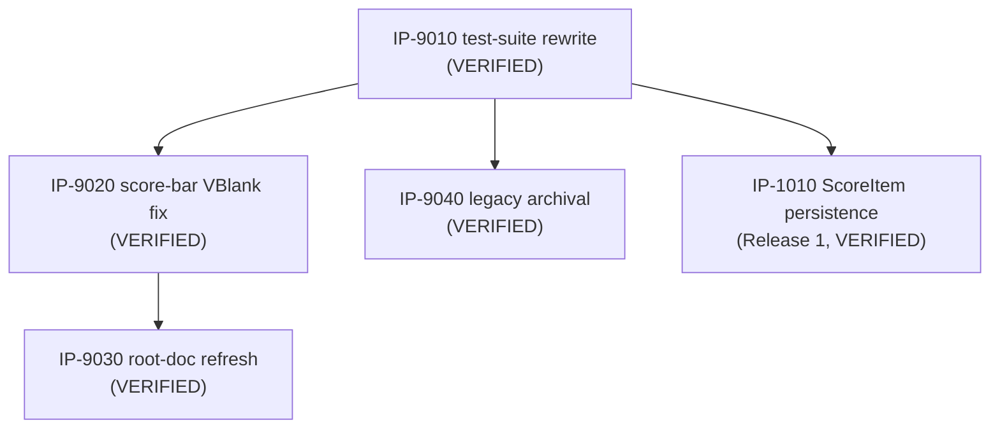

# Master Build Plan

> **Status: ✅ Bootstrap tranche fully VERIFIED (2026-07-10) — all five packages VERIFIED.** Owned by `07-implementation-planning`
> (rows/graph/authorization state) with status transitions written by the stage-08 peers
> (`IN PROGRESS`/`COMPLETE`/`BLOCKED`) and `09-package-verification` (`VERIFIED`, exclusively).
> Status vocabulary, verbatim: `NOT STARTED / READY / IN PROGRESS / BLOCKED / COMPLETE /
> VERIFIED`. `READY` requires fully-specified **and** all dependencies `VERIFIED`. Eligibility is
> not authorization (G3 — see `.claude/skills/README.md`, including the bootstrap carve-out).

[↑ Docs index](../INDEX.md) · [Packages](packages/INDEX.md) ·
[Verification reports](verification/INDEX.md) ·
[Technical Work Breakdown](01-technical-work-breakdown.md)

## Package status table

| Package | Title | Owner (08 peer) | Status | Depends on | Authorized? | Notes |
|---|---|---|---|---|---|---|
| [IP-9010](packages/IP-9010-test-suite-rewrite.md) | Test suite rewrite (BL-0006 + BL-0005) | `08-code-implementation` | **VERIFIED** | — | **YES — explicit user G3, 2026-07-07 (BL-0024)** | **Verified 2026-07-07 ([VR-9010](verification/VR-9010-test-suite-rewrite.md)):** 109/109 pass, ROM byte-identical, all DoD/checklist items confirmed independently. One Low finding: package cites nonexistent `NFR-7000` (should be `NFR-6100`). |
| [IP-9020](packages/IP-9020-score-bar-vblank-fix.md) | Score-bar VRAM write timing fix (BL-0003) | `08-code-implementation` | **VERIFIED** | IP-9010 (VERIFIED) | **YES** — G3 bootstrap carve-out (BL-0003 ∈ BL-0001…0005) | **Verified 2026-07-07 ([VR-9020](verification/VR-9020-score-bar-vblank-fix.md)):** sole call site confirmed at frame-top VBlank, all other VRAM writers LCD-off, T8.10a/b pass, 125/125. One Low finding: stale "pending verification" clauses (04-delta batch). |
| [IP-9030](packages/IP-9030-root-doc-refresh.md) | Root documentation refresh (BL-0007) | `08-code-implementation` | **VERIFIED** | IP-9010 (VERIFIED), IP-9020 (VERIFIED) | **YES — explicit user G3, 2026-07-07 (BL-0024)** | **Verified 2026-07-10 ([VR-9030](verification/VR-9030-root-doc-refresh.md)):** all three root docs confirmed accurate against the shipped tree and GDS ladder, stale-term sweep clean, README quick-start commands actually executed (byte-identical build, 125/125), WRAM pointer spot-check matches `asm_game.py`. No findings — bootstrap tranche complete. |
| [IP-9040](packages/IP-9040-legacy-artifact-archival.md) | Legacy artifact archival (BL-0004) | `08-code-implementation` | **VERIFIED** | IP-9010 (VERIFIED) | **YES** — G3 bootstrap carve-out + explicit user decision (run #1; widened scope run #2) | **Verified 2026-07-07 ([VR-9040](verification/VR-9040-legacy-artifact-archival.md)):** root clean, `legacy/` complete, history-preserving `git mv`, zero live references, ROM byte-identical, 125/125. No findings. |
| [IP-1010](packages/IP-1010-per-zone-scoreitem-persistence.md) | Per-zone ScoreItem persistence (FS-101 / FEAT-5100) | `08-code-implementation` | **VERIFIED** | IP-9010 (VERIFIED) | **YES — explicit user G3, 2026-07-07 (BL-0024)** | **Verified 2026-07-07 ([VR-1010](verification/VR-1010-per-zone-scoreitem-persistence.md)):** 125/125 pass independently re-run, ROM byte-identical rebuild, all DoD/checklist items confirmed, BL-0023 fix proven (T11.a4/a5). One Low finding: NFR-5200's "pending independent verification" clause now stale (04 delta). |

## Dependency graph

## Critical path & parallel opportunities

- **Critical path (Release 1, per FP-04):** IP-9010 → IP-1010.
- IP-9010 is `VERIFIED` (2026-07-07, [VR-9010](verification/VR-9010-test-suite-rewrite.md)) —
  the G5 gate is confirmed functional by independent re-run (109/109 pass, ROM byte-identical).
- IP-9020 is `VERIFIED` (2026-07-07, [VR-9020](verification/VR-9020-score-bar-vblank-fix.md)) —
  `IP-9030`'s last blocking dependency.
- IP-9040 is `VERIFIED` (2026-07-07, [VR-9040](verification/VR-9040-legacy-artifact-archival.md))
  — no downstream package depends on it.
- **IP-1010 is `VERIFIED` (2026-07-07, [VR-1010](verification/VR-1010-per-zone-scoreitem-persistence.md))
  — Release 1's critical path (IP-9010 → IP-1010) is complete end-to-end.**
- **IP-9030 is `VERIFIED` (2026-07-10, [VR-9030](verification/VR-9030-root-doc-refresh.md))** —
  the bootstrap tranche's last remaining package, verified in a fresh session per the
  same-session independence rule.
- **All five packages are now `VERIFIED`.** The bootstrap tranche is complete end-to-end;
  `10-integration-review` is the next unblocked step for this tranche.
- **Authorization state summary:** all five packages authorized — IP-9020/IP-9040 via the G3
  bootstrap carve-out; IP-9010/IP-9030/IP-1010 via the user's explicit go-ahead recorded
  2026-07-07 (`BL-0024`, "Authorize all three"). Execution order remains dependency-driven.
