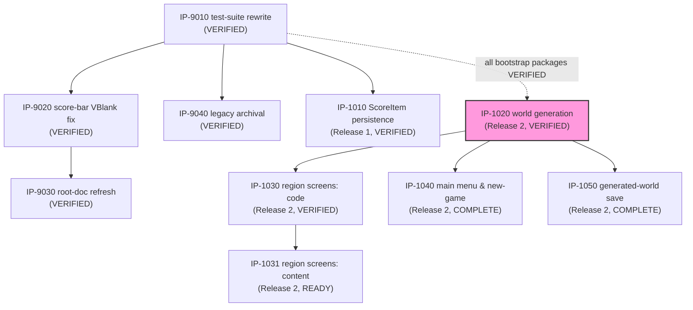

# Master Build Plan

> **Status: ✅ Bootstrap tranche fully VERIFIED (2026-07-10) — all five packages VERIFIED.**
> **Release 2 tranche (procgen-world increment): authorized 2026-07-10 (user G3, `BL-0040`, all
> five packages) — `IP-1020` (foundational, dependency-root) VERIFIED 2026-07-10
> ([VR-1020](verification/VR-1020-procedural-world-generation.md)); `IP-1030` (critical-path,
> code half) VERIFIED 2026-07-10 ([VR-1030](verification/VR-1030-generated-region-screen-composition-code.md)),
> which unblocked `IP-1031` (critical-path, content half) to `COMPLETE` 2026-07-11 — the
> tranche's critical path (`IP-1020`→`IP-1030`→`IP-1031`) is now fully implemented end-to-end,
> awaiting `IP-1031`'s own independent verification; `IP-1040` VERIFIED 2026-07-11
> ([VR-1040](verification/VR-1040-main-menu-new-game-flow.md)); `IP-1050` remains `COMPLETE`,
> awaiting independent verification.** Owned by `07-implementation-planning`
> (rows/graph/authorization state) with status transitions written by the stage-08 peers
> (`IN PROGRESS`/`COMPLETE`/`BLOCKED`) and `09-package-verification` (`VERIFIED`, exclusively).
> Status vocabulary, verbatim: `NOT STARTED / READY / IN PROGRESS / BLOCKED / COMPLETE /
> VERIFIED`. `READY` requires fully-specified **and** all dependencies `VERIFIED`. Eligibility is
> not authorization (G3 — see `.claude/skills/README.md`, including the bootstrap carve-out).

[↑ Docs index](../INDEX.md) · [Packages](packages/INDEX.md) ·
[Verification reports](verification/INDEX.md) ·
[Technical Work Breakdown](01-technical-work-breakdown.md)

## Package status table

| Package | Title | Owner (08 peer) | Status | Depends on | Authorized? | Notes |
|---|---|---|---|---|---|---|
| [IP-9010](packages/IP-9010-test-suite-rewrite.md) | Test suite rewrite (BL-0006 + BL-0005) | `08-code-implementation` | **VERIFIED** | — | **YES — explicit user G3, 2026-07-07 (BL-0024)** | **Verified 2026-07-07 ([VR-9010](verification/VR-9010-test-suite-rewrite.md)):** 109/109 pass, ROM byte-identical, all DoD/checklist items confirmed independently. One Low finding: package cites nonexistent `NFR-7000` (should be `NFR-6100`). |
| [IP-9020](packages/IP-9020-score-bar-vblank-fix.md) | Score-bar VRAM write timing fix (BL-0003) | `08-code-implementation` | **VERIFIED** | IP-9010 (VERIFIED) | **YES** — G3 bootstrap carve-out (BL-0003 ∈ BL-0001…0005) | **Verified 2026-07-07 ([VR-9020](verification/VR-9020-score-bar-vblank-fix.md)):** sole call site confirmed at frame-top VBlank, all other VRAM writers LCD-off, T8.10a/b pass, 125/125. One Low finding: stale "pending verification" clauses (04-delta batch). |
| [IP-9030](packages/IP-9030-root-doc-refresh.md) | Root documentation refresh (BL-0007) | `08-code-implementation` | **VERIFIED** | IP-9010 (VERIFIED), IP-9020 (VERIFIED) | **YES — explicit user G3, 2026-07-07 (BL-0024)** | **Verified 2026-07-10 ([VR-9030](verification/VR-9030-root-doc-refresh.md)):** all three root docs confirmed accurate against the shipped tree and GDS ladder, stale-term sweep clean, README quick-start commands actually executed (byte-identical build, 125/125), WRAM pointer spot-check matches `asm_game.py`. No findings — bootstrap tranche complete. |
| [IP-9040](packages/IP-9040-legacy-artifact-archival.md) | Legacy artifact archival (BL-0004) | `08-code-implementation` | **VERIFIED** | IP-9010 (VERIFIED) | **YES** — G3 bootstrap carve-out + explicit user decision (run #1; widened scope run #2) | **Verified 2026-07-07 ([VR-9040](verification/VR-9040-legacy-artifact-archival.md)):** root clean, `legacy/` complete, history-preserving `git mv`, zero live references, ROM byte-identical, 125/125. No findings. |
| [IP-1010](packages/IP-1010-per-zone-scoreitem-persistence.md) | Per-zone ScoreItem persistence (FS-101 / FEAT-5100) | `08-code-implementation` | **VERIFIED** | IP-9010 (VERIFIED) | **YES — explicit user G3, 2026-07-07 (BL-0024)** | **Verified 2026-07-07 ([VR-1010](verification/VR-1010-per-zone-scoreitem-persistence.md)):** 125/125 pass independently re-run, ROM byte-identical rebuild, all DoD/checklist items confirmed, BL-0023 fix proven (T11.a4/a5). One Low finding: NFR-5200's "pending independent verification" clause now stale (04 delta). |
| [IP-1020](packages/IP-1020-procedural-world-generation.md) | Procedural world generation & item-agnostic collection (FS-102 / FEAT-9000) | `08-code-implementation` | **VERIFIED** | IP-9010/9020/9030/9040/1010 (all VERIFIED) | **YES — explicit user G3, 2026-07-10 (BL-0040)** | **Verified 2026-07-10 ([VR-1020](verification/VR-1020-procedural-world-generation.md)):** 133/133 pass independently re-run (fresh container), ROM byte-identical rebuild (23660/32768 bytes), all 8 FS-102 ACs confirmed (T12.a–i + retargeted T8.7/T8.8), oracle/SM83 lockstep confirmed both by T12.b and direct side-by-side code read. `check_collisions`/`setup_zone_collects` generalized to `KEYITEM_FLAGS`/`KEYITEM_COUNT`, orphaning `CARROT_FLAGS` (companion fix to `update_map_hearts`/`st_intro`/`st_victory` confirmed necessary, not scope creep). `save_to_sram`/`try_load_save` deliberately untouched — `IP-1050`'s scope. This tranche's foundational package (critical path root) — `IP-1030`/`1040`/`1050` now `READY`. One Medium finding: `ROADMAP.md`'s `IM-00`/`IP-xxxx` rows stale (pre-dates this run). |
| [IP-1030](packages/IP-1030-generated-region-screen-composition-code.md) | Generated-region screen composition — code (FS-103 / FEAT-4100) | `08-code-implementation` | **VERIFIED** | IP-1020 (VERIFIED) | **YES — explicit user G3, 2026-07-10 (BL-0040)** | **Verified 2026-07-10 ([VR-1030](verification/VR-1030-generated-region-screen-composition-code.md)):** 180/180 pass on current tree head (IP-1030's own T13: 3/3), ROM byte-identical rebuild, both FS-103 ACs confirmed (T13.a tile-family audit, T13.b call-site audit), `_zone_arrows` retirement + scale=3 arrow-placement regression confirmed byte-for-byte (T13.c). `ALL_SCREENS` generalized from 14 fixed entries to 5 biome-family representatives (water→lake, sand→beach, grass→forest, stone→mountain, brick→castle — GDS-07's existing terrain-family/palette grouping; IP-1031 may revise, a one-line change) + 5 UI screens. Critical-path package — unblocks `IP-1031` to `READY`. No new findings. |
| [IP-1031](packages/IP-1031-generated-region-screen-composition-content.md) | Generated-region screen composition — content (FS-103 / FEAT-4100) | `08-content-authoring` | **COMPLETE — 180/180 checks pass** | IP-1020 (VERIFIED), IP-1030 (VERIFIED) | **YES — explicit user G3, 2026-07-10 (BL-0040)** | **Confirmation package, not new authorship:** `IP-1030`'s own commit (`3479dba`) already wired all 5 `(family_name, fn)` pairs this package specifies (Water→`lake_screen`, Sand→`beach_screen`, Grass→`forest_screen`, Stone→`mountain_screen`, Brick→`castle_screen`) directly into `ALL_SCREENS` as its default representative choice — `tilemaps.py` required zero further edits. This run independently confirmed the DoD: `tiles.py`/`build_rom.py` palette tables diff-clean (zero new art/palette entries), each family's tile-index usage falls within its own 8-tile-aligned block (IP-1030's own T13.a passes, no cross-family leakage), ROM rebuilds byte-identical (22344/32768 bytes), full suite 180/180. Rendered and screenshotted all 5 family screens in PyBoy (via `force_region_redraw`, mirroring T13.a's own method) — all read cleanly, correct family tiles/labels. Docs updated: GDS-08 §8 confirming note, FS-103 metadata. **Outstanding Issue:** the 07→08 package split assumed content work remained; in practice IP-1030's code-half package delivered the content mapping as an inherent side effect of generalizing `ALL_SCREENS`, since a working default had to be chosen to keep the code buildable/testable. Future packages splitting "code" from "content" across a data structure's *default values* should flag this coupling risk at planning time. First package `FEAT-6100`'s standard applies to (via a future `09-content-review` pass). |
| [IP-1040](packages/IP-1040-main-menu-new-game-flow.md) | Main menu & new-game flow (FS-104 / FEAT-1100) | `08-code-implementation` | **VERIFIED** | IP-1020 (VERIFIED) | **YES — explicit user G3, 2026-07-10 (BL-0040)** | **Verified 2026-07-11 ([VR-1040](verification/VR-1040-main-menu-new-game-flow.md)):** 180/180 pass (T14 sub-total 20/20), ROM byte-identical, all 6 FS-104 ACs confirmed, auto-load bypass confirmed genuinely retired (sole `try_load_save` call site), B-cancel writes nothing, exit-to-main-menu reuses the exact save-write routine, FR-9110 immutability holds under a systematic sweep. Two Low findings: stale "163/163" snapshot counts (corrected), commit message undercounted T14's own check count (cosmetic). Two new states (`GS_MAIN_MENU`, `GS_SEED_SCALE_ENTRY`) added; boot's unconditional `try_load_save` call replaced with an unconditional transition to `GS_MAIN_MENU` — retiring FR-1120's auto-load bypass (confirmed by direct code read: exactly one `try_load_save` call site remains, MAIN MENU's "continue" action). New `check_save_valid` probes magic+version (stricter than `try_load_save`'s own magic-only gate — ADR-0010: a version-mismatched save is absent for "continue" purposes). Digit-cursor SEED/SCALE ENTRY: 5 independent decimal digits + scale, composed into the real 16-bit `SEED` via saturating repeated-addition (`sse_compose_seed`, no general multiply needed) on A-confirm; B cancels to MAIN MENU without writing `SEED`/`WORLD_SCALE` (resolves FS-104 OQ1). D-pad up/down toggles MAIN MENU's highlighted option (resolves OQ2). `st_save` gains a third SELECT option (exit-to-main-menu, reuses `save_to_sram` verbatim); `st_victory`'s A-target changes to MAIN MENU. Two new screens (`main_menu_screen`/`seed_scale_entry_screen`, `tilemaps.py`) + 2 new `patches` pairs. **Cascading regression fixes** (the new boot flow ripples through every test that reaches PLAYING): `advance_to_playing` rewritten for the 3-step MAIN MENU→SEED/SCALE ENTRY→INTRO flow; T4/T5/T10/T11 updated for MAIN MENU replacing TITLE, the retired auto-load bypass (T10.6/T11.b3 now explicitly select "continue"), and ADR-0010's stricter pre-upgrade-save handling (T11.d1–d3 rewritten — a version-mismatched save no longer auto-loads at all, confirmed by `T11.d1b`). New suite **T14** (a–e, 20 checks — VR-1040 corrected the implementing commit's own "15 checks" undercount) added — package template named it "T13"; renumbered since IP-1030 claimed T13 earlier this tranche. ROM: 22344/32768 bytes (+3072 from IP-1030's 19272, ~10.2KB headroom remains). Parallel-eligible with IP-1030/1031/1050 — implemented independently of IP-1030's own COMPLETE state. |
| [IP-1050](packages/IP-1050-generated-world-save-persistence.md) | Generated-world save persistence (FS-105 / FEAT-5300) | `08-code-implementation` | **COMPLETE — 180/180 checks pass** | IP-1020 (VERIFIED) | **YES — explicit user G3, 2026-07-10 (BL-0040)** | Second save-format version bump since ship (`0x01`→`0x02`), extending IP-1010's exact pattern (a strictly monotonic sequence — a future extension must bump to `0x03`). `save_to_sram`/`try_load_save` extended with `SEED`/`WORLD_SCALE`/`KEYITEM_FLAGS` (81 bytes, via the existing `memcpy` subroutine rather than an unrolled loop) inside the existing single MBC1 bracket. `try_load_save`'s version-2 branch restores `SEED`/`WORLD_SCALE`, calls `IP-1020`'s `generate_world` to regenerate `REGION_GRAPH` (never itself persisted — confirmed by direct diff, T15.d), then restores `KEYITEM_FLAGS` onto the freshly-regenerated graph. `IP-1040`'s `check_save_valid`/`try_load_save` automatically consume the bumped version value via the shared `SAVE_VERSION_VAL` symbolic constant — zero code changes needed there; a version-1 save is now excluded from "continue" entirely. New suite **T15** (a–d, 17 checks) added — package template named it "T14"; renumbered since IP-1040 claimed T14 earlier this tranche. `T14.e1`'s static write-site audit (IP-1040) widened to also exclude `try_load_save`'s legitimate restore block. ROM: 22344/32768 bytes (unchanged after 0x100-boundary code padding; ~10.4KB headroom remains). Parallel-eligible with IP-1030/1031/1040 — implemented independently of both. |

**FEAT-6100 (Aesthetic & Biome-Transition Compliance) needs no package** — per FS-106 §8/§10, it
has no runtime behavior or module of its own; its standard (GDS-08 delta §7/§8) is already
authored and is first exercised via a future `09-content-review` pass on `IP-1031`'s content, not
via an Implementation Package.

## Dependency graph

*(The dotted edge into `IP1020` represents the Master Build Plan's own package-status
prerequisite — every Release-2 package's "Depends on" column names all five bootstrap packages,
all `VERIFIED` — not a functional dependency `FS-102` itself states. Solid edges are `FS-xxx`-
stated functional dependencies. `IP1020` highlighted pink as this tranche's foundational,
first-in-critical-path package.)*

## Critical path & parallel opportunities

- **Critical path (Release 1, per FP-04):** IP-9010 → IP-1010.
- IP-9010 is `VERIFIED` (2026-07-07, [VR-9010](verification/VR-9010-test-suite-rewrite.md)) —
  the G5 gate is confirmed functional by independent re-run (109/109 pass, ROM byte-identical).
- IP-9020 is `VERIFIED` (2026-07-07, [VR-9020](verification/VR-9020-score-bar-vblank-fix.md)) —
  `IP-9030`'s last blocking dependency.
- IP-9040 is `VERIFIED` (2026-07-07, [VR-9040](verification/VR-9040-legacy-artifact-archival.md))
  — no downstream package depends on it.
- **IP-1010 is `VERIFIED` (2026-07-07, [VR-1010](verification/VR-1010-per-zone-scoreitem-persistence.md))
  — Release 1's critical path (IP-9010 → IP-1010) is complete end-to-end.**
- **IP-9030 is `VERIFIED` (2026-07-10, [VR-9030](verification/VR-9030-root-doc-refresh.md))** —
  the bootstrap tranche's last remaining package, verified in a fresh session per the
  same-session independence rule.
- **All five packages are now `VERIFIED`.** The bootstrap tranche is complete end-to-end;
  `10-integration-review` is the next unblocked step for this tranche.
- **Authorization state summary (bootstrap tranche):** all five packages authorized — IP-9020/
  IP-9040 via the G3 bootstrap carve-out; IP-9010/IP-9030/IP-1010 via the user's explicit
  go-ahead recorded 2026-07-07 (`BL-0024`, "Authorize all three"). Execution order remains
  dependency-driven.

### Release 2 tranche (procgen-world increment, planned 2026-07-10)

- **Critical path (per FP-04/TWBS):** IP-1020 → IP-1030 → IP-1031 (3 packages) — the same
  3-node length FP-04's Feature-level critical path (FEAT-9000 → FEAT-4100 → FEAT-6100)
  predicted, since FEAT-6100 itself needs no package (see the package table's own note).
- **IP-1020 `VERIFIED`** (2026-07-10, [VR-1020](verification/VR-1020-procedural-world-generation.md))
  — this tranche's universal unblocker; every other package either consumes its generation output
  or triggers it. **IP-1030 `VERIFIED`** (2026-07-10, [VR-1030](verification/VR-1030-generated-region-screen-composition-code.md),
  180/180 on tree head, IP-1030's own T13: 3/3) — the critical path's second node, now cleared.
  **IP-1040 `COMPLETE`** (163/163) and **IP-1050 `COMPLETE`** (180/180) — both still awaiting
  independent verification (`COMPLETE` is not `VERIFIED`; see this table's own header rule).
  **IP-1031 is now `READY`** (both its dependencies, IP-1020 and IP-1030, are `VERIFIED`) — the
  critical path's final node, unblocked by this run.
- **Parallel opportunities exercised:** IP-1040 and IP-1050 each depend only on IP-1020
  (`VERIFIED`) and were implemented independently of IP-1030's own progress and of each other,
  exercising exactly the parallelism FP-04/TWBS predicted.
- **Authorization state summary (Release 2 tranche):** all five packages authorized — user's
  explicit "Authorize all five" (2026-07-10, `BL-0040`).
- **Prior framing (superseded):** this tranche was previously described as "no package
  authorized." This is genuinely new work — none of it falls under G3's bootstrap carve-out
  (as-built baselining, or remediation of `BL-0001`…`BL-0005`). **Explicit user G3 authorization
  is required before `08-code-implementation`/`08-content-authoring` can start any of these five
  packages.**
