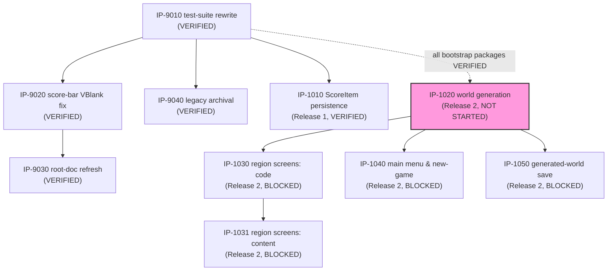

# Master Build Plan

> **Status: ✅ Bootstrap tranche fully VERIFIED (2026-07-10) — all five packages VERIFIED.**
> **Release 2 tranche (procgen-world increment) planned 2026-07-10 — five packages authored,
> none authorized (G3 pending, no bootstrap carve-out applies).** Owned by `07-implementation-planning`
> (rows/graph/authorization state) with status transitions written by the stage-08 peers
> (`IN PROGRESS`/`COMPLETE`/`BLOCKED`) and `09-package-verification` (`VERIFIED`, exclusively).
> Status vocabulary, verbatim: `NOT STARTED / READY / IN PROGRESS / BLOCKED / COMPLETE /
> VERIFIED`. `READY` requires fully-specified **and** all dependencies `VERIFIED`. Eligibility is
> not authorization (G3 — see `.claude/skills/README.md`, including the bootstrap carve-out).

[↑ Docs index](../INDEX.md) · [Packages](packages/INDEX.md) ·
[Verification reports](verification/INDEX.md) ·
[Technical Work Breakdown](01-technical-work-breakdown.md)

## Package status table

| Package | Title | Owner (08 peer) | Status | Depends on | Authorized? | Notes |
|---|---|---|---|---|---|---|
| [IP-9010](packages/IP-9010-test-suite-rewrite.md) | Test suite rewrite (BL-0006 + BL-0005) | `08-code-implementation` | **VERIFIED** | — | **YES — explicit user G3, 2026-07-07 (BL-0024)** | **Verified 2026-07-07 ([VR-9010](verification/VR-9010-test-suite-rewrite.md)):** 109/109 pass, ROM byte-identical, all DoD/checklist items confirmed independently. One Low finding: package cites nonexistent `NFR-7000` (should be `NFR-6100`). |
| [IP-9020](packages/IP-9020-score-bar-vblank-fix.md) | Score-bar VRAM write timing fix (BL-0003) | `08-code-implementation` | **VERIFIED** | IP-9010 (VERIFIED) | **YES** — G3 bootstrap carve-out (BL-0003 ∈ BL-0001…0005) | **Verified 2026-07-07 ([VR-9020](verification/VR-9020-score-bar-vblank-fix.md)):** sole call site confirmed at frame-top VBlank, all other VRAM writers LCD-off, T8.10a/b pass, 125/125. One Low finding: stale "pending verification" clauses (04-delta batch). |
| [IP-9030](packages/IP-9030-root-doc-refresh.md) | Root documentation refresh (BL-0007) | `08-code-implementation` | **VERIFIED** | IP-9010 (VERIFIED), IP-9020 (VERIFIED) | **YES — explicit user G3, 2026-07-07 (BL-0024)** | **Verified 2026-07-10 ([VR-9030](verification/VR-9030-root-doc-refresh.md)):** all three root docs confirmed accurate against the shipped tree and GDS ladder, stale-term sweep clean, README quick-start commands actually executed (byte-identical build, 125/125), WRAM pointer spot-check matches `asm_game.py`. No findings — bootstrap tranche complete. |
| [IP-9040](packages/IP-9040-legacy-artifact-archival.md) | Legacy artifact archival (BL-0004) | `08-code-implementation` | **VERIFIED** | IP-9010 (VERIFIED) | **YES** — G3 bootstrap carve-out + explicit user decision (run #1; widened scope run #2) | **Verified 2026-07-07 ([VR-9040](verification/VR-9040-legacy-artifact-archival.md)):** root clean, `legacy/` complete, history-preserving `git mv`, zero live references, ROM byte-identical, 125/125. No findings. |
| [IP-1010](packages/IP-1010-per-zone-scoreitem-persistence.md) | Per-zone ScoreItem persistence (FS-101 / FEAT-5100) | `08-code-implementation` | **VERIFIED** | IP-9010 (VERIFIED) | **YES — explicit user G3, 2026-07-07 (BL-0024)** | **Verified 2026-07-07 ([VR-1010](verification/VR-1010-per-zone-scoreitem-persistence.md)):** 125/125 pass independently re-run, ROM byte-identical rebuild, all DoD/checklist items confirmed, BL-0023 fix proven (T11.a4/a5). One Low finding: NFR-5200's "pending independent verification" clause now stale (04 delta). |
| [IP-1020](packages/IP-1020-procedural-world-generation.md) | Procedural world generation & item-agnostic collection (FS-102 / FEAT-9000) | `08-code-implementation` | **NOT STARTED** | IP-9010/9020/9030/9040/1010 (all VERIFIED) | **NOT AUTHORIZED — G3 pending** | Resolves FS-102 OQ1–3: flood-fill biome assignment over a fixed `scale×scale` grid (reachability trivial by construction), linear 5-family grammar axis (Water-Sand-Grass-Stone-Brick, no ROM table needed), `worldgen.py` oracle authored in lockstep. This tranche's foundational package (critical path root). |
| [IP-1030](packages/IP-1030-generated-region-screen-composition-code.md) | Generated-region screen composition — code (FS-103 / FEAT-4100) | `08-code-implementation` | **BLOCKED** | IP-1020 | **NOT AUTHORIZED — G3 pending** | `ALL_SCREENS` generalized to 5 biome-family entries; `_zone_arrows`' hardcoded rectangle math retired in favor of reading `REGION_GRAPH` neighbor data (ADR-0009 point 6). |
| [IP-1031](packages/IP-1031-generated-region-screen-composition-content.md) | Generated-region screen composition — content (FS-103 / FEAT-4100) | `08-content-authoring` | **BLOCKED** | IP-1020, IP-1030 | **NOT AUTHORIZED — G3 pending** | Registers 5 existing shipped zone-screen functions as biome-family representatives — zero new tile art, zero new palette entries. First package `FEAT-6100`'s standard applies to (via a future `09-content-review` pass). |
| [IP-1040](packages/IP-1040-main-menu-new-game-flow.md) | Main menu & new-game flow (FS-104 / FEAT-1100) | `08-code-implementation` | **BLOCKED** | IP-1020 | **NOT AUTHORIZED — G3 pending** | Resolves FS-104 OQ1–2: B-cancels-to-MAIN-MENU convention, cursor-based menu input. Retires the shipped auto-load bypass (FR-1120). Parallel-eligible with IP-1030/1031/1050. |
| [IP-1050](packages/IP-1050-generated-world-save-persistence.md) | Generated-world save persistence (FS-105 / FEAT-5300) | `08-code-implementation` | **BLOCKED** | IP-1020 | **NOT AUTHORIZED — G3 pending** | Second save-format version bump since ship (`0x01`→`0x02`), extending IP-1010's exact pattern. Region graph never persisted — regenerates from (SEED, WORLD_SCALE) on load. Parallel-eligible with IP-1030/1031/1040. |

**FEAT-6100 (Aesthetic & Biome-Transition Compliance) needs no package** — per FS-106 §8/§10, it
has no runtime behavior or module of its own; its standard (GDS-08 delta §7/§8) is already
authored and is first exercised via a future `09-content-review` pass on `IP-1031`'s content, not
via an Implementation Package.

## Dependency graph

*(The dotted edge into `IP1020` represents the Master Build Plan's own package-status
prerequisite — every Release-2 package's "Depends on" column names all five bootstrap packages,
all `VERIFIED` — not a functional dependency `FS-102` itself states. Solid edges are `FS-xxx`-
stated functional dependencies. `IP1020` highlighted pink as this tranche's foundational,
first-in-critical-path package.)*

## Critical path & parallel opportunities

- **Critical path (Release 1, per FP-04):** IP-9010 → IP-1010.
- IP-9010 is `VERIFIED` (2026-07-07, [VR-9010](verification/VR-9010-test-suite-rewrite.md)) —
  the G5 gate is confirmed functional by independent re-run (109/109 pass, ROM byte-identical).
- IP-9020 is `VERIFIED` (2026-07-07, [VR-9020](verification/VR-9020-score-bar-vblank-fix.md)) —
  `IP-9030`'s last blocking dependency.
- IP-9040 is `VERIFIED` (2026-07-07, [VR-9040](verification/VR-9040-legacy-artifact-archival.md))
  — no downstream package depends on it.
- **IP-1010 is `VERIFIED` (2026-07-07, [VR-1010](verification/VR-1010-per-zone-scoreitem-persistence.md))
  — Release 1's critical path (IP-9010 → IP-1010) is complete end-to-end.**
- **IP-9030 is `VERIFIED` (2026-07-10, [VR-9030](verification/VR-9030-root-doc-refresh.md))** —
  the bootstrap tranche's last remaining package, verified in a fresh session per the
  same-session independence rule.
- **All five packages are now `VERIFIED`.** The bootstrap tranche is complete end-to-end;
  `10-integration-review` is the next unblocked step for this tranche.
- **Authorization state summary (bootstrap tranche):** all five packages authorized — IP-9020/
  IP-9040 via the G3 bootstrap carve-out; IP-9010/IP-9030/IP-1010 via the user's explicit
  go-ahead recorded 2026-07-07 (`BL-0024`, "Authorize all three"). Execution order remains
  dependency-driven.

### Release 2 tranche (procgen-world increment, planned 2026-07-10)

- **Critical path (per FP-04/TWBS):** IP-1020 → IP-1030 → IP-1031 (3 packages) — the same
  3-node length FP-04's Feature-level critical path (FEAT-9000 → FEAT-4100 → FEAT-6100)
  predicted, since FEAT-6100 itself needs no package (see the package table's own note).
- **IP-1020 is this tranche's universal unblocker** — every other package either consumes its
  generation output or triggers it. `NOT STARTED`; all four others are `BLOCKED` on it.
- **Parallel opportunities:** IP-1040 and IP-1050 each depend only on IP-1020 — both are
  parallel-eligible with each other and with IP-1030/IP-1031 once IP-1020 lands.
- **Authorization state summary (Release 2 tranche):** **no package in this tranche is
  authorized.** This is genuinely new work — none of it falls under G3's bootstrap carve-out
  (as-built baselining, or remediation of `BL-0001`…`BL-0005`). **Explicit user G3 authorization
  is required before `08-code-implementation`/`08-content-authoring` can start any of these five
  packages.**
