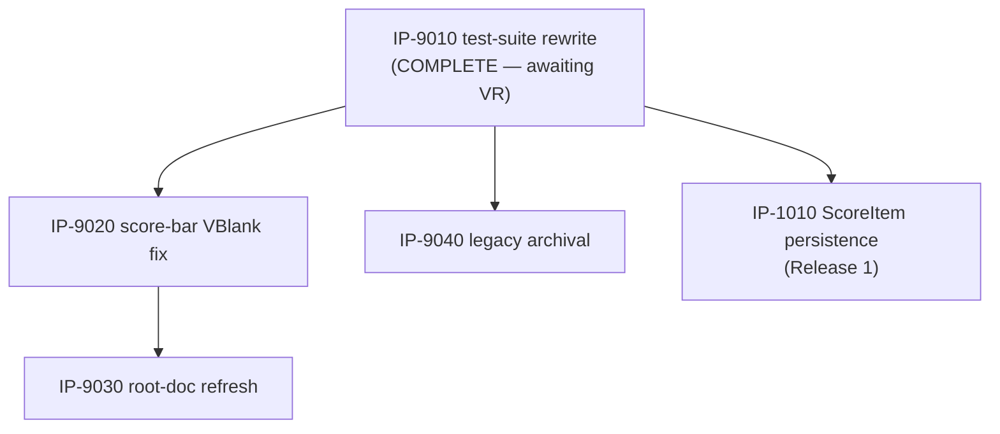

# Master Build Plan

> **Status: ♻️ live — first packages planned 2026-07-07.** Owned by `07-implementation-planning`
> (rows/graph/authorization state) with status transitions written by the stage-08 peers
> (`IN PROGRESS`/`COMPLETE`/`BLOCKED`) and `09-package-verification` (`VERIFIED`, exclusively).
> Status vocabulary, verbatim: `NOT STARTED / READY / IN PROGRESS / BLOCKED / COMPLETE /
> VERIFIED`. `READY` requires fully-specified **and** all dependencies `VERIFIED`. Eligibility is
> not authorization (G3 — see `.claude/skills/README.md`, including the bootstrap carve-out).

[↑ Docs index](../INDEX.md) · [Packages](packages/INDEX.md) ·
[Verification reports](verification/INDEX.md) ·
[Technical Work Breakdown](01-technical-work-breakdown.md)

## Package status table

| Package | Title | Owner (08 peer) | Status | Depends on | Authorized? | Notes |
|---|---|---|---|---|---|---|
| [IP-9010](packages/IP-9010-test-suite-rewrite.md) | Test suite rewrite (BL-0006 + BL-0005) | `08-code-implementation` | COMPLETE | — | **YES — explicit user G3, 2026-07-07 (BL-0024)** | **Implemented 2026-07-07:** suite rewritten (109/109 pass), paths repo-relative, ROM byte-identical, BL-0017 check included. Awaiting `09-package-verification`. |
| [IP-9020](packages/IP-9020-score-bar-vblank-fix.md) | Score-bar VRAM write timing fix (BL-0003) | `08-code-implementation` | BLOCKED | IP-9010 | **YES** — G3 bootstrap carve-out (BL-0003 ∈ BL-0001…0005) | Closes NFR-1200 NOT MET. Rider: BL-0019 headroom check. |
| [IP-9030](packages/IP-9030-root-doc-refresh.md) | Root documentation refresh (BL-0007) | `08-code-implementation` | BLOCKED | IP-9010, IP-9020 | **YES — explicit user G3, 2026-07-07 (BL-0024)** | Docs-only; must land after the fixes it documents. |
| [IP-9040](packages/IP-9040-legacy-artifact-archival.md) | Legacy artifact archival (BL-0004) | `08-code-implementation` | BLOCKED | IP-9010 | **YES** — G3 bootstrap carve-out + explicit user decision (run #1; widened scope run #2) | Pure git-mv hygiene; blocked only by the G5 gate's availability. |
| [IP-1010](packages/IP-1010-per-zone-scoreitem-persistence.md) | Per-zone ScoreItem persistence (FS-101 / FEAT-5100) | `08-code-implementation` | BLOCKED | IP-9010 | **YES — explicit user G3, 2026-07-07 (BL-0024)** | Release 1's sole Feature. Fixes BL-0023 as designed side effect. Rider: BL-0019 headroom check. |

## Dependency graph

## Critical path & parallel opportunities

- **Critical path (Release 1, per FP-04):** IP-9010 → IP-1010.
- IP-9010 is `COMPLETE` (2026-07-07) — downstream packages stay `BLOCKED` until it is `VERIFIED` by stage 09 (`COMPLETE` is not sufficient).
- **After IP-9010 is `VERIFIED`:** IP-9020, IP-9040, and IP-1010 can proceed in parallel
  (independent files/concerns); IP-9030 follows IP-9020.
- **IP-9010 blocks everything** because the G5 permanent gate ("full `test_rom.py` suite
  passes") is unsatisfiable until the suite stops asserting pre-rewrite semantics (BL-0006,
  Critical) — sequencing it first is the whole plan's leverage.
- **Authorization state summary:** all five packages authorized — IP-9020/IP-9040 via the G3
  bootstrap carve-out; IP-9010/IP-9030/IP-1010 via the user's explicit go-ahead recorded
  2026-07-07 (`BL-0024`, "Authorize all three"). Execution order remains dependency-driven.
