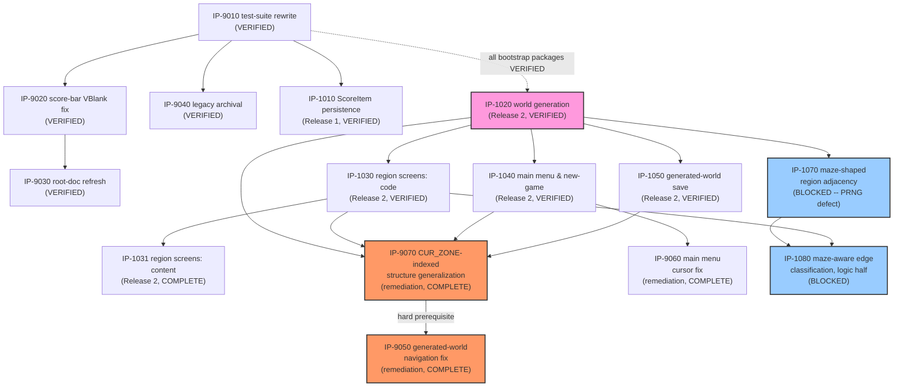

# Master Build Plan

> **Status: ✅ Bootstrap tranche fully VERIFIED (2026-07-10) — all five packages VERIFIED.**
> **Release 2 tranche (procgen-world increment): authorized 2026-07-10 (user G3, `BL-0040`, all
> five packages) — `IP-1020` (foundational, dependency-root) VERIFIED 2026-07-10
> ([VR-1020](verification/VR-1020-procedural-world-generation.md)); `IP-1030` (critical-path,
> code half) VERIFIED 2026-07-10 ([VR-1030](verification/VR-1030-generated-region-screen-composition-code.md)),
> which unblocked `IP-1031` (critical-path, content half) to `COMPLETE` 2026-07-11 — the
> tranche's critical path (`IP-1020`→`IP-1030`→`IP-1031`) is now fully implemented end-to-end,
> awaiting `IP-1031`'s own independent verification (blocked this session on the same-session
> independence rule — needs a fresh session); `IP-1040`/`IP-1050` both VERIFIED 2026-07-11
> ([VR-1040](verification/VR-1040-main-menu-new-game-flow.md),
> [VR-1050](verification/VR-1050-generated-world-save-persistence.md)). Four of five Release-2
> packages VERIFIED; only `IP-1031` remains.** **Post-ship remediation tranche planned
> 2026-07-11** (`IP-9050`/`IP-9060`/`IP-9070`, five bugs from playtesting — see below) — **all
> three packages authorized 2026-07-11 (user G3, `BL-0062`); all three reached `COMPLETE` the
> same session (implementer independence required before any can reach `VERIFIED`).** **Maze-
> shaped region adjacency tranche planned 2026-07-11** (`IP-1070`/`IP-1080`, `FS-107`/`FS-108`
> logic half, `ADR-0012`) — **`IP-1070` authorized (user G3, `BL-0069`), but `08-code-
> implementation`'s 2026-07-11 attempt hit a Blocking Report: the shipped PRNG (`gw_prng_step`)
> collapses to a degenerate short cycle/fixed point across the many back-to-back draws the braid
> pass needs, undermining `FR-9150`'s own reopen-fraction guarantee — routed to
> `02-research-gbc-hardware`/`03-architecture-design-synthesis`, not fixed here.** `IP-1080`
> remains unauthorized and `BLOCKED` on `IP-1070` reaching `VERIFIED` (now further out).
> `FS-108`'s rendering half remains unplanned, riding `BL-0068`'s still-open `GDS-08` delta.
> Owned by
> `07-implementation-planning`
> (rows/graph/authorization state) with status transitions written by the stage-08 peers
> (`IN PROGRESS`/`COMPLETE`/`BLOCKED`) and `09-package-verification` (`VERIFIED`, exclusively).
> Status vocabulary, verbatim: `NOT STARTED / READY / IN PROGRESS / BLOCKED / COMPLETE /
> VERIFIED`. `READY` requires fully-specified **and** all dependencies `VERIFIED`. Eligibility is
> not authorization (G3 — see `.claude/skills/README.md`, including the bootstrap carve-out).

[↑ Docs index](../INDEX.md) · [Packages](packages/INDEX.md) ·
[Verification reports](verification/INDEX.md) ·
[Technical Work Breakdown](01-technical-work-breakdown.md)

## Package status table

| Package | Title | Owner (08 peer) | Status | Depends on | Authorized? | Notes |
|---|---|---|---|---|---|---|
| [IP-9010](packages/IP-9010-test-suite-rewrite.md) | Test suite rewrite (BL-0006 + BL-0005) | `08-code-implementation` | **VERIFIED** | — | **YES — explicit user G3, 2026-07-07 (BL-0024)** | **Verified 2026-07-07 ([VR-9010](verification/VR-9010-test-suite-rewrite.md)):** 109/109 pass, ROM byte-identical, all DoD/checklist items confirmed independently. One Low finding: package cites nonexistent `NFR-7000` (should be `NFR-6100`). |
| [IP-9020](packages/IP-9020-score-bar-vblank-fix.md) | Score-bar VRAM write timing fix (BL-0003) | `08-code-implementation` | **VERIFIED** | IP-9010 (VERIFIED) | **YES** — G3 bootstrap carve-out (BL-0003 ∈ BL-0001…0005) | **Verified 2026-07-07 ([VR-9020](verification/VR-9020-score-bar-vblank-fix.md)):** sole call site confirmed at frame-top VBlank, all other VRAM writers LCD-off, T8.10a/b pass, 125/125. One Low finding: stale "pending verification" clauses (04-delta batch). |
| [IP-9030](packages/IP-9030-root-doc-refresh.md) | Root documentation refresh (BL-0007) | `08-code-implementation` | **VERIFIED** | IP-9010 (VERIFIED), IP-9020 (VERIFIED) | **YES — explicit user G3, 2026-07-07 (BL-0024)** | **Verified 2026-07-10 ([VR-9030](verification/VR-9030-root-doc-refresh.md)):** all three root docs confirmed accurate against the shipped tree and GDS ladder, stale-term sweep clean, README quick-start commands actually executed (byte-identical build, 125/125), WRAM pointer spot-check matches `asm_game.py`. No findings — bootstrap tranche complete. |
| [IP-9040](packages/IP-9040-legacy-artifact-archival.md) | Legacy artifact archival (BL-0004) | `08-code-implementation` | **VERIFIED** | IP-9010 (VERIFIED) | **YES** — G3 bootstrap carve-out + explicit user decision (run #1; widened scope run #2) | **Verified 2026-07-07 ([VR-9040](verification/VR-9040-legacy-artifact-archival.md)):** root clean, `legacy/` complete, history-preserving `git mv`, zero live references, ROM byte-identical, 125/125. No findings. |
| [IP-1010](packages/IP-1010-per-zone-scoreitem-persistence.md) | Per-zone ScoreItem persistence (FS-101 / FEAT-5100) | `08-code-implementation` | **VERIFIED** | IP-9010 (VERIFIED) | **YES — explicit user G3, 2026-07-07 (BL-0024)** | **Verified 2026-07-07 ([VR-1010](verification/VR-1010-per-zone-scoreitem-persistence.md)):** 125/125 pass independently re-run, ROM byte-identical rebuild, all DoD/checklist items confirmed, BL-0023 fix proven (T11.a4/a5). One Low finding: NFR-5200's "pending independent verification" clause now stale (04 delta). |
| [IP-1020](packages/IP-1020-procedural-world-generation.md) | Procedural world generation & item-agnostic collection (FS-102 / FEAT-9000) | `08-code-implementation` | **VERIFIED** | IP-9010/9020/9030/9040/1010 (all VERIFIED) | **YES — explicit user G3, 2026-07-10 (BL-0040)** | **Verified 2026-07-10 ([VR-1020](verification/VR-1020-procedural-world-generation.md)):** 133/133 pass independently re-run (fresh container), ROM byte-identical rebuild (23660/32768 bytes), all 8 FS-102 ACs confirmed (T12.a–i + retargeted T8.7/T8.8), oracle/SM83 lockstep confirmed both by T12.b and direct side-by-side code read. `check_collisions`/`setup_zone_collects` generalized to `KEYITEM_FLAGS`/`KEYITEM_COUNT`, orphaning `CARROT_FLAGS` (companion fix to `update_map_hearts`/`st_intro`/`st_victory` confirmed necessary, not scope creep). `save_to_sram`/`try_load_save` deliberately untouched — `IP-1050`'s scope. This tranche's foundational package (critical path root) — `IP-1030`/`1040`/`1050` now `READY`. One Medium finding: `ROADMAP.md`'s `IM-00`/`IP-xxxx` rows stale (pre-dates this run). |
| [IP-1030](packages/IP-1030-generated-region-screen-composition-code.md) | Generated-region screen composition — code (FS-103 / FEAT-4100) | `08-code-implementation` | **VERIFIED** | IP-1020 (VERIFIED) | **YES — explicit user G3, 2026-07-10 (BL-0040)** | **Verified 2026-07-10 ([VR-1030](verification/VR-1030-generated-region-screen-composition-code.md)):** 180/180 pass on current tree head (IP-1030's own T13: 3/3), ROM byte-identical rebuild, both FS-103 ACs confirmed (T13.a tile-family audit, T13.b call-site audit), `_zone_arrows` retirement + scale=3 arrow-placement regression confirmed byte-for-byte (T13.c). `ALL_SCREENS` generalized from 14 fixed entries to 5 biome-family representatives (water→lake, sand→beach, grass→forest, stone→mountain, brick→castle — GDS-07's existing terrain-family/palette grouping; IP-1031 may revise, a one-line change) + 5 UI screens. Critical-path package — unblocks `IP-1031` to `READY`. No new findings. |
| [IP-1031](packages/IP-1031-generated-region-screen-composition-content.md) | Generated-region screen composition — content (FS-103 / FEAT-4100) | `08-content-authoring` | **COMPLETE — 180/180 checks pass** | IP-1020 (VERIFIED), IP-1030 (VERIFIED) | **YES — explicit user G3, 2026-07-10 (BL-0040)** | **Confirmation package, not new authorship:** `IP-1030`'s own commit (`3479dba`) already wired all 5 `(family_name, fn)` pairs this package specifies (Water→`lake_screen`, Sand→`beach_screen`, Grass→`forest_screen`, Stone→`mountain_screen`, Brick→`castle_screen`) directly into `ALL_SCREENS` as its default representative choice — `tilemaps.py` required zero further edits. This run independently confirmed the DoD: `tiles.py`/`build_rom.py` palette tables diff-clean (zero new art/palette entries), each family's tile-index usage falls within its own 8-tile-aligned block (IP-1030's own T13.a passes, no cross-family leakage), ROM rebuilds byte-identical (22344/32768 bytes), full suite 180/180. Rendered and screenshotted all 5 family screens in PyBoy (via `force_region_redraw`, mirroring T13.a's own method) — all read cleanly, correct family tiles/labels. Docs updated: GDS-08 §8 confirming note, FS-103 metadata. **Outstanding Issue:** the 07→08 package split assumed content work remained; in practice IP-1030's code-half package delivered the content mapping as an inherent side effect of generalizing `ALL_SCREENS`, since a working default had to be chosen to keep the code buildable/testable. Future packages splitting "code" from "content" across a data structure's *default values* should flag this coupling risk at planning time. First package `FEAT-6100`'s standard applies to (via a future `09-content-review` pass). |
| [IP-1040](packages/IP-1040-main-menu-new-game-flow.md) | Main menu & new-game flow (FS-104 / FEAT-1100) | `08-code-implementation` | **VERIFIED** | IP-1020 (VERIFIED) | **YES — explicit user G3, 2026-07-10 (BL-0040)** | **Verified 2026-07-11 ([VR-1040](verification/VR-1040-main-menu-new-game-flow.md)):** 180/180 pass (T14 sub-total 20/20), ROM byte-identical, all 6 FS-104 ACs confirmed, auto-load bypass confirmed genuinely retired (sole `try_load_save` call site), B-cancel writes nothing, exit-to-main-menu reuses the exact save-write routine, FR-9110 immutability holds under a systematic sweep. Two Low findings: stale "163/163" snapshot counts (corrected), commit message undercounted T14's own check count (cosmetic). Two new states (`GS_MAIN_MENU`, `GS_SEED_SCALE_ENTRY`) added; boot's unconditional `try_load_save` call replaced with an unconditional transition to `GS_MAIN_MENU` — retiring FR-1120's auto-load bypass (confirmed by direct code read: exactly one `try_load_save` call site remains, MAIN MENU's "continue" action). New `check_save_valid` probes magic+version (stricter than `try_load_save`'s own magic-only gate — ADR-0010: a version-mismatched save is absent for "continue" purposes). Digit-cursor SEED/SCALE ENTRY: 5 independent decimal digits + scale, composed into the real 16-bit `SEED` via saturating repeated-addition (`sse_compose_seed`, no general multiply needed) on A-confirm; B cancels to MAIN MENU without writing `SEED`/`WORLD_SCALE` (resolves FS-104 OQ1). D-pad up/down toggles MAIN MENU's highlighted option (resolves OQ2). `st_save` gains a third SELECT option (exit-to-main-menu, reuses `save_to_sram` verbatim); `st_victory`'s A-target changes to MAIN MENU. Two new screens (`main_menu_screen`/`seed_scale_entry_screen`, `tilemaps.py`) + 2 new `patches` pairs. **Cascading regression fixes** (the new boot flow ripples through every test that reaches PLAYING): `advance_to_playing` rewritten for the 3-step MAIN MENU→SEED/SCALE ENTRY→INTRO flow; T4/T5/T10/T11 updated for MAIN MENU replacing TITLE, the retired auto-load bypass (T10.6/T11.b3 now explicitly select "continue"), and ADR-0010's stricter pre-upgrade-save handling (T11.d1–d3 rewritten — a version-mismatched save no longer auto-loads at all, confirmed by `T11.d1b`). New suite **T14** (a–e, 20 checks — VR-1040 corrected the implementing commit's own "15 checks" undercount) added — package template named it "T13"; renumbered since IP-1030 claimed T13 earlier this tranche. ROM: 22344/32768 bytes (+3072 from IP-1030's 19272, ~10.2KB headroom remains). Parallel-eligible with IP-1030/1031/1050 — implemented independently of IP-1030's own COMPLETE state. |
| [IP-1050](packages/IP-1050-generated-world-save-persistence.md) | Generated-world save persistence (FS-105 / FEAT-5300) | `08-code-implementation` | **VERIFIED** | IP-1020 (VERIFIED) | **YES — explicit user G3, 2026-07-10 (BL-0040)** | **Verified 2026-07-11 ([VR-1050](verification/VR-1050-generated-world-save-persistence.md)):** 180/180 pass (T15: 17/17, matching the implementing commit's own count exactly), ROM byte-identical, both FS-105 ACs confirmed, single MBC1 bracket preserved, `REGION_GRAPH` confirmed never persisted, legacy fields round-trip, pre-upgrade saves cleanly rejected. No findings. Second save-format version bump since ship (`0x01`→`0x02`), extending IP-1010's exact pattern (a strictly monotonic sequence — a future extension must bump to `0x03`). `save_to_sram`/`try_load_save` extended with `SEED`/`WORLD_SCALE`/`KEYITEM_FLAGS` (81 bytes, via the existing `memcpy` subroutine rather than an unrolled loop) inside the existing single MBC1 bracket. `try_load_save`'s version-2 branch restores `SEED`/`WORLD_SCALE`, calls `IP-1020`'s `generate_world` to regenerate `REGION_GRAPH` (never itself persisted — confirmed by direct diff, T15.d), then restores `KEYITEM_FLAGS` onto the freshly-regenerated graph. `IP-1040`'s `check_save_valid`/`try_load_save` automatically consume the bumped version value via the shared `SAVE_VERSION_VAL` symbolic constant — zero code changes needed there; a version-1 save is now excluded from "continue" entirely. New suite **T15** (a–d, 17 checks) added — package template named it "T14"; renumbered since IP-1040 claimed T14 earlier this tranche. `T14.e1`'s static write-site audit (IP-1040) widened to also exclude `try_load_save`'s legitimate restore block. ROM: 22344/32768 bytes (unchanged after 0x100-boundary code padding; ~10.4KB headroom remains). Parallel-eligible with IP-1030/1031/1040 — implemented independently of both. |
| [IP-9070](packages/IP-9070-cur-zone-indexed-structures-generalization.md) | `CUR_ZONE`-indexed structure generalization (BL-0058 + BL-0059) | `08-code-implementation` | **COMPLETE — 193/193 checks pass** | IP-1020 (VERIFIED), IP-1030 (VERIFIED), IP-1040 (VERIFIED), IP-1050 (VERIFIED) | **YES — explicit user G3, 2026-07-11 (BL-0062)** | **Implementation Summary (2026-07-11).** Files Modified: `asm_game.py` (`SCOREITEM_FLAGS` relocated `0xC060`→`0xC286`, widened 9→81 bytes; `SRAM_SCOREITEM` relocated `0xA013`→`0xA070`, widened 9→81 bytes; `SAVE_VERSION_VAL` `0x02`→`0x03`; `st_intro`/`st_victory` clear loops widened to 81 bytes; `save_to_sram`/`try_load_save` converted to 81-byte `memcpy` transfers; `setup_zone_collects` rewritten to read `REGION_GRAPH`'s biome-id and index `zc_table` by it, not `CUR_ZONE`), `tilemaps.py` (`ZONE_COLLECTS` reduced 9→5 biome-family lists, docstring corrected), `test_rom.py` (T1.10 fixed; T8/T11/T15 hardcoded-position fixes for the Forest-list region-0 default; new suite **T16 a–e**, 13 checks; stale pre-relocation `SCOREITEM_FLAGS`/`SRAM_SCOREITEM` test constants corrected to the real new addresses — a latent gap where T11.d2/T15.c5-6 had been passing against the wrong WRAM location). Files Created: none. Tests Added: T16.a (bounds/BL-0058 regression), T16.b (biome-keyed lookup/BL-0059 regression), T16.c (save-format v3 round-trip incl. region 80), T16.d (pre-upgrade rejection, version-2 fixture), T16.e (legacy-field regression at scale=7). Tests Passed: 193/193 (up from 180/180; ROM 22216/32768 bytes, down from 22344 — net WRAM/ROM layout change, zero code-size regression). Requirements Implemented: FR-5220 generalization, `BL-0058`/`BL-0059` fixes. Documentation Updated: GDS-07 §2/§3 tables + new §7a, GDS-08 §8 extension, `memory.md` collectible quick-ref, NFR-4200 (SRAM half MET), NFR-5300 (third version bump). Traceability Updated: this row. Outstanding Issues: none — `IP-9050` (`BL-0047`'s own fix) is the dependent package this unblocks. Discovered by `BL-0047`'s own mandatory supersession sweep. |
| [IP-9050](packages/IP-9050-generated-world-navigation-fix.md) | Generated-world navigation fix (BL-0047) | `08-code-implementation` | **COMPLETE — 213/213 checks pass** | IP-9070 (COMPLETE — hard prerequisite), IP-1020 (VERIFIED), IP-1030 (VERIFIED) | **YES — explicit user G3, 2026-07-11 (BL-0062)** | **Implementation Summary (2026-07-11).** Files Modified: `asm_game.py` (`check_zone_transition` fully rewritten — new shared `czt_region_hl` subroutine computes `HL = REGION_GRAPH + CUR_ZONE*5` mirroring `dsr_p`'s own addressing exactly; all four edge-branches now read a `REGION_GRAPH` neighbor byte, `0xFF` = blocked, otherwise `CUR_ZONE` ← the neighbor byte's own value directly — zero hardcoded `CUR_ZONE` literal comparisons/arithmetic remain; the pre-fix cascade control-flow, kept bit-for-bit, per `T17.b`'s scale=3 regression), plus companion fix `BL-0063` (`KEYITEM_FLAGS`'s `st_intro`/`st_victory` clear loops widened 9→81 bytes — found incidental to this package's own supersession sweep, folded in as same-package scope per the finding's own note), `test_rom.py` (retired **T9** entirely, replaced by new suite **T17 a–d**, 24 checks — `T17.b` is `T9`'s own 14 checks renamed/relocated, bit-for-bit unchanged). Files Created: none. Tests Added: T17.a (scale=5, 25-region full-world traversal via real button-driven navigation, oracle-cross-checked — the direct `BL-0047` regression test), T17.b (scale=3 regression, `T9`'s retired checks), T17.c (boundary halt at a genuine generated-world edge, not an assumed `CUR_ZONE` value), T17.d (entry-position correctness, folded into T17.a's own per-step assertions). Tests Passed: 213/213 (up from 205/205; ROM unchanged at 22216/32768 bytes). Requirements Implemented: `FR-2300`/`FR-2310` (forward-pointer notes only, per this package's own SHALL-NOT-modify-requirements scope — `BL-0061` routes the actual text generalization upstream). Documentation Updated: GDS-04 (`Region` adjacency confirmed navigation-driven, completing `ADR-0009` Decision point 1), FR-2300/FR-2310 Notes fields, RTM Test cells (now cite `T17`, superseding `T9`). Traceability Updated: this row. Outstanding Issues: none — the tranche's critical path (`IP-9070`→`IP-9050`) is now fully implemented end-to-end. |
| [IP-9060](packages/IP-9060-main-menu-cursor-fix.md) | Main menu cursor fix (BL-0048) | `08-code-implementation` | **COMPLETE — 205/205 checks pass** | IP-1040 (VERIFIED) | **YES — explicit user G3, 2026-07-11 (BL-0062)** | **Implementation Summary (2026-07-11).** Files Modified: `asm_game.py` (new 1-byte WRAM flag `MM_JUST_ENTERED` at `0xC2D7`; `check_save_valid`'s own `MM_CURSOR`-reset tail removed entirely; reset logic moved into `mm_on_entry`, gated on `MM_JUST_ENTERED`; the flag is set at every genuine `GAMESTATE → GS_MAIN_MENU` transition site — **4 found, not the 3 the package's own §6 task list named**: boot, `st_victory`'s A-press, `st_save`'s SELECT option, and `st_seed_scale_entry`'s B-cancel, the last one caught only because `T18.c`'s own test exercises it), `test_rom.py` (new suite **T18 a–d**, 12 checks). Files Created: none. Tests Added: T18.a (direct `BL-0048` regression — toggle with a valid save, exact-value assertions at every step), T18.b (toggle no-op with no save), T18.c (genuine re-entry via SEED/SCALE ENTRY B-cancel still resets correctly — the test that surfaced the 4th transition site), T18.d (new game end-to-end reachable from the toggled state). Tests Passed: 205/205 (up from 193/193; ROM unchanged at 22216/32768 bytes — one new 1-byte WRAM flag, no ROM growth after 0x100-boundary padding). Requirements Implemented: `FR-1170` regression fix (no requirement text change — the target behavior was always correctly specified). Documentation Updated: confirmed GDS-01's target-state diagram needed no change (already describes the correct, now-actually-achieved toggle behavior); this row. Traceability Updated: this row. Outstanding Issues: none. Independent of `IP-9050`/`IP-9070` — implemented in parallel, no shared file region touched by either. |
| [IP-1070](packages/IP-1070-maze-shaped-region-adjacency.md) | Maze-shaped region adjacency (FS-107 / FEAT-9100) | `08-code-implementation` | **BLOCKED** | IP-1020 (VERIFIED) | **YES — explicit user G3, 2026-07-11 (BL-0069)** — authorization stands; blocked on a dependency defect, not on authorization | **Blocking Report (2026-07-11, `08-code-implementation` attempt).** **Reason:** implemented the spanning-tree carve + canonical-edge braid/prune pass exactly per the package's own §6/§7 design; the carve phase is directly confirmed correct (PyBoy-driven: at `scale=5`, all 25 regions visited, full reachability holds, every kept edge is a genuine subgraph-of-full-lattice member) — but the braid pass's per-edge PRNG draw exposed a **structural defect in the existing shipped PRNG** (`gw_prng_step`, `asm_game.py`, shipped/VERIFIED `IP-1020`): its final mixing step (`x ^= byteswap(x)`) makes the new state's high and low bytes **always equal** by construction (XORing any 16-bit value with its own byteswap always yields two equal bytes) — collapsing the *effective* state space from 65536 to 256 values, and frequently collapsing further, within 1-2 steps, either to the `0` absorbing state (a fixed point of any pure-XOR construction — confirmed directly: seed 12345 reaches state 0 after 2 `gw_prng_step` calls and stays there) or a short 3-cycle. Directly measured (`scale=5`, 16 non-tree candidate edges per world): seeds 12345/1 produced **0/16 pruned** (PRNG stuck at 0, always reopens); seeds 999/42424 produced **11/16 pruned** (stuck cycling `{128,129,1}`) — none approximate `FR-9150`'s own ~25%-reopen target, because the braid pass is the first caller in this codebase to draw many PRNG values back-to-back with no intervening non-PRNG state change (the existing biome-assignment loop's single clamped-delta-per-region usage never exercised this failure mode, and none of `T12`'s existing checks — determinism, reachability, grammar-validity — are sensitive to PRNG *quality*, only to determinism, which a degenerate-but-deterministic stream still satisfies). **Missing dependency:** a PRNG (or per-draw mixing strategy) that stays well-distributed across many consecutive draws within one generation event — `R111`/`R112`/`ADR-0012` characterized the existing PRNG only against the biome loop's single-draw-per-region usage pattern, never against this back-to-back usage; that characterization is now known incomplete. **Required action:** route to `02-research-gbc-hardware` to properly characterize `gw_prng_step`'s actual period/degeneracy (the byteswap-XOR step's every-state-has-hi==lo property, and the observed collapse-to-0 risk), then `03-architecture-design-synthesis` to decide the fix — repair the mixing step (an `R111`/`ADR-0009` amendment, but changes biome-generation output for every existing `(seed,scale)`, a compatibility-relevant decision needing explicit authorization), add a decorrelating perturbation to the maze pass's own draws specifically (narrower blast radius, but still a design decision this stage has no authority to invent unilaterally), or redesign the braid mechanism to need less of the PRNG's quality. **Recommended owner:** `02-research-gbc-hardware` first, then `03-architecture-design-synthesis`, then back to `07-implementation-planning`/`08-code-implementation` once a fix is decided. **Work products of this attempt:** none left in the tree — `asm_game.py`/`BunnyQuest.gbc`/`test_results.txt` reverted to the pre-attempt, all-green (213/213) baseline, since the package cannot be completed as specified and this project's own G5 gate (full suite always green) must hold; the carve-phase design (§6/§7 of the package) is directly validated correct and does not need to be redone once the PRNG issue resolves — only the braid pass's own PRNG-consumption strategy needs revisiting. |
| [IP-1080](packages/IP-1080-maze-aware-edge-classification.md) | Maze-aware transition-edge classification, logic half (FS-108 / FEAT-2100) | `08-code-implementation` | **BLOCKED** | IP-1070 (must reach VERIFIED — hard prerequisite), IP-1030 (VERIFIED) | **NOT AUTHORIZED — no G3 on record** | Planned 2026-07-11. Render-time open/blocked/absent classification inside `draw_region_arrows`'s existing per-direction loop, reusing `check_zone_transition`'s own grid-boundary arithmetic pattern; the blocked case is a logic-only no-op render-wise in this package (no new WRAM, no new tile). Covers `FR-2330` **partially** — the rendering half (tile art/palette) is not planned by this package, still blocked on `BL-0068`'s unrouted `GDS-08` delta; FS-108's own Acceptance Criterion 4 stays explicitly open in this package's Definition of Done, not silently implied covered. New suite **T20** planned (open/blocked/absent classification checks, sharing `IP-1070`'s T19 corpus). `BLOCKED` (not merely `NOT STARTED`) on `IP-1070` reaching `VERIFIED`, per this skill's own `READY` convention. |

**FEAT-6100 (Aesthetic & Biome-Transition Compliance) needs no package** — per FS-106 §8/§10, it
has no runtime behavior or module of its own; its standard (GDS-08 delta §7/§8) is already
authored and is first exercised via a future `09-content-review` pass on `IP-1031`'s content, not
via an Implementation Package.

## Post-ship remediation tranche (playtesting bugs, planned 2026-07-11)

Three packages remediating bugs the project owner found playtesting the shipped Release-2
tranche (`BL-0047`/`BL-0048`, filed via `00-intake`) — plus two more Critical defects
(`BL-0058`/`BL-0059`) `BL-0047`'s own mandatory supersession sweep discovered along the way (see
the
[TWBS](01-technical-work-breakdown.md#post-ship-remediation-tranche-playtesting-bugs-bl-0047bl-0048-planned-2026-07-11)
for the full sweep record). **None of these five bugs — nor the three packages remediating
them — fall under the `BL-0001`…`BL-0005` G3 bootstrap carve-out; explicit user authorization is
required before `08-code-implementation` can start any of them.** Critical path: **IP-9070 →
IP-9050** (2 packages); `IP-9060` is independent and parallel-eligible with both.

## Maze-shaped region adjacency tranche (planned 2026-07-11)

Two packages implementing `ADR-0012`'s maze-generation decision (`BL-0064`/`BL-0065`/`BL-0067`,
`FS-107`/`FS-108`). **Neither falls under the `BL-0001`…`BL-0005` G3 bootstrap carve-out; explicit
user authorization is required before `08-code-implementation` can start either.** Critical path:
**IP-1070 → IP-1080** (2 packages, the tranche's full extent). `FS-108`'s rendering half remains
unplanned — riding `BL-0068`'s still-open `GDS-08` delta, not a package in this tranche.

- **`IP-1070`** (`FEAT-9100`) depends functionally only on `IP-1020` (`VERIFIED`) — the maze pass
  reads `REGION_GRAPH`'s already-written full-lattice candidate bytes as its own input.
- **`IP-1080`** (`FEAT-2100`, logic half) depends on `IP-1070` reaching `VERIFIED` — no maze-
  blocked case exists to classify before the maze exists.
- **Authorization state: `IP-1070` authorized 2026-07-11** (explicit user G3, `BL-0069` —
  "Authorize IP-1070"). **Now `BLOCKED`, not `READY`** — `08-code-implementation`'s attempt this
  session hit a Blocking Report (see the package status table's own `IP-1070` row): the existing
  PRNG doesn't stay well-distributed across the many consecutive draws the braid pass needs.
  Authorization stands; the blocker is a dependency defect, not a missing go-ahead. **`IP-1080`
  remains unauthorized** — a separate G3 question once it becomes eligible, now further out.

## Dependency graph

*(The dotted edge into `IP1020` represents the Master Build Plan's own package-status
prerequisite — every Release-2 package's "Depends on" column names all five bootstrap packages,
all `VERIFIED` — not a functional dependency `FS-102` itself states. Solid edges are `FS-xxx`-
stated functional dependencies. `IP1020` highlighted pink as this tranche's foundational,
first-in-critical-path package.)*

## Critical path & parallel opportunities

- **Critical path (Release 1, per FP-04):** IP-9010 → IP-1010.
- IP-9010 is `VERIFIED` (2026-07-07, [VR-9010](verification/VR-9010-test-suite-rewrite.md)) —
  the G5 gate is confirmed functional by independent re-run (109/109 pass, ROM byte-identical).
- IP-9020 is `VERIFIED` (2026-07-07, [VR-9020](verification/VR-9020-score-bar-vblank-fix.md)) —
  `IP-9030`'s last blocking dependency.
- IP-9040 is `VERIFIED` (2026-07-07, [VR-9040](verification/VR-9040-legacy-artifact-archival.md))
  — no downstream package depends on it.
- **IP-1010 is `VERIFIED` (2026-07-07, [VR-1010](verification/VR-1010-per-zone-scoreitem-persistence.md))
  — Release 1's critical path (IP-9010 → IP-1010) is complete end-to-end.**
- **IP-9030 is `VERIFIED` (2026-07-10, [VR-9030](verification/VR-9030-root-doc-refresh.md))** —
  the bootstrap tranche's last remaining package, verified in a fresh session per the
  same-session independence rule.
- **All five packages are now `VERIFIED`.** The bootstrap tranche is complete end-to-end;
  `10-integration-review` is the next unblocked step for this tranche.
- **Authorization state summary (bootstrap tranche):** all five packages authorized — IP-9020/
  IP-9040 via the G3 bootstrap carve-out; IP-9010/IP-9030/IP-1010 via the user's explicit
  go-ahead recorded 2026-07-07 (`BL-0024`, "Authorize all three"). Execution order remains
  dependency-driven.

### Release 2 tranche (procgen-world increment, planned 2026-07-10)

- **Critical path (per FP-04/TWBS):** IP-1020 → IP-1030 → IP-1031 (3 packages) — the same
  3-node length FP-04's Feature-level critical path (FEAT-9000 → FEAT-4100 → FEAT-6100)
  predicted, since FEAT-6100 itself needs no package (see the package table's own note).
- **IP-1020 `VERIFIED`** (2026-07-10, [VR-1020](verification/VR-1020-procedural-world-generation.md))
  — this tranche's universal unblocker; every other package either consumes its generation output
  or triggers it. **IP-1030 `VERIFIED`** (2026-07-10, [VR-1030](verification/VR-1030-generated-region-screen-composition-code.md),
  180/180 on tree head, IP-1030's own T13: 3/3) — the critical path's second node, now cleared.
  **IP-1040 `COMPLETE`** (163/163) and **IP-1050 `COMPLETE`** (180/180) — both still awaiting
  independent verification (`COMPLETE` is not `VERIFIED`; see this table's own header rule).
  **IP-1031 is now `READY`** (both its dependencies, IP-1020 and IP-1030, are `VERIFIED`) — the
  critical path's final node, unblocked by this run.
- **Parallel opportunities exercised:** IP-1040 and IP-1050 each depend only on IP-1020
  (`VERIFIED`) and were implemented independently of IP-1030's own progress and of each other,
  exercising exactly the parallelism FP-04/TWBS predicted.
- **Authorization state summary (Release 2 tranche):** all five packages authorized — user's
  explicit "Authorize all five" (2026-07-10, `BL-0040`).
- **Prior framing (superseded):** this tranche was previously described as "no package
  authorized." This is genuinely new work — none of it falls under G3's bootstrap carve-out
  (as-built baselining, or remediation of `BL-0001`…`BL-0005`). **Explicit user G3 authorization
  is required before `08-code-implementation`/`08-content-authoring` can start any of these five
  packages.**
- **Current status update (2026-07-11):** `IP-1040`/`IP-1050` both `VERIFIED`; `IP-1031`
  `COMPLETE` with a clean content review, own verification blocked on a fresh session's
  independence. Four of five Release-2 packages `VERIFIED`.

### Post-ship remediation tranche (playtesting bugs, planned 2026-07-11)

- **Critical path: IP-9070 → IP-9050** (2 packages) — `IP-9070` widens/relocates every
  `CUR_ZONE`-indexed structure (`SCOREITEM_FLAGS`, `ZONE_COLLECTS`) that `IP-9050`'s own
  navigation fix would otherwise make unsafe; this is a correctness-ordering dependency, not a
  scheduling convenience (see `IP-9050`'s own Dependencies field). **Both packages reached
  `COMPLETE` 2026-07-11** — `IP-9070` first, unblocking `IP-9050`, then `IP-9050` itself (213/213,
  `check_zone_transition` fully regeneralized to `REGION_GRAPH`; also folded in `BL-0063`'s
  `KEYITEM_FLAGS` clear-width companion fix, found during this package's own supersession sweep).
  **The tranche's entire critical path is now implemented end-to-end.**
- **IP-9060 is independent** of both — a wholly unrelated MAIN MENU cursor defect in the same
  file, parallel-eligible from the start. **Reached `COMPLETE` 2026-07-11** (205/205), implemented
  alongside `IP-9070` in the same session; found and fixed a 4th `GAMESTATE → GS_MAIN_MENU`
  transition site (`st_seed_scale_entry`'s B-cancel) its own §6 task list hadn't named — filed
  as a spec-completeness catch, not a new bug.
- **Authorization state: all three packages authorized 2026-07-11** (explicit user G3, `BL-0062`
  — "Authorize all three"). None of `BL-0047`/`0048`/`0058`/`0059` fall under the
  `BL-0001`…`BL-0005` G3 bootstrap carve-out; this authorization was required before
  `08-code-implementation` could start any of them, and now covers all three.

### Maze-shaped region adjacency tranche (planned 2026-07-11)

- **Critical path: IP-1070 → IP-1080** (2 packages, the tranche's full extent) — `IP-1080` cannot
  classify a maze-blocked edge before `IP-1070`'s maze pass exists; this is a hard functional
  dependency (`FS-108`'s own Dependencies), not a scheduling convenience.
- **`IP-1070` is now `BLOCKED`** (was fully specified and eligible — `FS-107` had no blocking
  Open Questions, all three resolved by this package's own §6 — but `08-code-implementation`'s
  attempt this session found the design's own dependency on the existing PRNG's draw-quality
  doesn't hold; see the package status table's `IP-1070` row for the full Blocking Report).
  `IP-1080` remains `BLOCKED` on `IP-1070`, now further out.
- **Authorization state: `IP-1070` authorized 2026-07-11** (explicit user G3, `BL-0069`) —
  authorization stands, unaffected by the block. `IP-1080` remains unauthorized.
- **`FS-108`'s rendering half is not part of this tranche** — `BL-0068`'s `GDS-08` delta must
  resolve first; a third package will be planned once it does, per this pass's own TWBS note.
